<h1 align="center">Go Recipes 🦩 </h1>
<p align="center">Handy well-known and <i>lesser</i>-known tools for Go projects</p>

> _Know some cool tool or one-liner? Have a feature request or an idea?_  
> _Feel free to edit this page or create an Issue/Discussion!_  

## Contents

 - Testing
   + [➡ Make treemap of code coverage](#-make-treemap-of-code-coverage)
   + [➡ Pretty print coverage of Go code in terminal](#-pretty-print-coverage-of-go-code-in-terminal)
   + [➡ Browse code coverage of Go code in terminal](#-browse-code-coverage-of-go-code-in-terminal)
   + [➡ Get packages without tests](#-get-packages-without-tests)
   + [➡ Browse code coverage by file](#-browse-code-coverage-by-file)
   + [➡ Make histogram of Go files per package](#-make-histogram-of-go-files-per-package)
   + [➡ Run tests sequentially](#-run-tests-sequentially)
   + [➡ Run tests in parallel](#-run-tests-in-parallel)
   + [➡ Detect goroutine leaks](#-detect-goroutine-leaks)
   + [➡ Run tests with pretty output](#-run-tests-with-pretty-output)
   + [➡ Enrich `go test` output](#-enrich-go-test-output)
 - Dependencies
   + [➡ Get Go version of current module](#-get-go-version-of-current-module)
   + [➡ Get Go versions of upstream modules](#-get-go-versions-of-upstream-modules)
   + [➡ Get directly dependent modules that can be upgraded](#-get-directly-dependent-modules-that-can-be-upgraded)
   + [➡ Get upstream modules without Go version](#-get-upstream-modules-without-go-version)
   + [➡ Get available module versions](#-get-available-module-versions)
   + [➡ Make graph of upstream modules](#-make-graph-of-upstream-modules)
   + [➡ Make graph of upstream modules with gmchart](#-make-graph-of-upstream-modules-with-gmchart)
   + [➡ Make graph of upstream packages](#-make-graph-of-upstream-packages)
   + [➡ Scrape details about upstream modules and make graph](#-scrape-details-about-upstream-modules-and-make-graph)
   + [➡ Scrape licenses of upstream dependencies](#-scrape-licenses-of-upstream-dependencies)
   + [➡ Explore upstream dependencies interactively](#-explore-upstream-dependencies-interactively)
   + [➡ Use `go mod` directives](#-use-go-mod-directives)
   + [➡ Analyze dependencies with `goda`](#-analyze-dependencies-with-goda)
 - Code Visualization
   + [➡ Make graph of function calls](#-make-graph-of-function-calls)
   + [➡ Make graph of function calls in package](#-make-graph-of-function-calls-in-package)
   + [➡ Make PlantUML diagram](#-make-plantuml-diagram)
   + [➡ Make PlantUML diagram](#-make-plantuml-diagram)
   + [➡ Make 3D chart of Go codebase](#-make-3d-chart-of-go-codebase)
 - Static Analysis
   + [➡ Run default static analysis with `go vet`](#-run-default-static-analysis-with-go-vet)
   + [➡ Run custom static analysis tool with `go vet`](#-run-custom-static-analysis-tool-with-go-vet)
   + [➡ Run official static analyzers not included in `go vet`](#-run-official-static-analyzers-not-included-in-go-vet)
 - Code Generation
   + [➡ Generate `String` method for enum types](#-generate-string-method-for-enum-types)
   + [➡ Run `go:generate` in parallel](#-run-gogenerate-in-parallel)
 - Refactoring
   + [➡ Replace symbol](#-replace-symbol)
 - Errors
   + [➡ Pretty print `panic` messages](#-pretty-print-panic-messages)
 - Build
   + [➡ Show compiler optimization decisions on heap and inlining](#-show-compiler-optimization-decisions-on-heap-and-inlining)
   + [➡ Disable inlining](#-disable-inlining)
   + [➡ Aggressive inlining](#-aggressive-inlining)
   + [➡ Manually disable or enable `cgo`](#-manually-disable-or-enable-cgo)
   + [➡ Include metadata in binary during compilation with `ldflags`](#-include-metadata-in-binary-during-compilation-with-ldflags)
   + [➡ Make treemap breakdown of Go executable binary](#-make-treemap-breakdown-of-go-executable-binary)
 - Assembly
   + [➡ Get assembly of Go code snippets online](#-get-assembly-of-go-code-snippets-online)
   + [➡ Get Go compiler SSA intermediary representation](#-get-go-compiler-ssa-intermediary-representation)
   + [➡ View Go assembly interactively](#-view-go-assembly-interactively)
   + [➡ Generate Go assembly in Go](#-generate-go-assembly-in-go)
   + [➡ Generate AST for code snippets](#-generate-ast-for-code-snippets)
 - Execution
   + [➡ Run Go function in shell](#-run-go-function-in-shell)
   + [➡ Run simple fileserver](#-run-simple-fileserver)
   + [➡ Monitor Go processes](#-monitor-go-processes)
   + [➡ Create 3D visualization of concurrency traces](#-create-3d-visualization-of-concurrency-traces)
 - Benchmarking
   + [➡ Run benchmarks](#-run-benchmarks)
   + [➡ Table-driven benchmarks](#-table-driven-benchmarks)
   + [➡ Generate benchmak CPU and Memory profiles](#-generate-benchmak-cpu-and-memory-profiles)
   + [➡ Visualize callgraph of profiles wiht `pprof`](#-visualize-callgraph-of-profiles-wiht-pprof)
   + [➡ Visualize flamegraphs of profiles wiht `pprof`](#-visualize-flamegraphs-of-profiles-wiht-pprof)
   + [➡ Visualize profiles online](#-visualize-profiles-online)
   + [➡ Get delta between two benchmarks with `benchstat`](#-get-delta-between-two-benchmarks-with-benchstat)
   + [➡ Get summary of benchmarks with `benchstat`](#-get-summary-of-benchmarks-with-benchstat)
   + [➡ Continious benchmarking](#-continious-benchmarking)
   + [➡ Continious benchmarking with `gobenchdata`](#-continious-benchmarking-with-gobenchdata)
   + [➡ Continious benchmarking with `benchdiff`](#-continious-benchmarking-with-benchdiff)
   + [➡ Continious benchmarking with `cob`](#-continious-benchmarking-with-cob)
   + [➡ Generate live traces using `net/http/trace`](#-generate-live-traces-using-nethttptrace)
   + [➡ Generate traces using `go test`](#-generate-traces-using-go-test)
   + [➡ View traces with `go tool trace`](#-view-traces-with-go-tool-trace)
   + [➡ Get wallclock traces](#-get-wallclock-traces)
   + [➡ Get on/off CPU profiles](#-get-onoff-cpu-profiles)
 - Documentation
   + [➡ Make alternative documentation with golds](#-make-alternative-documentation-with-golds)
   + [➡ Read Go binary documentation in `man` format](#-read-go-binary-documentation-in-man-format)

## Testing

### [⏫](#contents)➡ Make treemap of code coverage

Visualize distribution of code coverage in your project. This helps to identify code areas with high and low coverage. Useful when you have large project with lots of files and packages. This 2D image-hash of your project should be more representative than a single number. Also available at https://go-cover-treemap.io. — [@nikolaydubina](https://github.com/nikolaydubina)


```
go test -coverprofile cover.out ./...
go-cover-treemap -coverprofile cover.out > out.svg
```

<div align="center"></div>


Requirements
```
go install github.com/nikolaydubina/go-cover-treemap@latest
```

### [⏫](#contents)➡ Pretty print coverage of Go code in terminal

It is similar to `go tool cover -html=cover.out` but not leaving the terminal. You can filter by functions, packages, or minimum coverage percent expressions. — [@nikandfor](https://github.com/nikandfor)


```
cover
```

<div align="center">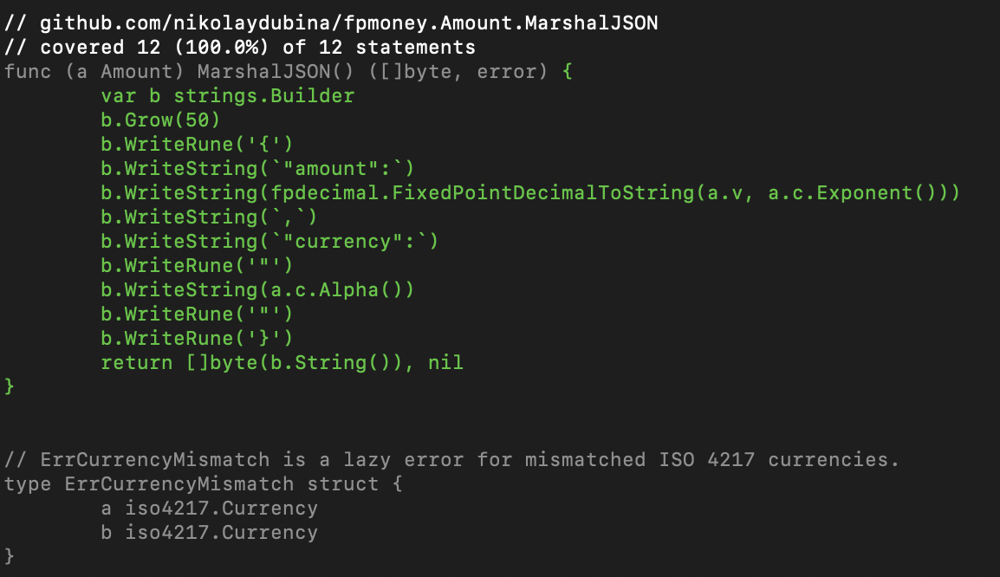</div>


Requirements
```
go install github.com/nikandfor/cover@latest
```

### [⏫](#contents)➡ Browse code coverage of Go code in terminal

This tool lets you interactively browse Go coverage similarly to HTML version provided by official Go toolchain, but within terminal. — [@orlangure](https://github.com/orlangure)


```
go test -cover -coverprofile coverage.out
gocovsh
gocovsh --profile profile.out
git diff --name-only | gocovsh
```

<div align="center">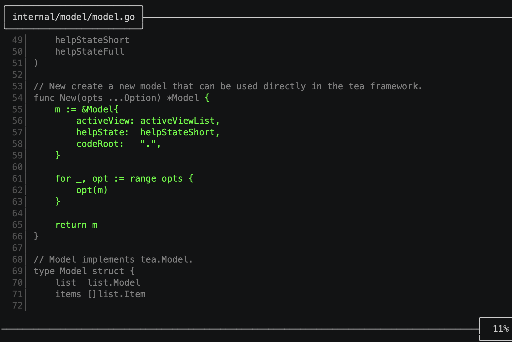</div>


Requirements
```
go install github.com/orlangure/gocovsh@latest
```

### [⏫](#contents)➡ Get packages without tests

If code coverage does not report packages without tests. This should be fast for CI. — [@nikolaydubina](https://github.com/nikolaydubina)


```
go list -json ./... | jq -rc 'select((.TestGoFiles | length)==0) | .ImportPath'
```

Example
```
github.com/gin-gonic/gin/ginS
github.com/gin-gonic/gin/internal/json
```

Requirements
```
https://stedolan.github.io/jq/download/
```

### [⏫](#contents)➡ Browse code coverage by file

This is very helpful tool from the official Go toolchain.


```
go test -coverprofile cover.out ./...
go tool cover -html=cover.out
```

<div align="center">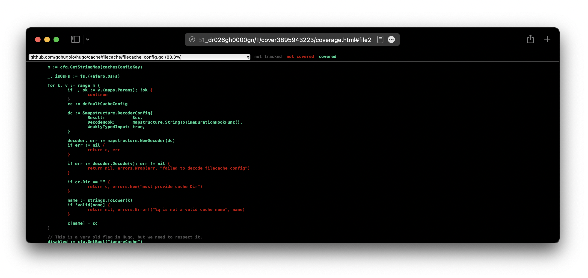</div>


### [⏫](#contents)➡ Make histogram of Go files per package

Use this to see when package is too big or too small. Adjust histogram length to maximum value.


```
go list -json ./... | jq -rc '[.ImportPath, (.GoFiles | length | tostring)] | join(" ")' | perl -lane 'print (" " x (20 - $F[1]), "=" x $F[1], " ", $F[1], "\t", $F[0])'
```

Example
```
  ================== 18	github.com/gin-gonic/gin
       ============= 13	github.com/gin-gonic/gin/binding
                   = 1	github.com/gin-gonic/gin/internal/bytesconv
                   = 1	github.com/gin-gonic/gin/internal/json
         =========== 11	github.com/gin-gonic/gin/render
```

Requirements
```
https://stedolan.github.io/jq/download/
```

### [⏫](#contents)➡ Run tests sequentially

This is in cases when you need to synchronize tests, for example in integration tests that share environment. [Official documentation](https://pkg.go.dev/cmd/go#hdr-Testing_flags).


```
go test -p 1 -parallel 1 ./...
```


### [⏫](#contents)➡ Run tests in parallel

Add `t.Parallel` to your tests case function bodies. As per documentation, by default `-p=GOMAXPROCS` and `-parallel=GOMAXPROCS` when you run `go test`. Different packages by default run in parallel, and tests within package can be enforced to run in parallel too. Make sure to copy test case data to new variable, why explained [here](https://gist.github.com/posener/92a55c4cd441fc5e5e85f27bca008721). [Official documentation](https://pkg.go.dev/cmd/go#hdr-Testing_flags).

```go
    ...
    for _, tc := range tests {
        tc := tc
        t.Run(tc.name, func(t *testing.T) {
            t.Parallel()
            ...
```


### [⏫](#contents)➡ Detect goroutine leaks

Refactored, tested variant of the goroutine leak detector found in both `net/http` tests and the cockroachdb source tree. You have to call this library in your tests. — [@fortytw2](https://github.com/fortytw2) / https://github.com/fortytw2/leaktest

```go
func TestPoolContext(t *testing.T) {
	ctx, cancel := context.WithTimeout(context.Background(), time.Second)
	defer cancel()
	defer leaktest.CheckContext(ctx, t)()

	go func() {
		for {
			time.Sleep(time.Second)
		}
	}()
}
```


### [⏫](#contents)➡ Run tests with pretty output

This wrapper around `go test` renders test output in easy to read format. Also supports JUnit, JSON output, skipping slow tests, running custom binary. — [@dnephin](https://github.com/dnephin)


```
gotestsum --format dots
```

<div align="center"></div>


Requirements
```
go install github.com/gotestyourself/gotestsum@latest
```

### [⏫](#contents)➡ Enrich `go test` output

This tool adds colors and enriches `go test` output. It can be used in pipeline and has lots of options. — [@kyoh86](https://github.com/kyoh86)


```
richgo test ./...
```

<div align="center"></div>


Requirements
```
go install github.com/kyoh86/richgo@latest
```

## Dependencies

### [⏫](#contents)➡ Get Go version of current module

Use this in CI to setup correct Go version automatically from `go.mod`.


```
go mod edit -json | jq -r .Go
```

Requirements
```
https://stedolan.github.io/jq/download/
```

### [⏫](#contents)➡ Get Go versions of upstream modules

Use this when upgrading version of Go or finding old modules.


```
go list -deps -json ./... | jq -rc 'select(.Standard!=true and .Module.GoVersion!=null) | [.Module.GoVersion,.Module.Path] | join(" ")' | sort -V | uniq
```

Example
```
1.11 github.com/ugorji/go/codec
1.11 golang.org/x/crypto
1.12 github.com/golang/protobuf
```

Requirements
```
https://stedolan.github.io/jq/download/
```

### [⏫](#contents)➡ Get directly dependent modules that can be upgraded

Use this to keep your modules updated. Similar function is integrated in VSCode official Go plugin and GoLand.


```
go list -u -m $(go list -m -f '{{.Indirect}} {{.}}' all | grep '^false' | cut -d ' ' -f2) | grep '\['
```

Example
```
github.com/goccy/go-json v0.5.1 [v0.7.3]
github.com/golang/protobuf v1.3.3 [v1.5.2]
github.com/json-iterator/go v1.1.9 [v1.1.11]
```


### [⏫](#contents)➡ Get upstream modules without Go version

Use this to find outdated modules or imports that you need to upgrade.


```
go list -deps -json ./... | jq -rc 'select(.Standard!=true and .Module.GoVersion==null) | .Module.Path' | sort -u
```

Example
```
github.com/facebookgo/clock
golang.org/x/text
gopkg.in/yaml.v2
```

Requirements
```
https://stedolan.github.io/jq/download/
```

### [⏫](#contents)➡ Get available module versions

This works even if you did not download or install module locally. This is useful to check to which version you can upgrade to, what is the latest version, and whether there are v2+ major versions recognized by Go toolchain.


```
go list -m -versions github.com/google/gofuzz
```


### [⏫](#contents)➡ Make graph of upstream modules

For each module, the node representing the greatest version (i.e., the version chosen by Go's minimal version selection algorithm) is colored green. Other nodes, which aren't in the final build list, are colored grey. — official Go team


```
go mod graph | modgraphviz | dot -Tsvg -o mod-graph.svg
```

<div align="center">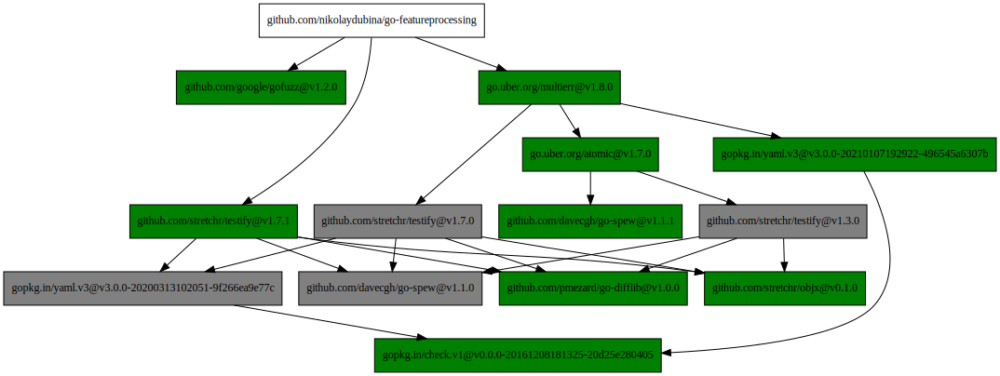</div>


Requirements
```
https://graphviz.org/download/
go install golang.org/x/exp/cmd/modgraphviz@latest
```

### [⏫](#contents)➡ Make graph of upstream modules with gmchart

Render in browser Go module graphs. Built with D3.js, Javascript, HTTP server in Go. — [@PaulXu-cn](https://github.com/PaulXu-cn)


```
go mod graph | gmchart
```

<div align="center"></div>


Requirements
```
go install github.com/PaulXu-cn/go-mod-graph-chart/gmchart@latest
```

### [⏫](#contents)➡ Make graph of upstream packages

Use to find unexpected dependencies or visualize project. Works best for small number of packages, for large projects use `grep` to narrow down subgraph. Without `-deps` only for current module. — [@nikolaydubina](https://github.com/nikolaydubina)


```
go list -deps -json ./... | jq -c 'select(.Standard!=true) | {from: .ImportPath, to: .Imports[]}' | jsonl-graph | dot -Tsvg > package-graph.svg
```

<div align="center">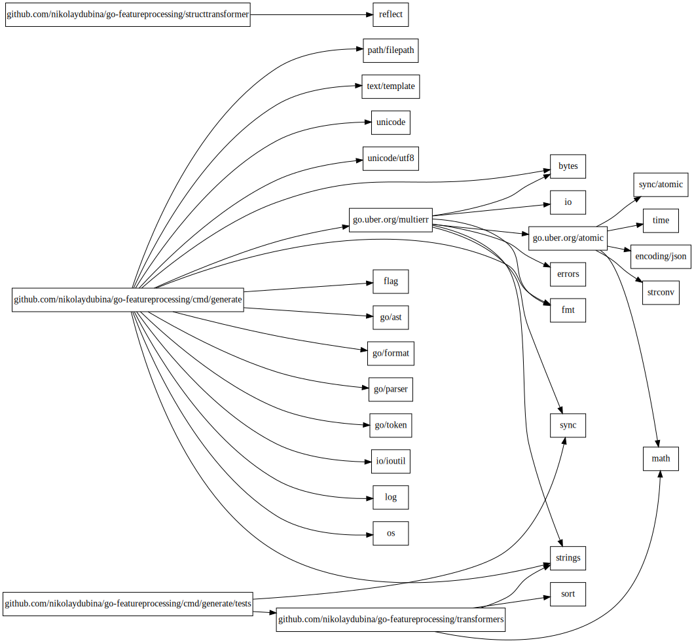</div>


Requirements
```
https://stedolan.github.io/jq/download/
https://graphviz.org/download/
go install github.com/nikolaydubina/import-graph@latest
go install github.com/nikolaydubina/jsonl-graph@latest
```

### [⏫](#contents)➡ Scrape details about upstream modules and make graph

Use to find low quality or unmaintained dependencies. — [@nikolaydubina](https://github.com/nikolaydubina)


```
go mod graph | import-graph -i=gomod | jsonl-graph -color-scheme=file://$PWD/basic.json | dot -Tsvg > output.svg
```

<div align="center">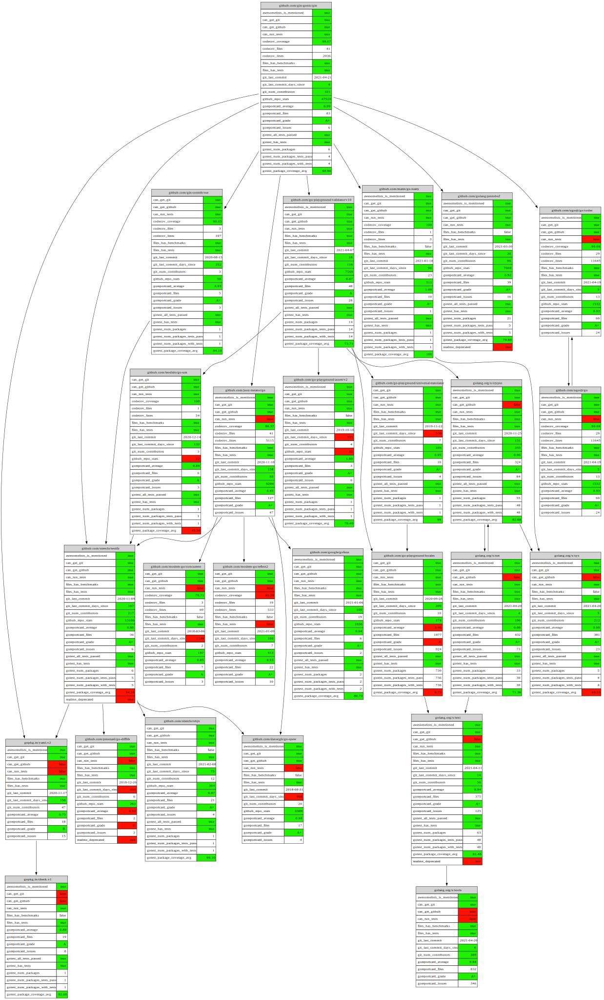</div>


Requirements
```
https://graphviz.org/download/
go install github.com/nikolaydubina/import-graph@latest
go install github.com/nikolaydubina/jsonl-graph@latest
```

### [⏫](#contents)➡ Scrape licenses of upstream dependencies

This is tool from Google. Might be useful to collect all the licenses or checking if you can use the project for example in proprietary or commercial environment. — official Go team


```
go-licenses csv github.com/gohugoio/hugo
```

Example
```
github.com/cli/safeexec,https://github.com/cli/safeexec/blob/master/LICENSE,BSD-2-Clause
github.com/bep/tmc,https://github.com/bep/tmc/blob/master/LICENSE,MIT
github.com/aws/aws-sdk-go,https://github.com/aws/aws-sdk-go/blob/master/LICENSE.txt,Apache-2.0
github.com/jmespath/go-jmespath,https://github.com/jmespath/go-jmespath/blob/master/LICENSE,Apache-2.0
github.com/gorilla/websocket,https://github.com/gorilla/websocket/blob/master/LICENSE,BSD-2-Clause
github.com/pelletier/go-toml/v2,https://github.com/pelletier/go-toml/blob/master/v2/LICENSE,MIT
github.com/spf13/cobra,https://github.com/spf13/cobra/blob/master/LICENSE.txt,Apache-2.0
github.com/kyokomi/emoji/v2,https://github.com/kyokomi/emoji/blob/master/v2/LICENSE,MIT
go.opencensus.io,Unknown,Apache-2.0
github.com/Azure/azure-storage-blob-go/azblob,https://github.com/Azure/azure-storage-blob-go/blob/master/azblob/LICENSE,MIT
github.com/yuin/goldmark-highlighting,https://github.com/yuin/goldmark-highlighting/blob/master/LICENSE,MIT
```

Requirements
```
go install github.com/google/go-licenses@latest
```

### [⏫](#contents)➡ Explore upstream dependencies interactively

This is a tool from one of creators of Go. This tool should help explore dependencies and assist large refactorings. — [Alan Donovan](https://github.com/adonovan), official Go team

<div align="center"></div>


Requirements
```
go install github.com/adonovan/spaghetti@latest
```

### [⏫](#contents)➡ Use `go mod` directives

Tell Go compiler which versions of upstreams to include in your build. Tell all users of your module how to deal with versions of your module.

```
// Deprecated: use example.com/mod/v2 instead.
module example.com/mod

go 1.16

require example.com/other/thing v1.0.2
require example.com/new/thing/v2 v2.3.4
exclude example.com/old/thing v1.2.3
replace example.com/bad/thing v1.4.5 => example.com/good/thing v1.4.5
retract [v1.9.0, v1.9.5]
```


### [⏫](#contents)➡ Analyze dependencies with `goda`

This tool has extensive syntax for filtering dependencies graphs. It can work with packages and modules. — [Egon Elbre](egonelbre@gmail.com)


```
goda graph . | dot -Tsvg -o graph.svg
goda graph -cluster -short "github.com/nikolaydubina/go-cover-treemap:all" | dot -Tsvg -o graph.svg
```

<div align="center"></div>


Requirements
```
https://graphviz.org/download/
go install github.com/loov/goda@latest
```

## Code Visualization

### [⏫](#contents)➡ Make graph of function calls

This is an official tool for generating call-graphs. Requires `main.go` in module. Supports Graphviz output format. Has many options for filtering and formatting. — official Go team


```
callgraph -format graphviz . | dot -Tsvg -o graph.svg
recommend: grep <package/class/func of interest>
recommend: grep -v Error since many packages report error
recommend: adding `rankdir=LR;` to graphviz file for denser graph
recommend: you would have to manually fix graphviz file first and last line
```

<div align="center">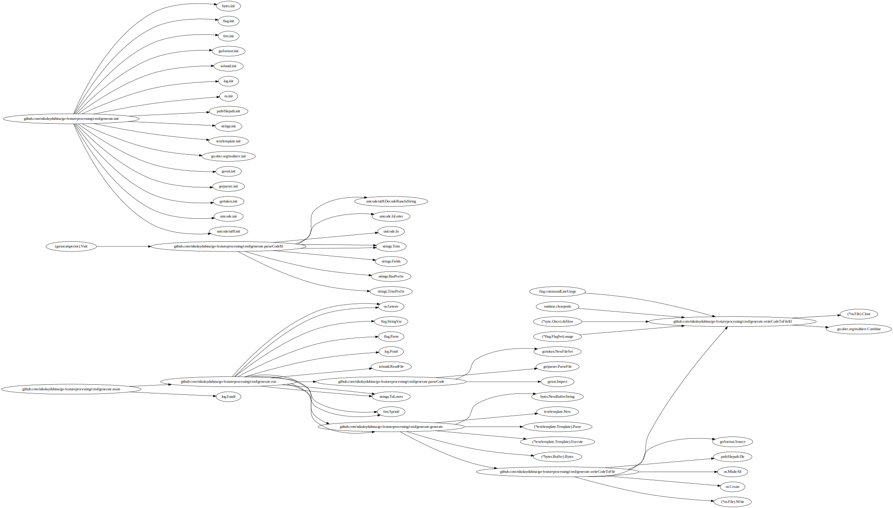</div>


Requirements
```
go install golang.org/x/tools/cmd/callgraph@latest
```

### [⏫](#contents)➡ Make graph of function calls in package

This can be helpful to quickly track which packages current package is calling and why. — [@ofabry](https://github.com/ofabry)


```
go-callvis .
```

<div align="center"></div>


Requirements
```
go install github.com/ofabry/go-callvis
```

### [⏫](#contents)➡ Make PlantUML diagram

This tool generates class diagram in PlantYML format with the information on structs, interfaces and their relationships. Render `.puml` files in for exmample [planttext.com](https://www.planttext.com). — [@jfeliu007](https://github.com/jfeliu007)


```
goplantuml -recursive path/to/gofiles path/to/gofiles2
```

<div align="center"></div>


Requirements
```
go get github.com/jfeliu007/goplantuml/parser
go install github.com/jfeliu007/goplantuml/cmd/goplantuml@latest
```

### [⏫](#contents)➡ Make PlantUML diagram

This can be useful to automatically generate visualization of classes and interfaces for go pacakges. Recommend recursive option. Render `.puml` files in for exmample [planttext.com](https://www.planttext.com). — [@bykof](https://github.com/bykof)


```
go-plantuml generate -d . -r -o graph.puml
```

<div align="center"></div>


Requirements
```
go install github.com/bykof/go-plantuml@latest
```

### [⏫](#contents)➡ Make 3D chart of Go codebase

GoCity is an implementation of the Code City metaphor for visualizing source code - folders are districts; files are buildings; structs are buildings on the top of their files. This project has research paper "[GoCity Code City for Go](https://homepages.dcc.ufmg.br/~mtov/pub/2019-saner-gocity.pdf)" at SANER'19. Also available at [go-city.github.io](https://go-city.github.io). — [@rodrigo-brito](https://github.com/rodrigo-brito)

<div align="center"></div>


Requirements
```
go install github.com/rodrigo-brito/gocity@latest
```

## Static Analysis

### [⏫](#contents)➡ Run default static analysis with `go vet`

It is an official tool for static analysis of Go programs. It has 27+ static analyzers. — official Go team


```
go vet ./...
```


### [⏫](#contents)➡ Run custom static analysis tool with `go vet`

It can also be used to run custom analyzers. Third party analyzers are supported. Lots of official analyzers not included by default into `go vet`. Analyzer has to satisfy interface and command described here https://pkg.go.dev/golang.org/x/tools/go/analysis. Refer for https://pkg.go.dev/golang.org/x/tools/go/analysis/passes for full list of official Go analyzers. — official Go team


```
go install golang.org/x/tools/go/analysis/passes/shadow/cmd/shadow
go vet -vettool=$(which shadow)
```


### [⏫](#contents)➡ Run official static analyzers not included in `go vet`

There are many analyzers not included in `go vet`. These tools are experimental and may not work as expected (e.g. `usesgenerics` does not work). Refer to for full list https://pkg.go.dev/golang.org/x/tools/go/analysis. — official Go team

```go
package main

import (
	"golang.org/x/tools/go/analysis/multichecker"

	"golang.org/x/tools/go/analysis/passes/atomicalign"
	"golang.org/x/tools/go/analysis/passes/deepequalerrors"
	"golang.org/x/tools/go/analysis/passes/fieldalignment"
	"golang.org/x/tools/go/analysis/passes/nilness"
	"golang.org/x/tools/go/analysis/passes/reflectvaluecompare"
	"golang.org/x/tools/go/analysis/passes/shadow"
	"golang.org/x/tools/go/analysis/passes/sortslice"
	"golang.org/x/tools/go/analysis/passes/unusedwrite"
	"golang.org/x/tools/go/analysis/passes/usesgenerics"
)

func main() {
	multichecker.Main(
		atomicalign.Analyzer,         // checks for non-64-bit-aligned arguments to sync/atomic functions
		deepequalerrors.Analyzer,     // checks for the use of reflect.DeepEqual with error values
		fieldalignment.Analyzer,      // detects structs that would use less memory if their fields were sorted
		nilness.Analyzer,             // inspects the control-flow graph of an SSA function and reports errors such as nil pointer dereferences and degenerate nil pointer comparisons
		reflectvaluecompare.Analyzer, // checks for accidentally using == or reflect.DeepEqual to compare reflect.Value values
		shadow.Analyzer,              // checks for shadowed variables
		sortslice.Analyzer,           // checks for calls to sort.Slice that do not use a slice type as first argument
		unusedwrite.Analyzer,         // checks for unused writes to the elements of a struct or array object
		usesgenerics.Analyzer,        // checks for usage of generic features added in Go 1.18
	)
}

```


## Code Generation

### [⏫](#contents)➡ Generate `String` method for enum types

This is an official tool for generating `String` for enums. It supports overrides via comments. — official Go team

```go
package painkiller

//go:generate stringer -type=Pill -linecomment

type Pill int

const (
	Placebo Pill = iota
	Ibuprofen
	Paracetamol
	PillAspirin   // Aspirin
	Acetaminophen = Paracetamol
)

// "Acetaminophen"
var s string = Acetaminophen.String()

```

Requirements
```
go install golang.org/x/tools/cmd/stringer@latest
```

### [⏫](#contents)➡ Run `go:generate` in parallel

Official Go team [encourages](https://github.com/golang/go/issues/20520) to run sequentially. However, in certain cituations, such as lots of mocks, parallelization helps a lot, ableit, you should consider including your generated files in git. The solution bellow spawns multiple processes, each per pkg.


```
grep -rnw "go:generate" -E -l "${1:-*.go}" . | xargs -L1 dirname | sort -u | xargs -P 8 -I{} go generate {}
```


## Refactoring

### [⏫](#contents)➡ Replace symbol

I found this in announcement [notice](https://github.com/golang/go/commit/2580d0e08d5e9f979b943758d3c49877fb2324cb) of Go 1.18 for changes to `interface{}` to `any`. This can be useful for other refactorings too.


```
gofmt -w -r 'interface{} -> any' .
```


## Errors

### [⏫](#contents)➡ Pretty print `panic` messages

This tool will be useful for reading `panic` messages. Need to redirect STDERR to this tool with `panic` stack traces. The tool has HTML output and does lots of deduplication and enhancements. Refer to examples in original repo.


```
go test -v |& pp
```

<div align="center"></div>


Requirements
```
go install github.com/maruel/panicparse/v2/cmd/pp@latest
```

## Build

### [⏫](#contents)➡ Show compiler optimization decisions on heap and inlining

Building with `-m` flag will show decisions of compiler on inlining and heap escape. This can help you to validate your understanding of your code and optimize it.


```
go build -gcflags="-m -m" . 2>&1 | grep inline
```

Example
```
...
./passengerfp.go:25:6: cannot inline (*PassengerFeatureTransformer).Fit: function too complex: cost 496 exceeds budget 80
...
./passengerfp.go:192:6: can inline (*PassengerFeatureTransformer).NumFeatures with cost 35 as: method(*PassengerFeatureTransformer) func() int { if e == nil { return 0 }; count := 6; count += (*transformers.OneHotEncoder).NumFeatures(e.Sex); count += (*transformers.OneHotEncoder).NumFeatures(e.Embarked); return count }
...
./passengerfp.go:238:43: inlining call to transformers.(*OneHotEncoder).FeatureNames
./passengerfp.go:238:43: inlining call to transformers.(*OneHotEncoder).NumFeatures
...
./passengerfp.go:151:7: parameter e leaks to {heap} with derefs=0:
./passengerfp.go:43:11: make(map[string]uint) escapes to heap
```


### [⏫](#contents)➡ Disable inlining

Usually you may not need it, but can reduce binary size and even improve performance.


```
go build -gcflags="-l" .
```


### [⏫](#contents)➡ Aggressive inlining

This can improve performance. This includes mid-stack inlining.


```
go build -gcflags="-l -l -l -l" .
```


### [⏫](#contents)➡ Manually disable or enable `cgo`

Disable `cgo` with `CGO_ENABLED=0` and enable with `CGO_ENABLED=1`. If you don't, `cgo` may end-up being enabled or code dynamically linked if, for example, you use some `net` or `os` packages. You may want to disable `cgo` to improve performance, since complier and runtime would have easier job optimizing code. This also should reduce your image size, as you can have alpine image with less shared libraries.


### [⏫](#contents)➡ Include metadata in binary during compilation with `ldflags`

You can pass metadata through compiler to your binary. This is useulf for including things like git commit, database schema version, integrity hashes. Variables can only be strings.


```
go build -v -ldflags="-X 'main.Version=v1.0.0'"
go build -v -ldflags="-X 'my/pkg/here.Variable=some-string'"
```

```go
package main

var Version string

func main() {
	// Version here has some value
	...
}

```


### [⏫](#contents)➡ Make treemap breakdown of Go executable binary

This can be useful for studying Go compiler, large projects, projects with C/C++ and `cgo`, 3rd party dependencies, embedding. However, total size may not be something to worry about for your executable. — [@nikolaydubina](https://github.com/nikolaydubina)


```
go tool nm -size <binary finename> | go-binsize-treemap > binsize.svg
```

<div align="center"></div>


Requirements
```
go install github.com/nikolaydubina/go-binsize-treemap@latest
```

## Assembly

### [⏫](#contents)➡ Get assembly of Go code snippets online

Use [godbolt.org](https://godbolt.org) to compile and see assembly of short Go code. You can check different platforms and compilers including `cgo`. This tool is commonly used by C++ community. — [@mattgodbolt](https://github.com/mattgodbolt)

<div align="center">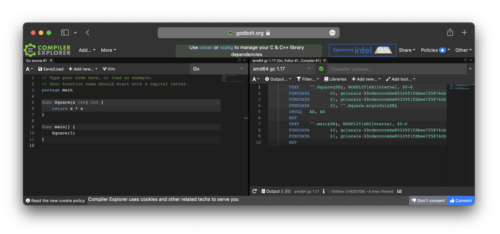</div>


### [⏫](#contents)➡ Get Go compiler SSA intermediary representation

This tool allows to check what does Go compiler do. Might be useful if you trying to optimize some code or learn more about compiler. https://golang.design/gossa. — [@changkun](https://github.com/changkun) / https://github.com/golang-design/ssaplayground

<div align="center"></div>


### [⏫](#contents)➡ View Go assembly interactively

This tool lets you interactively Go statement in assembly. — [@egonelbre](https://github.com/egonelbre) / https://github.com/loov/lensm

<div align="center"></div>


Requirements
```
go install loov.dev/lensm@main
```

### [⏫](#contents)➡ Generate Go assembly in Go

Write better quality Go assembly quicker in Go language itself. This tool conveniently generates stub for Go code to call your generated assembly. Used by Go core. — [@mmcloughlin](https://github.com/mmcloughlin) / https://github.com/mmcloughlin/avo

```go
//go:build ignore
// +build ignore

package main

import . "github.com/mmcloughlin/avo/build"

func main() {
	TEXT("Add", NOSPLIT, "func(x, y uint64) uint64")
	Doc("Add adds x and y.")
	x := Load(Param("x"), GP64())
	y := Load(Param("y"), GP64())
	ADDQ(x, y)
	Store(y, ReturnIndex(0))
	RET()
	Generate()
}

```


### [⏫](#contents)➡ Generate AST for code snippets

You can access Go core AST mechanism to generate AST.

```go
package main

import (
	"go/ast"
	"go/parser"
	"go/token"
)

func main() {
	fs := token.NewFileSet()
	tr, _ := parser.ParseExpr("(3-1) * 5")
	ast.Print(fs, tr)
}

```

Example
```
     0  *ast.BinaryExpr {
     1  .  X: *ast.ParenExpr {
     2  .  .  Lparen: -
     3  .  .  X: *ast.BinaryExpr {
     4  .  .  .  X: *ast.BasicLit {
     5  .  .  .  .  ValuePos: -
     6  .  .  .  .  Kind: INT
     7  .  .  .  .  Value: "3"
     8  .  .  .  }
     9  .  .  .  OpPos: -
    10  .  .  .  Op: -
    11  .  .  .  Y: *ast.BasicLit {
    12  .  .  .  .  ValuePos: -
    13  .  .  .  .  Kind: INT
    14  .  .  .  .  Value: "1"
    15  .  .  .  }
    16  .  .  }
    17  .  .  Rparen: -
    18  .  }
    19  .  OpPos: -
    20  .  Op: *
    21  .  Y: *ast.BasicLit {
    22  .  .  ValuePos: -
    23  .  .  Kind: INT
    24  .  .  Value: "5"
    25  .  }
    26  }

```


## Execution

### [⏫](#contents)➡ Run Go function in shell

This is short and convenient for Go one-liners. This tool will print to stdout the return of a function call. — [@natefinch](https://github.com/natefinch)


```
cat README.md | gorram crypto/sha1 Sum
echo 12345 | gorram encoding/base64 StdEncoding.EncodeToString
gorram net/http Get https://google.com
```

Requirements
```
go install github.com/natefinch/gorram@latest
```

### [⏫](#contents)➡ Run simple fileserver

It takes one line to run HTTP file server in Go. Akin to famous oneliner in Python `python3 -m http.server` and `python -m SimpleHTTPServer`. Run this file as usually `go run <filename>`.

```go
package main

import "net/http"

func main() { http.ListenAndServe(":9000", http.FileServer(http.Dir("."))) }

```

<div align="center">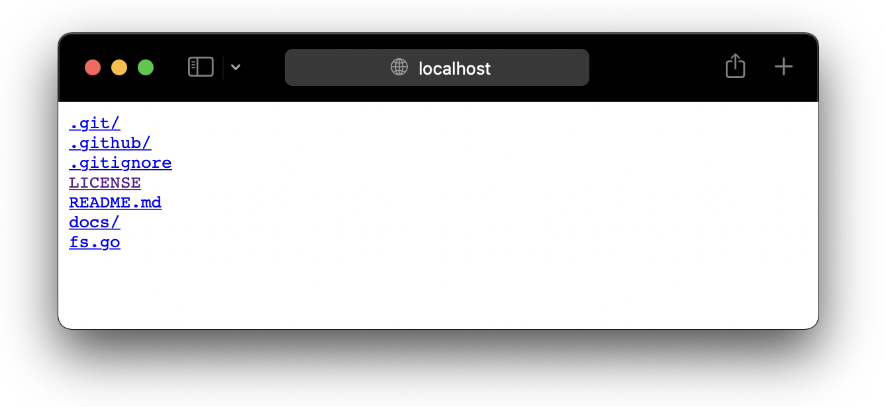</div>


### [⏫](#contents)➡ Monitor Go processes

This tool from Google has lots of useful features like monitoring memory of Go processes, forcing GC, getting version of Go of process. — official Go team


```
gops
```

Example
```
983   980    uplink-soecks  go1.9   /usr/local/bin/uplink-soecks
52697 52695  gops           go1.10  /Users/jbd/bin/gops
4132  4130   foops        * go1.9   /Users/jbd/bin/foops
51130 51128  gocode         go1.9.2 /Users/jbd/bin/gocode
```

Requirements
```
go install github.com/google/gops@latest
```

### [⏫](#contents)➡ Create 3D visualization of concurrency traces

This tool creates 3D visualization of coroutines execution. There is no advanced functions and it is hard to analyze production systems. However, it could be interesting for educational purposes. — [@divan](https://github.com/divan)

<div align="center"></div>


Requirements
```
go install github.com/divan/gotrace@latest
patch Go compiler, available via Docker
more instructions in original repo
```

## Benchmarking

### [⏫](#contents)➡ Run benchmarks

Start here. This is the standard tool for benchmarking. It can also do advanced features like mutex profiles. More flags are in Go [documentaion](https://pkg.go.dev/cmd/go#hdr-Testing_flags) and `go help testflag`.


```
go test -bench=. -benchmem -benchtime=10s ./...
```

Example
```
$ go test -bench=. -benchmem ./...
goos: darwin
goarch: arm64
pkg: github.com/nikolaydubina/fpmoney
BenchmarkArithmetic/add_x1-10                     1000000000             0.5 ns/op           0 B/op           0 allocs/op
BenchmarkArithmetic/add_x100-10                     18430124            64.6 ns/op           0 B/op           0 allocs/op
BenchmarkJSONUnmarshal/small-10                      3531835           340.7 ns/op         198 B/op           3 allocs/op
BenchmarkJSONUnmarshal/large-10                      2791712           426.9 ns/op         216 B/op           3 allocs/op
BenchmarkJSONMarshal/small-10                        4379685           274.4 ns/op         144 B/op           4 allocs/op
BenchmarkJSONMarshal/large-10                        3321205           345.8 ns/op         192 B/op           5 allocs/op
PASS
ok      github.com/nikolaydubina/fpmoney    62.744s
```


### [⏫](#contents)➡ Table-driven benchmarks

Simlar to tests, Go supports table-driven benchmarks, which is very helpful for fine gradation of meta-parameters. More details in the Go [blog](https://go.dev/blog/subtests).

```go
func benchIteratorSelector(b *testing.B, n int) {
	// ... setup here
	b.ResetTimer()
	for n := 0; n < b.N; n++ {
		err := myExpensiveFunc()
		if err != nil {
			b.Error(err)
		}
	}
}

func BenchmarkIteratorSelector(b *testing.B) {
	for _, q := range []int{100, 1000, 10000, 100000} {
		b.Run(fmt.Sprintf("n=%d", q), func(b *testing.B) {
			benchIteratorSelector(b, q)
		})
	}
}

```

Example
```
BenchmarkIteratorSelector/n=100-10    	  297792	      4265 ns/op	    5400 B/op	      13 allocs/op
BenchmarkIteratorSelector/n=1000-10   	   31400	     38182 ns/op	    9752 B/op	      16 allocs/op
BenchmarkIteratorSelector/n=10000-10  	    3134	    380777 ns/op	   89112 B/op	      24 allocs/op
BenchmarkIteratorSelector/n=100000-10 	     310	   3827292 ns/op	  912410 B/op	      32 allocs/op
```


### [⏫](#contents)➡ Generate benchmak CPU and Memory profiles

This is useful for identifying most time or memory consuming parts. Recommended to run for single benchmark at a time and with `-count` or `-benchtime` for better accuracy.


```
go test -bench=<my-benchmark-name> -cpuprofile cpu.out -memprofile mem.out ./...
```


### [⏫](#contents)➡ Visualize callgraph of profiles wiht `pprof`

Once you generate profiles, visualize them with `pprof`. Both memory and CPU profiles are supported. Many options are available. Refer to the link you get in SVG to how to interpret this graph. More official documentation [blog](https://go.dev/blog/pprof), [pkg-doc](https://pkg.go.dev/net/http/pprof). — official Go team


```
go tool pprof -svg cpu.out > cpu.svg
go tool pprof -svg mem.out > mem.svg
```

<div align="center">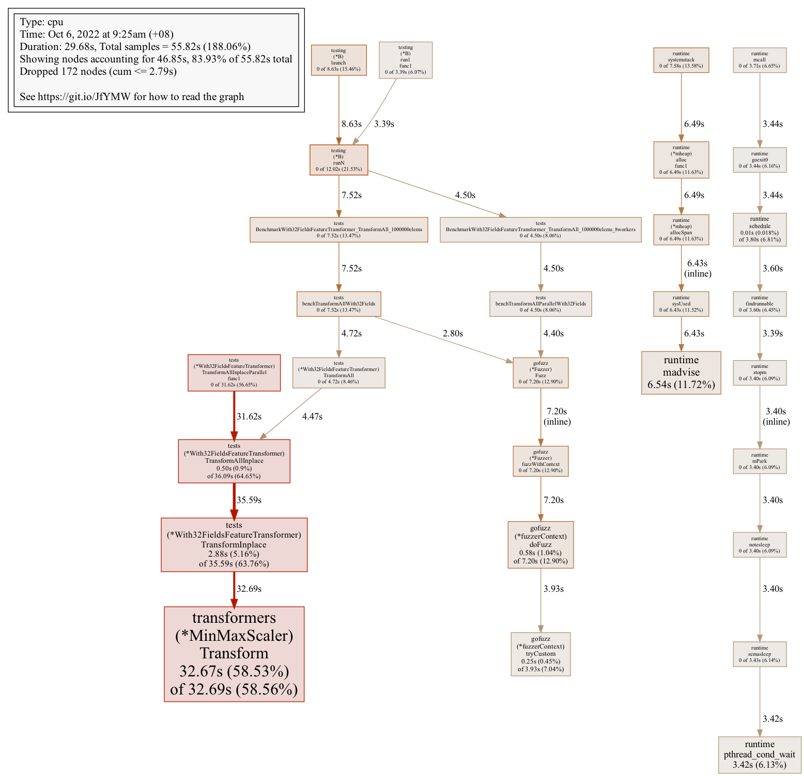</div>


### [⏫](#contents)➡ Visualize flamegraphs of profiles wiht `pprof`

Latest versions of `pprof` can also render [Flamegraphs](https://www.brendangregg.com/flamegraphs.html) for profiles. Make sure you set `-http` to start webserver. Then it is available in "View > Graph" in at http://0.0.0.0:80. — Google


```
pprof -http=0.0.0.0:80 cpu.out
```

<div align="center">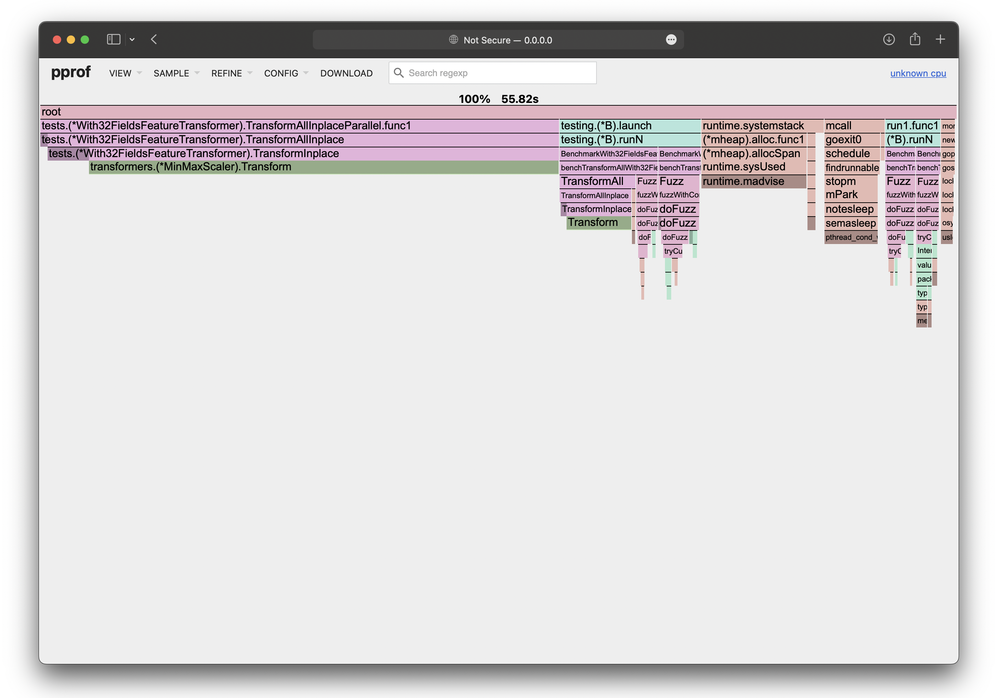</div>


Requirements
```
go install github.com/google/pprof@latest
```

### [⏫](#contents)➡ Visualize profiles online

You can also visualize profiles with online tools are aloso available https://www.speedscope.app (cpu).

<div align="center">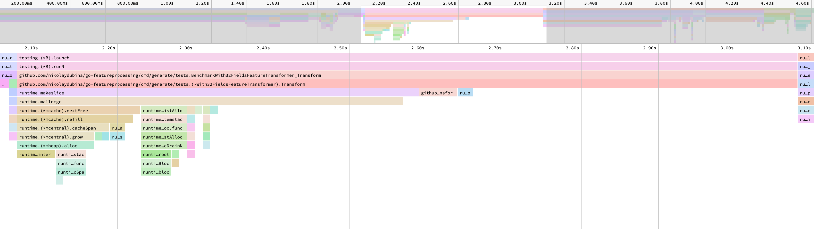</div>


### [⏫](#contents)➡ Get delta between two benchmarks with `benchstat`

This is standard way to compare two benchmark outputs. Names of bencharks should be the same. Generate benchmarks as per usual. You would get multiple tables per dimension. If no output, then pass `-split="XYZ"`. If you do not see `delta`, then pass `-count=2` or more in benchmark generation. It is recommended to have alternative implementations in different packages, to keep benchmark names the same. — official Go team


```
benchstat -split="XYZ" old.txt new.txt
```

Example
```
name                    old time/op    new time/op    delta
JSONUnmarshal/small-10     502ns ± 0%     331ns ± 0%   -33.99%  (p=0.008 n=5+5)
JSONUnmarshal/large-10     572ns ± 0%     414ns ± 0%   -27.64%  (p=0.008 n=5+5)
JSONMarshal/small-10       189ns ± 0%     273ns ± 0%   +44.20%  (p=0.008 n=5+5)
JSONMarshal/large-10       176ns ± 0%     340ns ± 0%   +93.29%  (p=0.008 n=5+5)

name                    old alloc/op   new alloc/op   delta
JSONUnmarshal/small-10      271B ± 0%      198B ± 0%   -26.94%  (p=0.008 n=5+5)
JSONUnmarshal/large-10      312B ± 0%      216B ± 0%   -30.77%  (p=0.008 n=5+5)
JSONMarshal/small-10       66.0B ± 0%    144.0B ± 0%  +118.18%  (p=0.008 n=5+5)
JSONMarshal/large-10       72.0B ± 0%    192.0B ± 0%  +166.67%  (p=0.008 n=5+5)

name                    old allocs/op  new allocs/op  delta
JSONUnmarshal/small-10      6.00 ± 0%      3.00 ± 0%   -50.00%  (p=0.008 n=5+5)
JSONUnmarshal/large-10      7.00 ± 0%      3.00 ± 0%   -57.14%  (p=0.008 n=5+5)
JSONMarshal/small-10        2.00 ± 0%      4.00 ± 0%  +100.00%  (p=0.008 n=5+5)
JSONMarshal/large-10        2.00 ± 0%      5.00 ± 0%  +150.00%  (p=0.008 n=5+5)
```

Requirements
```
go install golang.org/x/perf/cmd/benchstat@latest
```

### [⏫](#contents)➡ Get summary of benchmarks with `benchstat`

You can use this standard tool to summarise multiple runes per dimension. Names of bencharks should be the same. Generate benchmarks as per usual. You would get multiple tables per dimension. If no output, then pass `-split="XYZ"`. It is recommended to have alternative implementations in different packages, to keep benchmark names the same. — official Go team


```
benchstat -split="XYZ" int.txt float32.txt fpmoney.txt
```

Example
```
name \ time/op          int.bench   float32.bench  fpmoney.bench
JSONUnmarshal/small-10  481ns ± 2%     502ns ± 0%     331ns ± 0%
JSONUnmarshal/large-10  530ns ± 1%     572ns ± 0%     414ns ± 0%
JSONMarshal/small-10    140ns ± 1%     189ns ± 0%     273ns ± 0%
JSONMarshal/large-10    145ns ± 0%     176ns ± 0%     340ns ± 0%

name \ alloc/op         int.bench   float32.bench  fpmoney.bench
JSONUnmarshal/small-10   269B ± 0%      271B ± 0%      198B ± 0%
JSONUnmarshal/large-10   288B ± 0%      312B ± 0%      216B ± 0%
JSONMarshal/small-10    57.0B ± 0%     66.0B ± 0%    144.0B ± 0%
JSONMarshal/large-10    72.0B ± 0%     72.0B ± 0%    192.0B ± 0%

name \ allocs/op        int.bench   float32.bench  fpmoney.bench
JSONUnmarshal/small-10   6.00 ± 0%      6.00 ± 0%      3.00 ± 0%
JSONUnmarshal/large-10   7.00 ± 0%      7.00 ± 0%      3.00 ± 0%
JSONMarshal/small-10     2.00 ± 0%      2.00 ± 0%      4.00 ± 0%
JSONMarshal/large-10     2.00 ± 0%      2.00 ± 0%      5.00 ± 0%
```

Requirements
```
go install golang.org/x/perf/cmd/benchstat@latest
```

### [⏫](#contents)➡ Continious benchmarking

It is useful to see how benchmarks change in codebase over time. This is accomplished by running benchmarks for git commits, storing results, and visualizing difference. Running benchmarks can be in GitHub Actions or locally, storage can be in same repository `master` or dedicated branch, or standalone servers. It should be straighforward to setup this manually. Example of GitHub Action [spec](https://github.com/swaggest/rest/blob/master/.github/workflows/bench.yml) and [blog](https://dev.to/vearutop/continuous-benchmarking-with-go-and-github-actions-41ok) from [@vearutop](https://github.com/vearutop), and an example on how it produces a PR [comment](https://github.com/swaggest/rest/pull/88#issuecomment-1271540878).

<div align="center">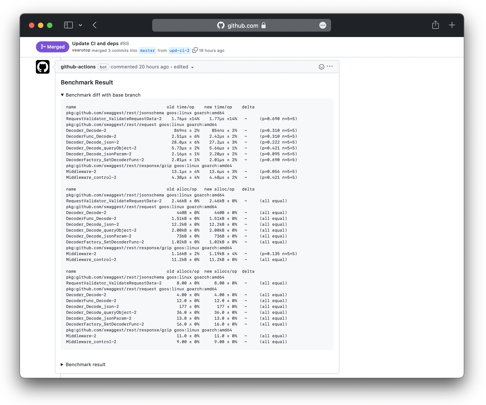</div>


### [⏫](#contents)➡ Continious benchmarking with `gobenchdata`

This tool uses `go test -bench` data in GitHub. It runs benchmarks, and uploads it as GitHub Pages for visualization. It is available as GitHub Action [gobenchdata](https://github.com/marketplace/actions/continuous-benchmarking-for-go). This is useful to see benchmark trends. — [@bobheadxi](https://github.com/bobheadxi) / https://github.com/bobheadxi/gobenchdata

<div align="center"></div>


Requirements
```
go install go.bobheadxi.dev/gobenchdata@latest
```

### [⏫](#contents)➡ Continious benchmarking with `benchdiff`

This tool automates comparing benchmarks with `benchstat` of two git references. It is available as GitHub Action [benchdiff](https://github.com/marketplace/actions/benchdiff) which runs `benchstat` of HEAD vs base branch. This is useful to see how benchmarks change with PRs in CI. — [@WillAbides](https://github.com/WillAbides)

<div align="center">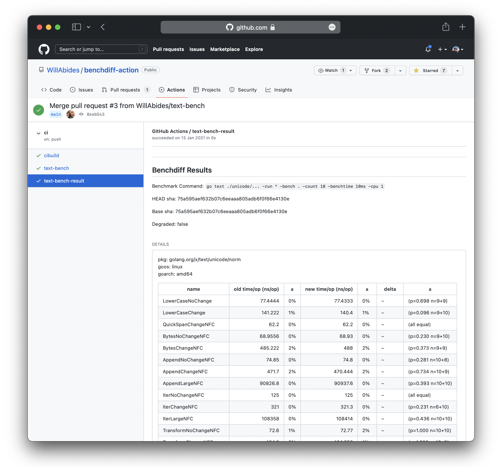</div>


Requirements
```
go install github.com/willabides/benchdiff/cmd/benchdiff
```

### [⏫](#contents)➡ Continious benchmarking with `cob`

This tool runs benchmarks between `HEAD` and `HEAD^1`. It can be used to block CI piplines if benchmarks deteriorate. It reports output as text in CLI. This cane be useful in CI or in local development. — [@knqyf263](https://github.com/knqyf263)

<div align="center"></div>


Requirements
```
go install github.com/knqyf263/cob@latest
```

### [⏫](#contents)➡ Generate live traces using `net/http/trace`

This will add endpoints to your youserver. If you don't have server runing already in your process, you can start one. Then you can point `pprof` tool to this data. More details in documentaion [trace](https://pkg.go.dev/cmd/trace), [pprof](https://pkg.go.dev/net/http/pprof).

```go
import _ "net/http/pprof"

func main() {
	// if don't have http server yet, then start like
	go func() { log.Println(http.ListenAndServe("localhost:6060", nil)) }()
}
```

Example
```
go tool pprof http://localhost:6060/debug/pprof/heap
go tool pprof http://localhost:6060/debug/pprof/profile?seconds=30
curl -o trace.out http://localhost:6060/debug/pprof/trace?seconds=5
```


### [⏫](#contents)➡ Generate traces using `go test`

This will produce a trace of execution of tests in pacakge.


```
go test -trace trace.out .
```


### [⏫](#contents)➡ View traces with `go tool trace`

You can view traces interactively in browser with standard Go tooling. This web tool also shows network blocking profile, synchronization blocking profile, syscall blockign profile, scheduler latency profile.


```
go tool trace trace.out
```

<div align="center">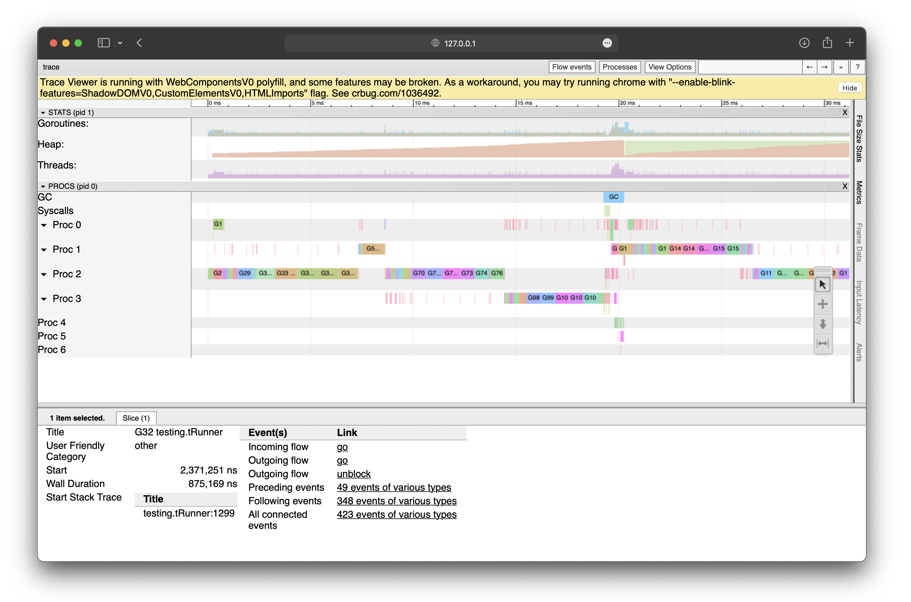</div>


### [⏫](#contents)➡ Get wallclock traces

This tool can be more illustrative of Go traces than standard Go traces. — [@felixge](https://github.com/felixge) / https://github.com/felixge/fgtrace

Example
```go
package main

import (
	"net/http"

	"github.com/felixge/fgtrace"
)

func main() {
	http.DefaultServeMux.Handle("/debug/fgtrace", fgtrace.Config{})
	http.ListenAndServe(":1234", nil)
}

```

<div align="center"></div>


### [⏫](#contents)➡ Get on/off CPU profiles

This tool can be more illustrative of Go profiles than standard Go profiling. — [@felixge](https://github.com/felixge) / https://github.com/felixge/fgprof

Example
```go
package main

import (
	"log"
	"net/http"
	_ "net/http/pprof"

	"github.com/felixge/fgprof"
)

func main() {
	http.DefaultServeMux.Handle("/debug/fgprof", fgprof.Handler())
	go func() {
		log.Println(http.ListenAndServe(":6060", nil))
	}()

	// <code to profile>
}

```

<div align="center"></div>


## Documentation

### [⏫](#contents)➡ Make alternative documentation with golds

It has additional information like implementations of interface; promoted methods. The tool has nice minimalistic aesthetics. — [Tapir Liu](https://www.tapirgames.com) / https://github.com/go101/golds


```
golds ./...
```

<div align="center">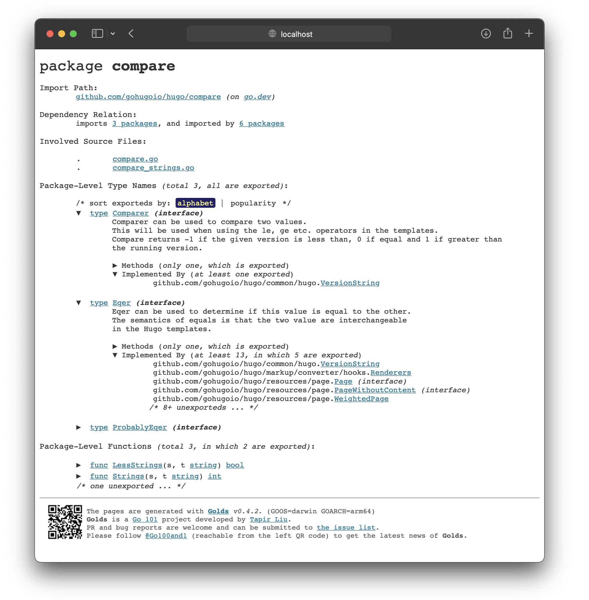</div>


Requirements
```
go install go101.org/golds@latest
```

### [⏫](#contents)➡ Read Go binary documentation in `man` format

This tool fetches the repo's readme as a man page replacement. — [@christophberger](https://github.com/christophberger)


```
goman <mypackage>
```

<div align="center"></div>


Requirements
```
go install github.com/appliedgocode/goman@latest
```


