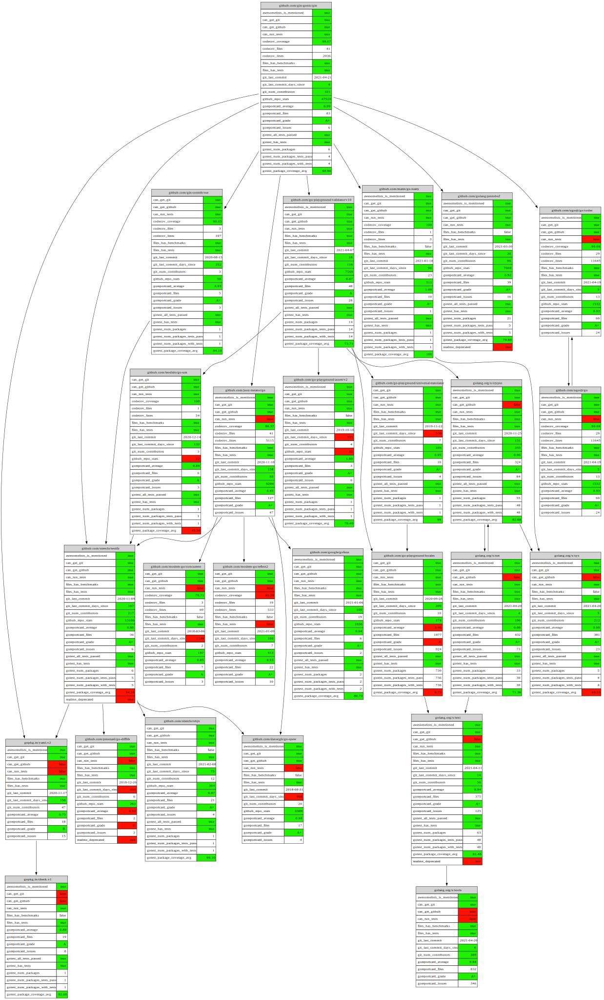
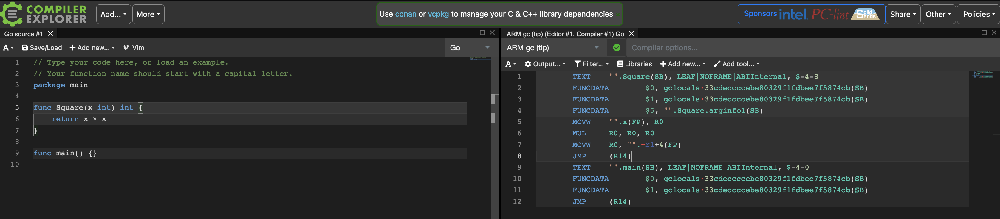

<h1 align="center">Go Recipes 🦩 </h1>
<p align="center">Handy commands and tools to use in Go projects</p>

This is a collection of mostly CLI tools, UNIX filters, websites you can use in your Go projects.
Primary motivation here is to collect and share less-known tools that enhanse development experience.
Feel free to open an issue or pull request!

## Contents

- Tests
  + [➡️ Make treemap of code coverage](asdf)
  + [➡️ Get packages without tests](asdf)
  + [➡️ Make histogram of Go files per package](asdf)
- Dependencies
  + [➡️ Get Go version of current module](asdf)
  + [➡️ Get Go versions of upstream modules](asdf)
  + [➡️ Get directly dependent modules that can be upgraded](asdf)
  + [➡️ Get upstream modules without Go version](asdf)
  + [➡️ Get available module versions](asdf)
  + [➡️ Make graph of upstream packages](asdf)
  + [➡️ Scrape details about upstream modules and make graph](asdf)
- Assembley
  + [➡️ Get assembly of Go code snippets online](asdf)

# Tests

### ➡️ Make treemap of code coverage

Visualize distribution of code coverage in your project.
This helps to identify code areas with high and low coverage.
Useful when you have large project with lots of files and packages.

First make profile with
```
go test -coverprofile cover.out ./...
```

Then turn coverprofile into SVG
```
go-cover-treemap -coverprofile cover.out > out.svg
```

<div align="center">

</div>


<details><summary>Requirements</summary>

```
go install github.com/nikolaydubina/go-cover-treemap@latest
```

</details>
  
---

### ➡️ Get packages without tests

If code coverage does not report packages without tests.
This should be fast for CI.

```
go list -json ./... | jq -rc 'select((.TestGoFiles | length)==0) | .ImportPath'
```

Example
```
github.com/gin-gonic/gin/ginS
github.com/gin-gonic/gin/internal/json
```

<details><summary>Requirements</summary>

```
https://stedolan.github.io/jq/download/
```

</details>
  
---

### ➡️ Make histogram of Go files per package

Use this to see when package is too big or too small.
Adjust histogram length to maximum value.

```
go list -json ./... | jq -rc '[.ImportPath, (.GoFiles | length | tostring)] | join(" ")' | perl -lane 'print (" " x (20 - $F[1]), "=" x $F[1], " ", $F[1], "\t", $F[0])'
```

Example
```
  ================== 18	github.com/gin-gonic/gin
       ============= 13	github.com/gin-gonic/gin/binding
                   = 1	github.com/gin-gonic/gin/internal/bytesconv
                   = 1	github.com/gin-gonic/gin/internal/json
         =========== 11	github.com/gin-gonic/gin/render
```

<details><summary>Requirements</summary>

```
https://stedolan.github.io/jq/download/
```
  
</details>
  
---

# Dependencies

### ➡️ Get Go version of current module

Use this in CI to setup correct Go version automatically from `go.mod`.

```
go mod edit -json | jq -r .Go
```

Example
```
1.16
```

<details><summary>Requirements</summary>

```
https://stedolan.github.io/jq/download/
```

</details>

---

### ➡️ Get Go versions of upstream modules

Use this when upgrading version of Go or finding old modules.

```
go list -deps -json ./... | jq -rc 'select(.Standard!=true and .Module.GoVersion!=null) | [.Module.GoVersion,.Module.Path] | join(" ")' | sort -V | uniq
```

Example
```
1.11 github.com/ugorji/go/codec
1.11 golang.org/x/crypto
1.12 github.com/golang/protobuf
```

<details><summary>Requirements</summary>
  
```
https://stedolan.github.io/jq/download/
```

</details>

---

### ➡️ Get directly dependent modules that can be upgraded

Use this to keep your modules updated.
Similar function is integrated in VSCode official Go plugin and GoLand.

```
go list -u -m $(go list -m -f '{{.Indirect}} {{.}}' all | grep '^false' | cut -d ' ' -f2) | grep '\['
```

Example
```
github.com/goccy/go-json v0.5.1 [v0.7.3]
github.com/golang/protobuf v1.3.3 [v1.5.2]
github.com/json-iterator/go v1.1.9 [v1.1.11]
```
---

### ➡️ Get upstream modules without Go version

Use this to find outdated modules or imports that you need to upgrade.

```
go list -deps -json ./... | jq -rc 'select(.Standard!=true and .Module.GoVersion==null) | .Module.Path' | sort -u
```

Example
```
github.com/facebookgo/clock
golang.org/x/text
gopkg.in/yaml.v2
```

<details><summary>Requirements</summary>

```
https://stedolan.github.io/jq/download/
```
  
</details>

---

### ➡️ Get available module versions

This works even if you did not download or install module locally.
This is useful to check to which version you can upgrade to, what is the latest version, and whether there are v2+ major versions recognized by Go toolchain.

```
go list -m -versions github.com/google/gofuzz
```

Example
```
github.com/google/gofuzz v1.0.0 v1.1.0 v1.2.0
```
---

### ➡️ Make graph of upstream packages

Use to find unexpected dependencies or visualize project.
Works best for small number of packages, for large projects use `grep` to narrow down subgraph.
Without `-deps` only for current module.

```
go list -deps -json ./... | jq -c 'select(.Standard!=true) | {from: .ImportPath, to: .Imports[]}' | jsonl-graph | dot -Tsvg > package-graph.svg
```

Example

<div align="center">

</div>

<details><summary>Requirements</summary>

```
https://stedolan.github.io/jq/download/
https://graphviz.org/download/
$ go install github.com/nikolaydubina/import-graph@latest
$ go install github.com/nikolaydubina/jsonl-graph@latest
```
  
</details>

---

### ➡️ Scrape details about upstream modules and make graph

Use to find low quality or unmaintained dependencies.

```
go mod graph | import-graph -i=gomod | jsonl-graph -color-scheme=file://$PWD/basic.json | dot -Tsvg > output.svg
```

Example

<div align="center">

</div>

<details><summary>Requirements</summary>
  
```
https://graphviz.org/download/
$ go install github.com/nikolaydubina/import-graph@latest
$ go install github.com/nikolaydubina/jsonl-graph@latest
```
 
</details>
  
---

# Assembly

### ➡️ Get assembly of Go code snippets online

Use [godbolt.org](https://godbolt.org) to compile and see assembly of short Go code.
You can check different platforms and compilers including `cgo`.
This tool is commonly used by C++ community.

<div align="center">

</div>

---
