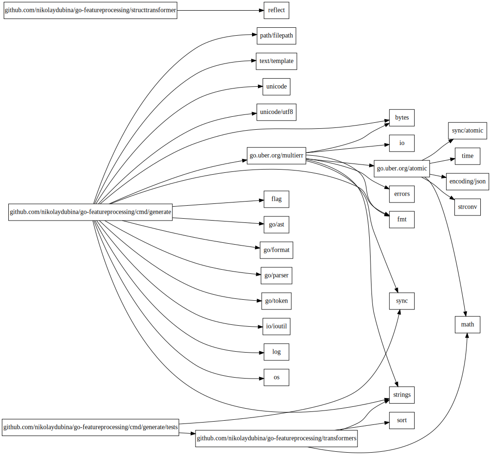

<h1 align="center">Go recipes 🦩 </h1>
<p align="center">Handy commands to run in Go projects</p>

### Find Go versions of upstream modules

> Use this when upgrading version of Go or finding old modules.

```bash
$ go list -deps -json ./... | jq -rc 'select(.Standard!="true") | [.Module.Path,.Module.GoVersion] | join(" ")' | grep -v "^ $" | uniq | sort -k 2
go.uber.org/atomic 1.13
go.uber.org/multierr 1.14
github.com/nikolaydubina/go-featureprocessing 1.15
```

### Make histogram of Go files per package

> Use this to see when package is too big or too small. Adjust histogram length to maximum value.

```bash
$ go list -json ./... | jq -rc '[.ImportPath, (.GoFiles | length)] | join(" ")' | perl -lane 'print (" " x (20 - $F[1]), "=" x $F[1], " ", $F[1], "\t", $F[0])'
  ================== 18	github.com/gin-gonic/gin
       ============= 13	github.com/gin-gonic/gin/binding
                   = 1	github.com/gin-gonic/gin/ginS
                   = 1	github.com/gin-gonic/gin/internal/bytesconv
                   = 1	github.com/gin-gonic/gin/internal/json
         =========== 11	github.com/gin-gonic/gin/render
```

### Find packages without tests

> If code coverage does not report packages without tests. This should be fast and good for CI.

```bash
$ go list -json ./... | jq -rc 'select((.TestGoFiles | length)==0) | .ImportPath'
github.com/gin-gonic/gin/ginS
github.com/gin-gonic/gin/internal/json
```

### Make graph of upstream packages

> Use to find unexpected dependencies, visualize project. Works best for small number of packages. Without `-deps` only for current module.

```bash
$ go list -deps -json ./... | jq -c "select(.Standard!="true") | {from: .ImportPath, to: .Imports[]}" | jsonl-graph | dot -Tsvg > package-graph.svg
```


### Scrape details about upstream modules and make graph

> Use to find low quality, unmaintained dependencies.

```bash
$ go mod graph | import-graph -i=gomod | jsonl-graph -color-scheme=file://$PWD/basic.json | dot -Tsvg > output.svg
```


## Prerequisites

```bash
# get https://graphviz.org/download/
# get https://stedolan.github.io/jq/download/
$ go install github.com/nikolaydubina/jsonl-graph@latest
$ go install github.com/nikolaydubina/import-graph@latest
$ go mod download
```

## Contributions

.. are welcomed! 🤝
