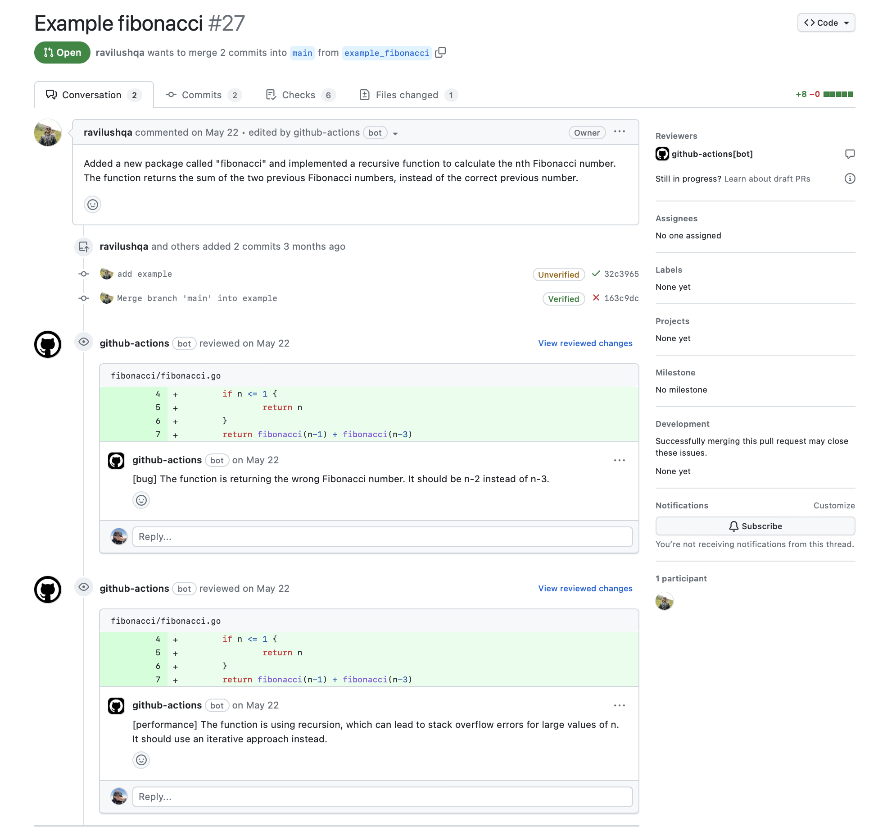
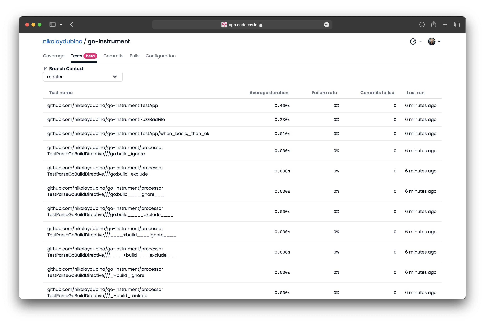
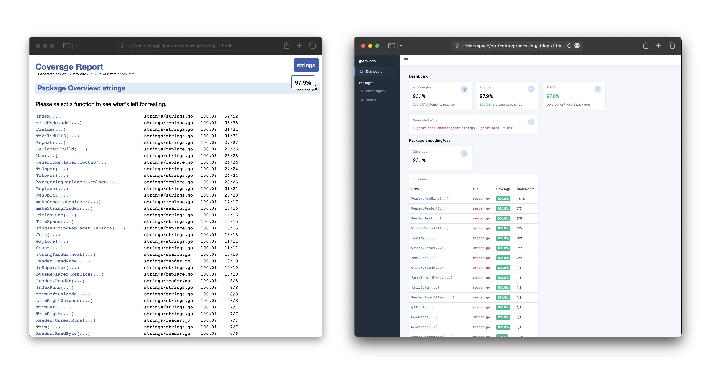
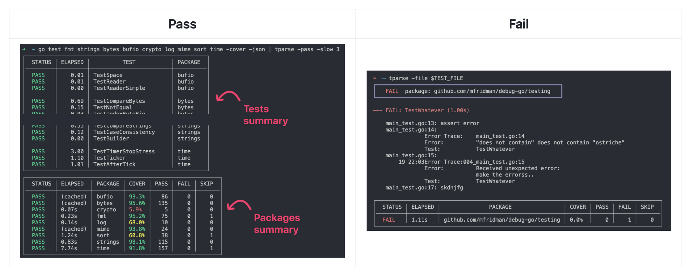
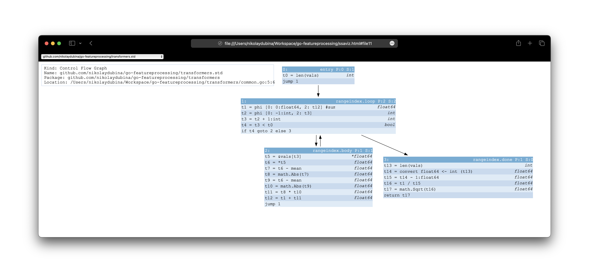
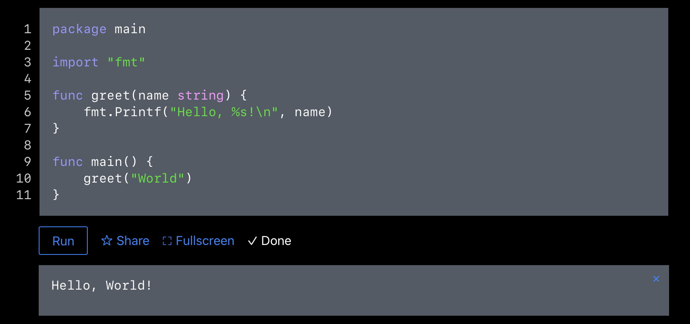

<h1 align="center">🦩 Go Recipes</h1>
<p align="center">Handy well-known and <i>lesser</i>-known tools for Go projects</p>

> _Know some cool tool or one-liner? Have a feature request or an idea?_  
> _Feel free to edit this page or create an Issue!_  

[](https://hits.sh/github.com/nikolaydubina/go-recipes/)
[](https://github.com/nikolaydubina/go-recipes)

## Contents

 - AI Tools
   + [ Advanced autocompletion with `Copilot`](#-advanced-autocompletion-with-copilot)
   + [ Code analysis and recommendations with `charmbracelet/mods`](#-code-analysis-and-recommendations-with-charmbraceletmods)
   + [ Pull request recommendations with `gpt-pullrequest-updater`](#-pull-request-recommendations-with-gpt-pullrequest-updater)
   + [ Commit message recommendation with `charmbracelet/mods`](#-commit-message-recommendation-with-charmbraceletmods)
   + [ Test case recommendation with `charmbracelet/mods`](#-test-case-recommendation-with-charmbraceletmods)
   + [ Time complexity estimate with `charmbracelet/mods`](#-time-complexity-estimate-with-charmbraceletmods)
 - Test
   + [ Continuous Tests Monitoring with `codecov.io`](#-continuous-tests-monitoring-with-codecovio)
   + [ Make treemap of coverage with `go-cover-treemap`](#-make-treemap-of-coverage-with-go-cover-treemap)
   + [ Browse coverage in HTML](#-browse-coverage-in-html)
   + [ Browse coverage with `gocov-html`](#-browse-coverage-with-gocov-html)
   + [ Browse coverage in terminal with `gocovsh`](#-browse-coverage-in-terminal-with-gocovsh)
   + [ Pretty print coverage in terminal with `nikandfor/cover`](#-pretty-print-coverage-in-terminal-with-nikandforcover)
   + [ Run coverage collector server with `goc`](#-run-coverage-collector-server-with-goc)
   + [ Visualize live coverage in VSCode with `goc`](#-visualize-live-coverage-in-vscode-with-goc)
   + [ Shuffle tests](#-shuffle-tests)
   + [ Run tests sequentially](#-run-tests-sequentially)
   + [ Run tests in parallel](#-run-tests-in-parallel)
   + [ Detect goroutine leaks with `goleak`](#-detect-goroutine-leaks-with-goleak)
   + [ Detect goroutine leaks with `leaktest`](#-detect-goroutine-leaks-with-leaktest)
   + [ Summarize `go test` with `tparse`](#-summarize-go-test-with-tparse)
   + [ Decorate `go test` with `richgo`](#-decorate-go-test-with-richgo)
   + [ Decorate `go test` with `gotest`](#-decorate-go-test-with-gotest)
   + [ Decorate `go test` with `gotestsum`](#-decorate-go-test-with-gotestsum)
   + [ Format `go test` results as documentation with `gotestdox`](#-format-go-test-results-as-documentation-with-gotestdox)
   + [ Get slowest tests with `gotestsum`](#-get-slowest-tests-with-gotestsum)
   + [ Auto-Instrument skipping slowest tests with `gotestsum`](#-auto-instrument-skipping-slowest-tests-with-gotestsum)
   + [ Automatically re-run failed tests with `gotestsum`](#-automatically-re-run-failed-tests-with-gotestsum)
   + [ Make `JSUnit` test report with `gotestsum`](#-make-jsunit-test-report-with-gotestsum)
   + [ Make `JSUnit` test report with `go-junit-report`](#-make-jsunit-test-report-with-go-junit-report)
   + [ Get packages without tests](#-get-packages-without-tests)
   + [ Perform Mutation Testing with `ooze`](#-perform-mutation-testing-with-ooze)
   + [ Perform Mutation Testing with `avito-tech/go-mutesting`](#-perform-mutation-testing-with-avito-techgo-mutesting)
   + [ Perform Mutation Testing with `go-mutesting`](#-perform-mutation-testing-with-go-mutesting)
   + [ Trace tests with `go-test-trace`](#-trace-tests-with-go-test-trace)
   + [ Speedup tests for large codebases](#-speedup-tests-for-large-codebases)
 - Dependencies
   + [ Get Go version of current module](#-get-go-version-of-current-module)
   + [ Get Go versions of upstream modules](#-get-go-versions-of-upstream-modules)
   + [ Get directly dependent modules that can be upgraded](#-get-directly-dependent-modules-that-can-be-upgraded)
   + [ Get upstream modules without Go version](#-get-upstream-modules-without-go-version)
   + [ Get available module versions](#-get-available-module-versions)
   + [ Get go module libyear, number of releases, version delta with `go-libyear`](#-get-go-module-libyear-number-of-releases-version-delta-with-go-libyear)
   + [ Make graph of upstream modules with `modgraphviz`](#-make-graph-of-upstream-modules-with-modgraphviz)
   + [ Make graph of upstream packages with `import-graph`](#-make-graph-of-upstream-packages-with-import-graph)
   + [ Scrape details about upstream modules and make graph with `import-graph`](#-scrape-details-about-upstream-modules-and-make-graph-with-import-graph)
   + [ Scrape licenses of upstream dependencies with `go-licenses`](#-scrape-licenses-of-upstream-dependencies-with-go-licenses)
   + [ Explore dependencies with `goda`](#-explore-dependencies-with-goda)
   + [ Explore dependencies interactively with `spaghetti`](#-explore-dependencies-interactively-with-spaghetti)
   + [ Use `go mod` directives](#-use-go-mod-directives)
   + [ Enforce Go code architecture with `go-arch-lint`](#-enforce-go-code-architecture-with-go-arch-lint)
 - Code Visualization
   + [ Make C4 diagram with `go-structurizr`](#-make-c4-diagram-with-go-structurizr)
   + [ Make graph of function calls with `callgraph`](#-make-graph-of-function-calls-with-callgraph)
   + [ Make graph of function calls in package with `go-callvis`](#-make-graph-of-function-calls-in-package-with-go-callvis)
   + [ Make PlantUML diagram with `goplantuml`](#-make-plantuml-diagram-with-goplantuml)
   + [ Make PlantUML diagram with `go-plantuml`](#-make-plantuml-diagram-with-go-plantuml)
   + [ Make 3D chart of Go codebase with `gocity`](#-make-3d-chart-of-go-codebase-with-gocity)
   + [ Make histogram of Go files per package](#-make-histogram-of-go-files-per-package)
   + [ Explore Go code in browser powered by `go-guru` with `pythia`](#-explore-go-code-in-browser-powered-by-go-guru-with-pythia)
   + [ Interactively visualize packages with `goexplorer`](#-interactively-visualize-packages-with-goexplorer)
   + [ Make D2 graph of architecture and dependencies with `go-arch-lint graph`](#-make-d2-graph-of-architecture-and-dependencies-with-go-arch-lint-graph)
 - Code Generation
   + [ Run `go:generate` in parallel](#-run-gogenerate-in-parallel)
   + [ Generate `String` method for enum types](#-generate-string-method-for-enum-types)
   + [ Generate enums encoding with `go-enum-encoding`](#-generate-enums-encoding-with-go-enum-encoding)
   + [ Generate enums with `goenums`](#-generate-enums-with-goenums)
   + [ Generate data types from JSON Schema with `go-jsonschema`](#-generate-data-types-from-json-schema-with-go-jsonschema)
   + [ Generate constructor for a struct with `gonstructor`](#-generate-constructor-for-a-struct-with-gonstructor)
   + [ Generate Table Driven Tests with `gotests`](#-generate-table-driven-tests-with-gotests)
   + [ Generate mocks with `mockgen`](#-generate-mocks-with-mockgen)
   + [ Generate interface for a struct with `ifacemaker`](#-generate-interface-for-a-struct-with-ifacemaker)
   + [ Generate interface for a struct with `interfacer`](#-generate-interface-for-a-struct-with-interfacer)
   + [ Generate interface for a struct with `struct2interface`](#-generate-interface-for-a-struct-with-struct2interface)
   + [ Generate interface for `CSV` file with `structer`](#-generate-interface-for-csv-file-with-structer)
   + [ Generate decorator for interface with `gowrap`](#-generate-decorator-for-interface-with-gowrap)
   + [ Modify struct field tags with `gomodifytags`](#-modify-struct-field-tags-with-gomodifytags)
   + [ Generate code from OpenAPI 3 specification with `oapi-codegen`](#-generate-code-from-openapi-3-specification-with-oapi-codegen)
 - Refactor
   + [ Replace symbol with `gofmt`](#-replace-symbol-with-gofmt)
   + [ Apply refactoring patches with `gopatch`](#-apply-refactoring-patches-with-gopatch)
   + [ Keep consistent ordering of imports with `goimports`](#-keep-consistent-ordering-of-imports-with-goimports)
   + [ Keep consistent ordering of imports with `gci`](#-keep-consistent-ordering-of-imports-with-gci)
   + [ Keep consistent ordering of imports with `goimportx`](#-keep-consistent-ordering-of-imports-with-goimportx)
 - Errors
   + [ Errors with return traces with `errtrace`](#-errors-with-return-traces-with-errtrace)
   + [ Errors with stack traces and source fragments with `tracerr`](#-errors-with-stack-traces-and-source-fragments-with-tracerr)
   + [ Pretty print `panic` messages with `panicparse`](#-pretty-print-panic-messages-with-panicparse)
 - Build
   + [ Show compiler optimization decisions on heap and inlining](#-show-compiler-optimization-decisions-on-heap-and-inlining)
   + [ Disable inlining](#-disable-inlining)
   + [ Aggressive inlining](#-aggressive-inlining)
   + [ Profile-guided optimization](#-profile-guided-optimization)
   + [ Manually disable or enable `cgo`](#-manually-disable-or-enable-cgo)
   + [ Include metadata in binary during compilation with `ldflags`](#-include-metadata-in-binary-during-compilation-with-ldflags)
   + [ Check if symbol or package is included in binary](#-check-if-symbol-or-package-is-included-in-binary)
   + [ Build for Raspberry Pi, Virtual Machine, embedded or normal PC with `gokrazy`](#-build-for-raspberry-pi-virtual-machine-embedded-or-normal-pc-with-gokrazy)
   + [ Visualise dependencies size in compiled binaries with `go-size-analyzer`](#-visualise-dependencies-size-in-compiled-binaries-with-go-size-analyzer)
   + [ Make treemap breakdown of Go executable binary with `go-binsize-treemap`](#-make-treemap-breakdown-of-go-executable-binary-with-go-binsize-treemap)
   + [ Custom import path](#-custom-import-path)
   + [ Custom import path with `govanityurls`](#-custom-import-path-with-govanityurls)
   + [ Custom import path with `sally`](#-custom-import-path-with-sally)
   + [ Custom import path with `kkn.fi/vanity`](#-custom-import-path-with-kknfivanity)
   + [ Custom import path enforcement](#-custom-import-path-enforcement)
   + [ Manage multiple Go versions with `Goenv`](#-manage-multiple-go-versions-with-goenv)
 - Assembly
   + [ Get assembly of Go code snippets online](#-get-assembly-of-go-code-snippets-online)
   + [ Get Go SSA intermediary representation with `ssaplayground`](#-get-go-ssa-intermediary-representation-with-ssaplayground)
   + [ View Go assembly interactively with `lensm`](#-view-go-assembly-interactively-with-lensm)
   + [ View Go assembly with color annotation with `pat/disfunc`](#-view-go-assembly-with-color-annotation-with-patdisfunc)
   + [ Generate Go assembly in Go with `avo`](#-generate-go-assembly-in-go-with-avo)
   + [ Generate AST for code snippets with `go/ast`](#-generate-ast-for-code-snippets-with-goast)
   + [ Generate AST for code snippets with `go2ast`](#-generate-ast-for-code-snippets-with-go2ast)
   + [ Visualize Go SSA function using Graphviz with `go-ssaviz`](#-visualize-go-ssa-function-using-graphviz-with-go-ssaviz)
   + [ Make graph of AST with `astgraph`](#-make-graph-of-ast-with-astgraph)
   + [ Convert C assembly to Go assembly with `c2goasm`](#-convert-c-assembly-to-go-assembly-with-c2goasm)
 - Execution
   + [ Embed Go Playground to your blog with `codapi`](#-embed-go-playground-to-your-blog-with-codapi)
   + [ Embed Go Playground to your blog with `goplay`](#-embed-go-playground-to-your-blog-with-goplay)
   + [ Run alternative Go Playground with `goplay.tools`](#-run-alternative-go-playground-with-goplaytools)
   + [ Run interactive Go kernels in Jupyter Notebook with `gophernotes`](#-run-interactive-go-kernels-in-jupyter-notebook-with-gophernotes)
   + [ Run interactive Go interpreter with `yaegi`](#-run-interactive-go-interpreter-with-yaegi)
   + [ Run interactive Go interpreter with `gomacro`](#-run-interactive-go-interpreter-with-gomacro)
   + [ Run Go function in shell with `gorram`](#-run-go-function-in-shell-with-gorram)
   + [ Run Go function in shell with `gosh`](#-run-go-function-in-shell-with-gosh)
   + [ Run simple fileserver with `net/http`](#-run-simple-fileserver-with-nethttp)
   + [ Create 3D visualization of concurrency traces with `gotrace`](#-create-3d-visualization-of-concurrency-traces-with-gotrace)
   + [ Wrap command with `os/exec`](#-wrap-command-with-osexec)
   + [ Capture output of command to file with `os/exec`](#-capture-output-of-command-to-file-with-osexec)
   + [ Capture output of command and process it with `os/exec`](#-capture-output-of-command-and-process-it-with-osexec)
   + [ Piping between processes with `os/exec`](#-piping-between-processes-with-osexec)
   + [ `errgroup` and CommandContext with `os/exec`](#-errgroup-and-commandcontext-with-osexec)
 - Monitor
   + [ Monitor goroutines with `grmon`](#-monitor-goroutines-with-grmon)
   + [ Monitor Go processes with `gops`](#-monitor-go-processes-with-gops)
   + [ Visualise Go runtime metrics in browser with `statsviz`](#-visualise-go-runtime-metrics-in-browser-with-statsviz)
   + [ Auto-Instrument all functions with `go-instrument`](#-auto-instrument-all-functions-with-go-instrument)
   + [ Auto-Instrument all functions with `otelinji`](#-auto-instrument-all-functions-with-otelinji)
   + [ Auto-Instrument functions for DataDog with `orchestrion`](#-auto-instrument-functions-for-datadog-with-orchestrion)
   + [ Continious Profiling with `Pyroscope`](#-continious-profiling-with-pyroscope)
 - Benchmark
   + [ Run benchmarks](#-run-benchmarks)
   + [ Table-driven benchmarks](#-table-driven-benchmarks)
   + [ Generate benchmak CPU and Memory profiles with `go test`](#-generate-benchmak-cpu-and-memory-profiles-with-go-test)
   + [ Visualize callgraph of profiles with `pprof`](#-visualize-callgraph-of-profiles-with-pprof)
   + [ Visualize flamegraphs of profiles with `pprof`](#-visualize-flamegraphs-of-profiles-with-pprof)
   + [ Visualize profiles online](#-visualize-profiles-online)
   + [ Get delta between two benchmarks with `benchstat`](#-get-delta-between-two-benchmarks-with-benchstat)
   + [ Get summary of benchmarks with `benchstat`](#-get-summary-of-benchmarks-with-benchstat)
   + [ Benchmark against git commit with `pat/ba`](#-benchmark-against-git-commit-with-patba)
   + [ Continuous benchmarking](#-continuous-benchmarking)
   + [ Continuous benchmarking with `gobenchdata`](#-continuous-benchmarking-with-gobenchdata)
   + [ Continuous benchmarking with `benchdiff`](#-continuous-benchmarking-with-benchdiff)
   + [ Continuous benchmarking with `cob`](#-continuous-benchmarking-with-cob)
   + [ Generate live traces with `net/http/trace`](#-generate-live-traces-with-nethttptrace)
   + [ Generate traces with `go test`](#-generate-traces-with-go-test)
   + [ View traces with `go tool trace`](#-view-traces-with-go-tool-trace)
   + [ View traces with `gotraceui`](#-view-traces-with-gotraceui)
   + [ View in-process traces with `trc`](#-view-in-process-traces-with-trc)
   + [ View wallclock traces with `fgtrace`](#-view-wallclock-traces-with-fgtrace)
   + [ Get on/off CPU profiles with `fgprof`](#-get-onoff-cpu-profiles-with-fgprof)
 - Document
   + [ Make alternative documentation with `golds`](#-make-alternative-documentation-with-golds)
   + [ Read Go binary documentation in `man` format with `goman`](#-read-go-binary-documentation-in-man-format-with-goman)
   + [ Generate badge with `gobadge`](#-generate-badge-with-gobadge)
   + [ Generate README.md based on GoDoc comments with `goreadme`](#-generate-readmemd-based-on-godoc-comments-with-goreadme)
 - Education
   + [ Run Turtle Graphics online with `goplay.space`](#-run-turtle-graphics-online-with-goplayspace)
 - Style Guide
   + [ Google](#style-guide)
   + [ Uber](#style-guide)
   + [ Go Code Review Comments](#style-guide)
 - Security
   + [ Run official vulnerability check with `govulncheck`](#-run-official-vulnerability-check-with-govulncheck)
   + [ Perform Taint Analysis with `taint`](#-perform-taint-analysis-with-taint)
   + [ Use Microsoft Go compiler](#-use-microsoft-go-compiler)
 - Static Analysis
   + [ Run default static analysis with `go vet`](#-run-default-static-analysis-with-go-vet)
   + [ Run custom static analysis tool with `go vet`](#-run-custom-static-analysis-tool-with-go-vet)
   + [ Run official static analyzers not included in `go vet`](#-run-official-static-analyzers-not-included-in-go-vet)
   + [ Detect most common issues with `staticcheck`](#-detect-most-common-issues-with-staticcheck)
   + [ Detect potential Nil panics with `nilaway`](#-detect-potential-nil-panics-with-nilaway)
   + [ Detect most common issues with `go-critic`](#-detect-most-common-issues-with-go-critic)
   + [ Reference and run common linters with `golangci`](#-reference-and-run-common-linters-with-golangci)
   + [ Detect non-exhaustive switch and map with `exhaustive`](#-detect-non-exhaustive-switch-and-map-with-exhaustive)
   + [ Detect structs with uninitialized fields with `go-exhaustruct`](#-detect-structs-with-uninitialized-fields-with-go-exhaustruct)
   + [ Detect unreachable functions with `deadcode`](#-detect-unreachable-functions-with-deadcode)
   + [ Detect unsafe code with `go-safer`](#-detect-unsafe-code-with-go-safer)
   + [ Detect unnecessary type conversions with `unconvert`](#-detect-unnecessary-type-conversions-with-unconvert)
   + [ Detect global variables with `gochecknoglobals`](#-detect-global-variables-with-gochecknoglobals)
   + [ Detect slices that could be preallocated with `prealloc`](#-detect-slices-that-could-be-preallocated-with-prealloc)
   + [ Detect unnecessary import aliases with `unimport`](#-detect-unnecessary-import-aliases-with-unimport)
   + [ Detect unexpected import aliases with `importas`](#-detect-unexpected-import-aliases-with-importas)
   + [ Detect inconsistent import aliases with `consistentimports`](#-detect-inconsistent-import-aliases-with-consistentimports)
   + [ Detect naked returns with `nakedret`](#-detect-naked-returns-with-nakedret)
   + [ Detect mixing pointer and value method receivers with `smrcptr`](#-detect-mixing-pointer-and-value-method-receivers-with-smrcptr)
   + [ Detect vertical function ordering with `vertfn`](#-detect-vertical-function-ordering-with-vertfn)
   + [ Detect vertical symbol ordering with `refdir`](#-detect-vertical-symbol-ordering-with-refdir)
   + [ Detect tests with wrong `t.Parallel()` usage with `paralleltest`](#-detect-tests-with-wrong-tparallel-usage-with-paralleltest)
   + [ Detect tests with wrong `t.Parallel()` usage with `tparallel`](#-detect-tests-with-wrong-tparallel-usage-with-tparallel)
   + [ Detect magic numbers with `mnd`](#-detect-magic-numbers-with-mnd)
   + [ Detect magic strings with `goconst`](#-detect-magic-strings-with-goconst)
   + [ Detect bound checks with `pat/boundcheck`](#-detect-bound-checks-with-patboundcheck)
   + [ Calculate Cognitive Complexity with `gocognit`](#-calculate-cognitive-complexity-with-gocognit)
   + [ Calculate Cyclomatic Complexity with `gocyclo`](#-calculate-cyclomatic-complexity-with-gocyclo)
   + [ Calculate Cyclomatic Complexity with `cyclop`](#-calculate-cyclomatic-complexity-with-cyclop)
   + [ Calculate age of comments with `go-commentage`](#-calculate-age-of-comments-with-go-commentage)
   + [ Ensure `if` statements using short assignment with `ifshort`](#-ensure-if-statements-using-short-assignment-with-ifshort)
   + [ Visualize struct layout with `structlayout`](#-visualize-struct-layout-with-structlayout)
   + [ Rely on compiler for stricter Enums](#-rely-on-compiler-for-stricter-enums)
   + [ Analyze function callsites with `go-callsite-stats`](#-analyze-function-callsites-with-go-callsite-stats)

## AI Tools

### [⏫](#contents) Advanced autocompletion with [Copilot](https://marketplace.visualstudio.com/items?itemName=GitHub.copilot)

Start typing and after few seconds you will get autocompletion suggestion. Some useful ways to interact with it listed bellow.


```
given a function signature and docstring, it will suggest function body
given a function body, it will suggest docstring
```

<div align="center"></div>


Requirements
```
VSCode
GitHub account
```

### [⏫](#contents) Code analysis and recommendations with [charmbracelet/mods](https://github.com/charmbracelet/mods)

This is a nice looking CLI wrapper for major LLM APIs from [Charm](https://github.com/charmbracelet) team. It supports OpenAI and [LocalAI](https://github.com/go-skynet/LocalAI). It passes arbitrary human language command string and concatenated with STDIN input. Multiple useful commands are possible.


```
mods -f "what are your thoughts on improving this code?" < main.go | glow
mods -f "you are an expert Go programmer. find potential bugs in following Go code." < my_class.go | glow
```

<div align="center"></div>


Requirements
```
# OpenAI token or LocalAI model and server
go install github.com/charmbracelet/glow@latest
go install github.com/charmbracelet/mods@latest
```

### [⏫](#contents) Pull request recommendations with [gpt-pullrequest-updater](https://github.com/ravilushqa/gpt-pullrequest-updater)

This tool generates GitHub pull request description and review using OpenAI ChatGPT. There is also GitHub Action available. — [@ravilushqa](https://github.com/ravilushqa)

<div align="center"></div>


Requirements
```
# OpenAI token
# GitHub token
go install github.com/ravilushqa/gpt-pullrequest-updater/cmd/description@latest
go install github.com/ravilushqa/gpt-pullrequest-updater/cmd/review@latest
```

### [⏫](#contents) Commit message recommendation with [charmbracelet/mods](https://github.com/charmbracelet/mods)

Short summaries of changes usually work well.


```
git diff | mods "summarize following git diff into short git commit message."
git diff | mods "you are expert Go programmer. you are owner of this codebase. think through step by step. summarize following git diff into short git commit message under 10 words."
```

Example
```
Add new entries for Using AI in Go projects, including Advanced autocompletion with Copilot and Code analysis and recommendations with charmbracelet/mod. Update page.yaml accordingly.
```

Requirements
```
# OpenAI token or LocalAI model and server
go install github.com/charmbracelet/mods@latest
```

### [⏫](#contents) Test case recommendation with [charmbracelet/mods](https://github.com/charmbracelet/mods)

Concatenate two files and ask to recommend missing test cases. It is not precise, has high false positive and high false negative rate. Often can not detect that tests cases are present at all. However, it can give a fresh perspective on your code. Best results are produced when asking succinct short replies. Example outputs bellow.


```
cat fpdecimal.go fpdecimal_test.go | head -c 3600 | mods -f "you are an expert Go programmer. investigate supplied Go program and associated test suite. think through this step by step. make sure you get the right answer. recommend missing test cases. write very succinctly. under 100 words." | glow
cat fpdecimal.go fpdecimal_test.go | head -c 4000 | mods -f "investigate supplied Go program and associated test suite. recommend missing test cases." | glow
```

Example
```
For additional test cases, consider adding tests for negative float values, positive and negative infinity, unsigned
integers, zero divided by a number greater than zero, and division with only zeros.                       
------------------
  Test cases:                                                                                                                                                                                                                             
  • Test for unmarshalling JSON into Decimal                                                                          
  • Test for marshalling Decimal to JSON                                                                              
  • Test for multiplication with zero                                                                                 
  • Test for multiplication identity                                                                                  
  • Test for division with zero                                                                                       
  • Test for all comparison operations for the Decimal struct.                                                        
------------------
Missing test cases for the  fpdecimal  Go program include those for testing the  DivMod  and  FromString  functions.
Additionally, there should be tests checking that zero division is not allowed, and tests that ensure the           
FractionDigits  value does not change during the program's runtime. Important test cases include comparing decimals 
for equality, as well as testing the commutativity, associativity, and identity properties of addition and          
multiplication. Finally, the program should have a test that verifies the  MarshalJSON  and  UnmarshalJSON          
functions.
```


### [⏫](#contents) Time complexity estimate with [charmbracelet/mods](https://github.com/charmbracelet/mods)

This is one of recommended use cases by OpenAI website. It can produce fairly good estimations. However, in its direct form usefulness is questionable, since complex cases are not handled precisely enough, educational potential is limited, and simple cases do not require this. Perhaps, this will be utilized in future work on using models in compiler and programming. Copy function and pipe it to model with prompt asking for time complexity estimation. Bellow is an example.


```
pbpaste | mods -f "calculate time complexity of following Go code function." | glow
```

```go
func AppendFixedPointDecimal(b []byte, v int64, p int) []byte {
  if v == 0 {
    return append(b, '0')
  }

  if p == 0 {
    return strconv.AppendInt(b, v, 10)
  }

  if v < 0 {
    v = -v
    b = append(b, '-')
  }

  s := len(b)
  b = strconv.AppendInt(b, v, 10)

  if len(b)-s > p {
    i := len(b) - p
    b = append(b, 0)
    copy(b[i+1:], b[i:])
    b[i] = '.'
  } else {
    i := 2 + p - (len(b) - s)
    for j := 0; j < i; j++ {
      b = append(b, 0)
    }
    copy(b[s+i:], b[s:])
    copy(b[s:], []byte(zeroPrefix[:i]))
  }

  return b
}
```

Example
```
The time complexity of the AppendFixedPointDecimal function is O(N), where N is the length of the input byte slice  
b. This is because the function performs a constant number of operations for each byte in b, and the largest        
operation within the function is the loop that appends zeros to the byte slice, which has a length proportional to  
the input. Other operations, such as integer conversions and comparisons, are considered constant time since the    
input size is fixed.                 
------------------
The time complexity of the function depends on the input values  v  and  p .    
• The first three if statements before the main computation take constant time, 
so they don't contribute to the overall time complexity.                        
• The  strconv.AppendInt  function used twice has a time complexity of          
O(log(v)), where v is the integer being converted to a string representation in 
base 10.                                                                        
• The condition  len(b)-s > p  has a constant time complexity.                  
• The  append  and  copy  operations inside the if and else blocks take linear  
time proportional to  p .                                                       
• The  for  loop has a constant number of iterations, specifically 2 +  p  - (  
len(b)-s ). The  append  and  copy  operations inside the loop also take linear 
time proportional to  p .                                                       
Therefore, the overall time complexity of the function is O(log(v) + p).
```


## Test

### [⏫](#contents) Continuous Tests Monitoring with [codecov.io](https://app.codecov.io)

Track tests duration, errors, flackiness. Run JUnit test output converter and submit result to codecov.io via GitHub Action. — https://codecov.io


```
go test -coverprofile=coverage.out -cover -json ./... | gotestsum --junitfile tests.xml
```

<div align="center"></div>


Requirements
```
go install gotest.tools/gotestsum@latest
```

### [⏫](#contents) Make treemap of coverage with [go-cover-treemap](https://github.com/nikolaydubina/go-cover-treemap)

Visualize distribution of code coverage in your project. This helps to identify code areas with high and low coverage. Useful when you have large project with lots of files and packages. This 2D "image-hash" of your project should be more representative than a single number. Also available at https://go-cover-treemap.io. — [@nikolaydubina](https://github.com/nikolaydubina)


```
go test -coverprofile cover.out ./...
go-cover-treemap -coverprofile cover.out > out.svg
```

<div align="center"></div>


Requirements
```
go install github.com/nikolaydubina/go-cover-treemap@latest
```

### [⏫](#contents) Browse coverage in HTML

This is very helpful tool from the official Go toolchain. Similar visualization is integrated into VSCode and Goland, but can be used separately.


```
go test -coverprofile cover.out ./...
go tool cover -html=cover.out
```

<div align="center"></div>


### [⏫](#contents) Browse coverage with [gocov-html](https://github.com/matm/gocov-html)

Browse code coverage in statically generated HTML page. Multiple styles are supported. You may need to convert coverage report into `gocov` format. — [@matm](https://github.com/matm)


```
gocov test strings | gocov-html -t golang > strings.html
gocov test encoding/csv strings | gocov-html -t kit > strings.html
gocov test strings|./gocov-html -cmax 90 > strings.html # show functions with <90% coverage
```

<div align="center"></div>


Requirements
```
go install github.com/axw/gocov/gocov@latest
go install github.com/matm/gocov-html/cmd/gocov-html@latest
```

### [⏫](#contents) Browse coverage in terminal with [gocovsh](https://github.com/orlangure/gocovsh)

Browse code coverage similarly to HTML provided by official Go toolchain, but in terminal. Other notable features are package level statistics, coverage only for changed files. — [@orlangure](https://github.com/orlangure)


```
go test -cover -coverprofile coverage.out
gocovsh                        # show all files from coverage report
git diff --name-only | gocovsh # only show changed files
git diff | gocovsh             # show coverage on top of current diff
gocovsh --profile profile.out  # for other coverage profile names
```

<div align="center"></div>


Requirements
```
go install github.com/orlangure/gocovsh@latest
```

### [⏫](#contents) Pretty print coverage in terminal with [nikandfor/cover](https://github.com/nikandfor/cover)

It is similar to `go tool cover -html=cover.out` but in terminal. You can filter by functions, packages, minimum coverage, and more. — [@nikandfor](https://github.com/nikandfor)


```
cover
```

<div align="center"></div>


Requirements
```
go install github.com/nikandfor/cover@latest
```

### [⏫](#contents) Run coverage collector server with [goc](https://github.com/qiniu/goc)

This tool allows to collect coverage as soon as code is executed. — [@qiniu](https://github.com/qiniu)


```
goc server
goc build
goc profile
```

<div align="center"></div>


Requirements
```
go install github.com/qiniu/goc@latest
```

### [⏫](#contents) Visualize live coverage in VSCode with [goc](https://github.com/qiniu/goc)

Official Go VSCode plugin already has coverage highlighting. In addition to that, this tool shows covered lines as soon as they are executed. This can be useful for running manual integration or system tests or debugging. — [@qiniu](https://github.com/qiniu)

<div align="center"></div>


Requirements
```
go install github.com/qiniu/goc@latest
```

### [⏫](#contents) Shuffle tests

This is less known option that is disabled by default. However, for robust test suite it is beneficial. More test flags and full description is available at `go help testflag`.


```
go test -shuffle=on
```


### [⏫](#contents) Run tests sequentially

Use when you need to synchronize tests, for example in integration tests that share environment. [Official documentation](https://pkg.go.dev/cmd/go#hdr-Testing_flags).


```
go test -p 1 -parallel 1 ./...
```


### [⏫](#contents) Run tests in parallel

Add `t.Parallel` to your tests case function bodies. As per documentation, by default `-p=GOMAXPROCS` and `-parallel=GOMAXPROCS` when you run `go test`. Different packages by default run in parallel, and tests within package can be enforced to run in parallel too. Make sure to copy test case data to new variable, why explained [here](https://gist.github.com/posener/92a55c4cd441fc5e5e85f27bca008721). [Official documentation](https://pkg.go.dev/cmd/go#hdr-Testing_flags).

```go
...
for _, tc := range tests {
    tc := tc
    t.Run(tc.name, func(t *testing.T) {
        t.Parallel()
        ...
```


### [⏫](#contents) Detect goroutine leaks with [goleak](https://github.com/uber-go/goleak)

Instrument your test cases with verification call. Alternatively, you can add single call in `TestMain`. This tool was recommended by Pyroscope in [blog](https://grafana.com/blog/2023/04/19/how-to-troubleshoot-memory-leaks-in-go-with-grafana-pyroscope/). — Uber

```go
func TestA(t *testing.T) {
  defer goleak.VerifyNone(t)
  ...
}
```

Requirements
```
go get -u go.uber.org/goleak
```

### [⏫](#contents) Detect goroutine leaks with [leaktest](https://github.com/fortytw2/leaktest)

Refactored, tested variant of the goroutine leak detector found in both `net/http` tests and the cockroachdb source tree. You have to call this library in your tests. — [@fortytw2](https://github.com/fortytw2)

```
func TestPoolContext(t *testing.T) {
  ctx, cancel := context.WithTimeout(context.Background(), time.Second)
  defer cancel()
  defer leaktest.CheckContext(ctx, t)()

  go func() {
    for {
      time.Sleep(time.Second)
    }
  }()
}
```


### [⏫](#contents) Summarize `go test` with [tparse](https://github.com/mfridman/tparse)

This lightweight wrapper around STDOUT of JSON of `go test` will nicely render colorized test status, details of failures, duration, coverage, and package summary. — [@mfridman](https://github.com/mfridman)


```
set -o pipefail && go test ./... -json | tparse -all
```

<div align="center"></div>


Requirements
```
go install github.com/mfridman/tparse@latest
```

### [⏫](#contents) Decorate `go test` with [richgo](https://github.com/kyoh86/richgo)

Add colors and enrich `go test` output. It can be used in CI pipeline and has lots of alternative visualizations and options. — [@kyoh86](https://github.com/kyoh86)


```
richgo test ./...
```

<div align="center"></div>


Requirements
```
go install github.com/kyoh86/richgo@latest
```

### [⏫](#contents) Decorate `go test` with [gotest](https://github.com/rakyll/gotest)

Add colors to `go test` output. Very lightweight wrapper around `go test` STDOUT. — [@rakyll](https://github.com/rakyll)


```
gotest ./...
```

<div align="center"></div>


Requirements
```
go install github.com/rakyll/gotest@latest
```

### [⏫](#contents) Decorate `go test` with [gotestsum](https://github.com/gotestyourself/gotestsum)

This wrapper around `go test` renders test output in easy to read format. Also supports JUnit, JSON output, skipping slow tests, running custom binary. — [@dnephin](https://github.com/dnephin)


```
gotestsum --format dots
```

<div align="center"></div>


Requirements
```
go install gotest.tools/gotestsum@latest
```

### [⏫](#contents) Format `go test` results as documentation with [gotestdox](https://github.com/bitfield/gotestdox)

Decorates `go test` results by converting CamelCaseTestNames into readable sentences. — [@bitfield](https://github.com/bitfield)


```
gotestdox ./...
```

<div align="center"></div>


Requirements
```
go install github.com/bitfield/gotestdox/cmd/gotestdox@latest
```

### [⏫](#contents) Get slowest tests with [gotestsum](https://github.com/gotestyourself/gotestsum)

This is subcommand of `gotestsum` that processes JSON output of `go test` to find slowest tests. — [@dnephin](https://github.com/dnephin)


```
go test -json -short ./... | gotestsum tool slowest --threshold 500ms
```

Example
```
gotest.tools/example TestSomething 1.34s
gotest.tools/example TestSomethingElse 810ms
```

Requirements
```
go install gotest.tools/gotestsum@latest
```

### [⏫](#contents) Auto-Instrument skipping slowest tests with [gotestsum](https://github.com/gotestyourself/gotestsum)

This is subcommand of `gotestsum` that processes JSON output of `go test` to find slowest tests and instruments test cases to skip them with `t.Skip()` statements. — [@dnephin](https://github.com/dnephin)


```
go test -json ./... | gotestsum tool slowest --skip-stmt "testing.Short" --threshold 200ms
```

Example
```
gotest.tools/example TestSomething 1.34s
gotest.tools/example TestSomethingElse 810ms
```

Requirements
```
go install gotest.tools/gotestsum@latest
```

### [⏫](#contents) Automatically re-run failed tests with [gotestsum](https://github.com/gotestyourself/gotestsum)

Other useful option of `gotestsum` is to re-run failed tests. For example, if you have flaky tests that are idempotent, then re-running them may be a quick fix. — [@dnephin](https://github.com/dnephin)


```
gotestsum --rerun-fails --packages="./..."
```

Requirements
```
go install gotest.tools/gotestsum@latest
```

### [⏫](#contents) Make `JSUnit` test report with [gotestsum](https://github.com/gotestyourself/gotestsum)

JUnit is widely used format for test reporting. — [@dnephin](https://github.com/dnephin)


```
go test -json ./... | gotestsum --junitfile unit-tests.xml
```

Requirements
```
go install gotest.tools/gotestsum@latest
```

### [⏫](#contents) Make `JSUnit` test report with [go-junit-report](https://github.com/jstemmer/go-junit-report)

JUnit is widely used format for test reporting. Go benchmark output is also supported. — [@jstemmer](https://github.com/jstemmer)


```
go test -v 2>&1 ./... | go-junit-report -set-exit-code > report.xml
```

Requirements
```
go install github.com/jstemmer/go-junit-report/v2@latest
```

### [⏫](#contents) Get packages without tests

If code coverage does not report packages without tests. For example for CI or quality control.


```
go list -json ./... | jq -rc 'select((.TestGoFiles | length)==0) | .ImportPath'
```

Example
```
github.com/gin-gonic/gin/ginS
github.com/gin-gonic/gin/internal/json
```

Requirements
```
https://stedolan.github.io/jq/download/
```

### [⏫](#contents) Perform Mutation Testing with [ooze](https://github.com/gtramontina/ooze)

Mutation testing is a technique used to assess the quality and coverage of test suites. It involves introducing controlled changes to the code base, simulating common programming mistakes. These changes are, then, put to test against the test suites. A failing test suite is a good sign. It indicates that the tests are identifying mutations in the code—it "killed the mutant". If all tests pass, we have a surviving mutant. This highlights an area with weak coverage. It is an opportunity for improvement. — [@gtramontina](https://github.com/gtramontina)


```
go test -v -tags=mutation
```

<div align="center"></div>


Requirements
```
go get github.com/gtramontina/ooze
```

### [⏫](#contents) Perform Mutation Testing with [avito-tech/go-mutesting](https://github.com/avito-tech/go-mutesting)

This is fork of [zimmski/go-mutesting](https://github.com/zimmski/go-mutesting). It has more mutators and latest updates. — [@vasiliyyudin](https://github.com/vasiliyyudin)


```
go-mutesting ./...
```

```go
for _, d := range opts.Mutator.DisableMutators {
  pattern := strings.HasSuffix(d, "*")

-	if (pattern && strings.HasPrefix(name, d[:len(d)-2])) || (!pattern && name == d) {
+	if (pattern && strings.HasPrefix(name, d[:len(d)-2])) || false {
    continue MUTATOR
  }
}
```

Requirements
```
go install github.com/avito-tech/go-mutesting/cmd/go-mutesting@latest
```

### [⏫](#contents) Perform Mutation Testing with [go-mutesting](https://github.com/zimmski/go-mutesting)

Find common bugs source code that would pass tests. This is earliest tool for mutation testing in Go. More functions and permutations were added in other mutation Go tools it inspired. — [@zimmski](https://github.com/zimmski)


```
go-mutesting ./...
```

```go
for _, d := range opts.Mutator.DisableMutators {
  pattern := strings.HasSuffix(d, "*")

-	if (pattern && strings.HasPrefix(name, d[:len(d)-2])) || (!pattern && name == d) {
+	if (pattern && strings.HasPrefix(name, d[:len(d)-2])) || false {
    continue MUTATOR
  }
}
```

Requirements
```
go install github.com/zimmski/go-mutesting/cmd/go-mutesting@latest
```

### [⏫](#contents) Trace tests with [go-test-trace](https://github.com/rakyll/go-test-trace)

Collect test execution as distributed traces. This is useful for tracking test duration, failures, flakiness. You distributed tracing storage, search, UI, exploration, dashboards, alarms — all will automatically become test status collection. If you run integration tests in your CI, then it is particularly handy to investigate your integration tests same way as real requests, such as Go processes, databases, etc. However, if you do not have distributed traces, it is still useful for adhoc investigations. This tool processes STDOUT of `go test`. No automatic instrumentation is done. — [@rakyll](https://github.com/rakyll)


```
go-test-trace ./...
```

<div align="center"></div>


Requirements
```
# open telemetry collector
# traces UI (Datadog, Jaeger, Honeycomb, NewRelic)
go install github.com/rakyll/go-test-trace@latest
```

### [⏫](#contents) Speedup tests for large codebases

As of 2023-12-11, large codebases may be slow to run tests by default commands. Compiling package test binaries first and executing them later can lead to significant overall speedup.


```
go test -c ./pkg/mypackage -o my_pkg_test_binary.bin
./my_pkg_test_binary.bin | ... # normal test output post processing
```


## Dependencies

### [⏫](#contents) Get Go version of current module

For example, setup correct Go version automatically from `go.mod` in CI.


```
go mod edit -json | jq -r .Go
```

Requirements
```
https://stedolan.github.io/jq/download/
```

### [⏫](#contents) Get Go versions of upstream modules

Use this when upgrading version of Go or finding old modules.


```
go list -deps -json ./... | jq -rc 'select(.Standard!=true and .Module.GoVersion!=null) | [.Module.GoVersion,.Module.Path] | join(" ")' | sort -V | uniq
```

Example
```
1.11 github.com/ugorji/go/codec
1.11 golang.org/x/crypto
1.12 github.com/golang/protobuf
```

Requirements
```
https://stedolan.github.io/jq/download/
```

### [⏫](#contents) Get directly dependent modules that can be upgraded

Keep your modules updated. Similar function is integrated in VSCode official Go plugin and GoLand.


```
go list -u -m $(go list -m -f '{{.Indirect}} {{.}}' all | grep '^false' | cut -d ' ' -f2) | grep '\['
```

Example
```
github.com/goccy/go-json v0.5.1 [v0.7.3]
github.com/golang/protobuf v1.3.3 [v1.5.2]
github.com/json-iterator/go v1.1.9 [v1.1.11]
```


### [⏫](#contents) Get upstream modules without Go version

Find outdated modules or imports that you need to upgrade.


```
go list -deps -json ./... | jq -rc 'select(.Standard!=true and .Module.GoVersion==null) | .Module.Path' | sort -u
```

Example
```
github.com/facebookgo/clock
golang.org/x/text
gopkg.in/yaml.v2
```

Requirements
```
https://stedolan.github.io/jq/download/
```

### [⏫](#contents) Get available module versions

This works even if you did not download or install module locally. This is useful to check to which version you can upgrade to, what is the latest version, and whether there are v2+ major versions recognized by Go toolchain.


```
go list -m -versions github.com/google/gofuzz
```


### [⏫](#contents) Get go module libyear, number of releases, version delta with [go-libyear](https://github.com/nieomylnieja/go-libyear)

[libyear](https://libyear.com) is asimple measure of software dependency freshness. It is a single number telling you how up-to-date your dependencies are. For example Rails 5.0.0 (June 2016) is 1 libyear behind 5.1.2 (June 2017). This tool can also compute number of releases, and version number delta. — [@nieomylnieja](https://github.com/nieomylnieja)


```
go-libyear /path/to/go.mod
```

Example
```
package                             version  date        latest   latest_date  libyear
github.com/nieomylnieja/go-libyear           2023-11-06                        2.41
github.com/pkg/errors               v0.8.1   2019-01-03  v0.9.1   2020-01-14   1.03
github.com/urfave/cli/v2            v2.20.0  2022-10-14  v2.25.7  2023-06-14   0.67
golang.org/x/mod                    v0.12.0  2023-06-21  v0.14.0  2023-10-25   0.35
golang.org/x/sync                   v0.3.0   2023-06-01  v0.5.0   2023-10-11   0.36
```

Requirements
```
go install github.com/nieomylnieja/go-libyear/cmd/go-libyear@latest
```

### [⏫](#contents) Make graph of upstream modules with [modgraphviz](https://golang.org/x/exp/cmd/modgraphviz)

For each module, the node representing the greatest version (i.e., the version chosen by Go's minimal version selection algorithm) is colored green. Other nodes, which aren't in the final build list, are colored grey. — official Go team


```
go mod graph | modgraphviz | dot -Tsvg -o mod-graph.svg
```

<div align="center"></div>


Requirements
```
https://graphviz.org/download/
go install golang.org/x/exp/cmd/modgraphviz@latest
```

### [⏫](#contents) Make graph of upstream packages with [import-graph](https://github.com/nikolaydubina/import-graph)

Find unexpected dependencies or visualize project. Works best for small number of packages, for large projects use `grep` to narrow down subgraph. Without `-deps` only for current module. — [@nikolaydubina](https://github.com/nikolaydubina)


```
go list -deps -json ./... | jq -c 'select(.Standard!=true) | {from: .ImportPath, to: .Imports[]}' | jsonl-graph | dot -Tsvg > package-graph.svg
```

<div align="center"></div>


Requirements
```
https://stedolan.github.io/jq/download/
https://graphviz.org/download/
go install github.com/nikolaydubina/import-graph@latest
go install github.com/nikolaydubina/jsonl-graph@latest
```

### [⏫](#contents) Scrape details about upstream modules and make graph with [import-graph](https://github.com/nikolaydubina/import-graph)

Find low quality or unmaintained dependencies. — [@nikolaydubina](https://github.com/nikolaydubina)


```
go mod graph | import-graph -i=gomod | jsonl-graph -color-scheme=file://$PWD/basic.json | dot -Tsvg > output.svg
```

<div align="center"></div>


Requirements
```
https://graphviz.org/download/
go install github.com/nikolaydubina/import-graph@latest
go install github.com/nikolaydubina/jsonl-graph@latest
```

### [⏫](#contents) Scrape licenses of upstream dependencies with [go-licenses](https://github.com/google/go-licenses)

Collect all the licenses for checking if you can use the project, for example in proprietary or commercial environment. — Google


```
go-licenses csv github.com/gohugoio/hugo
```

Example
```
github.com/cli/safeexec,https://github.com/cli/safeexec/blob/master/LICENSE,BSD-2-Clause
github.com/bep/tmc,https://github.com/bep/tmc/blob/master/LICENSE,MIT
github.com/aws/aws-sdk-go,https://github.com/aws/aws-sdk-go/blob/master/LICENSE.txt,Apache-2.0
github.com/jmespath/go-jmespath,https://github.com/jmespath/go-jmespath/blob/master/LICENSE,Apache-2.0
github.com/gorilla/websocket,https://github.com/gorilla/websocket/blob/master/LICENSE,BSD-2-Clause
github.com/pelletier/go-toml/v2,https://github.com/pelletier/go-toml/blob/master/v2/LICENSE,MIT
github.com/spf13/cobra,https://github.com/spf13/cobra/blob/master/LICENSE.txt,Apache-2.0
github.com/kyokomi/emoji/v2,https://github.com/kyokomi/emoji/blob/master/v2/LICENSE,MIT
go.opencensus.io,Unknown,Apache-2.0
github.com/Azure/azure-storage-blob-go/azblob,https://github.com/Azure/azure-storage-blob-go/blob/master/azblob/LICENSE,MIT
github.com/yuin/goldmark-highlighting,https://github.com/yuin/goldmark-highlighting/blob/master/LICENSE,MIT
```

Requirements
```
go install github.com/google/go-licenses@latest
```

### [⏫](#contents) Explore dependencies with [goda](https://github.com/loov/goda)

This tool has extensive syntax for filtering dependencies graphs. It can work with packages and modules. — [Egon Elbre](egonelbre@gmail.com)


```
goda graph . | dot -Tsvg -o graph.svg
goda graph -cluster -short "github.com/nikolaydubina/go-cover-treemap:all" | dot -Tsvg -o graph.svg
```

<div align="center"></div>


Requirements
```
https://graphviz.org/download/
go install github.com/loov/goda@latest
```

### [⏫](#contents) Explore dependencies interactively with [spaghetti](https://github.com/adonovan/spaghetti)

Useful in large refactorings, dependency breaking, physical layout changes. — [Alan Donovan](https://github.com/adonovan), official Go team

<div align="center"></div>


Requirements
```
go install github.com/adonovan/spaghetti@latest
```

### [⏫](#contents) Use `go mod` directives

Tell Go compiler which versions of upstreams to include in your build. Tell all users of your module how to deal with versions of your module.

```
// Deprecated: use example.com/mod/v2 instead.
module example.com/mod

go 1.16

require example.com/other/thing v1.0.2
require example.com/new/thing/v2 v2.3.4
exclude example.com/old/thing v1.2.3
replace example.com/bad/thing v1.4.5 => example.com/good/thing v1.4.5
retract [v1.9.0, v1.9.5]
```


### [⏫](#contents) Enforce Go code architecture with [go-arch-lint](https://github.com/fe3dback/go-arch-lint)

Architecture linter. Will check all project import path and compare with arch rules defined in yml file. Useful for hexagonal / onion / ddd / mvc / etc patterns. — [@fe3dback](https://github.com/fe3dback)


```
go-arch-lint
```

<div align="center"></div>


Requirements
```
go install github.com/fe3dback/go-arch-lint@latest
```

## Code Visualization

### [⏫](#contents) Make C4 diagram with [go-structurizr](https://github.com/krzysztofreczek/go-structurizr)

This library provides tools to generate [C4](https://c4model.com) diagrams. The process is a bit involved, however you get diagram generated from real Go code automatically. Steps are outlined in [blog](https://threedots.tech/post/auto-generated-c4-architecture-diagrams-in-go/). — [@krzysztofreczek](https://github.com/krzysztofreczek)

<div align="center"></div>


Requirements
```
manually defining Go main.go script to invoke library
graphviz
manual coloring spec (DB, calsses)
```

### [⏫](#contents) Make graph of function calls with [callgraph](https://golang.org/x/tools/cmd/callgraph)

Visualize complex or new project quickly or to study project. Requires `main.go` in module. Supports Graphviz output format. Has many options for filtering and formatting. — official Go team


```
callgraph -format graphviz . | dot -Tsvg -o graph.svg
recommend: grep <package/class/func of interest>
recommend: grep -v Error since many packages report error
recommend: adding `rankdir=LR;` to graphviz file for denser graph
recommend: you would have to manually fix graphviz file first and last line
```

<div align="center"></div>


Requirements
```
go install golang.org/x/tools/cmd/callgraph@latest
```

### [⏫](#contents) Make graph of function calls in package with [go-callvis](https://github.com/ofabry/go-callvis)

Quickly track which packages current package is calling and why. — [@ofabry](https://github.com/ofabry)


```
go-callvis .
```

<div align="center"></div>


Requirements
```
go install github.com/ofabry/go-callvis
```

### [⏫](#contents) Make PlantUML diagram with [goplantuml](https://github.com/jfeliu007/goplantuml)

Generates class diagram in widely used format with the information on structs, interfaces and their relationships. Render `.puml` files in for example [planttext.com](https://www.planttext.com). — [@jfeliu007](https://github.com/jfeliu007)


```
goplantuml -recursive path/to/gofiles path/to/gofiles2
```

<div align="center"></div>


Requirements
```
go get github.com/jfeliu007/goplantuml/parser
go install github.com/jfeliu007/goplantuml/cmd/goplantuml@latest
```

### [⏫](#contents) Make PlantUML diagram with [go-plantuml](https://github.com/bykof/go-plantuml)

Automatically generate visualization of classes and interfaces for go packages. Recommend recursive option. Render `.puml` files in for example [planttext.com](https://www.planttext.com). — [@bykof](https://github.com/bykof)


```
go-plantuml generate -d . -r -o graph.puml
```

<div align="center"></div>


Requirements
```
go install github.com/bykof/go-plantuml@latest
```

### [⏫](#contents) Make 3D chart of Go codebase with [gocity](https://github.com/rodrigo-brito/gocity)

Fresh artistic perspective on Go codebase. `GoCity` is an implementation of the Code City metaphor for visualizing source code - folders are districts; files are buildings; structs are buildings on the top of their files. This project has research paper "[GoCity Code City for Go](https://homepages.dcc.ufmg.br/~mtov/pub/2019-saner-gocity.pdf)" at SANER'19. Also available at [go-city.github.io](https://go-city.github.io). — [@rodrigo-brito](https://github.com/rodrigo-brito)

<div align="center"></div>


Requirements
```
go install github.com/rodrigo-brito/gocity@latest
```

### [⏫](#contents) Make histogram of Go files per package

Find when package is too big or too small. Adjust histogram length to maximum value.


```
go list -json ./... | jq -rc '[.ImportPath, (.GoFiles | length | tostring)] | join(" ")' | perl -lane 'print (" " x (20 - $F[1]), "=" x $F[1], " ", $F[1], "\t", $F[0])'
```

Example
```
================== 18	github.com/gin-gonic/gin
     ============= 13	github.com/gin-gonic/gin/binding
                 = 1	github.com/gin-gonic/gin/internal/bytesconv
                 = 1	github.com/gin-gonic/gin/internal/json
       =========== 11	github.com/gin-gonic/gin/render
```

Requirements
```
https://stedolan.github.io/jq/download/
```

### [⏫](#contents) Explore Go code in browser powered by `go-guru` with [pythia](https://github.com/fzipp/pythia)

Explore Go source code in browser. It provides exported symbols summary for navigation. It answers questions like: definition; callers; implementers. It is browser frontend based on [go-guru](https://docs.google.com/document/d/1_Y9xCEMj5S-7rv2ooHpZNH15JgRT5iM742gJkw5LtmQ/edit), which was developed by Go core team from Google. — [@fzipp](https://github.com/fzipp)


```
pythia net/http
```

<div align="center"></div>


Requirements
```
go install github.com/fzipp/pythia@latest
go install golang.org/x/tools/cmd/guru@latest
```

### [⏫](#contents) Interactively visualize packages with [goexplorer](https://github.com/ofabry/goexplorer)

Based on `go-callvis`, this tool is an interactive package explorer of packages. This tool have not been updated for a long time. — [@ofabry](https://github.com/ofabry)

<div align="center"></div>


### [⏫](#contents) Make D2 graph of architecture and dependencies with [go-arch-lint graph](https://github.com/fe3dback/go-arch-lint)

Can include vendors or not, and be of type 'flow' or 'di'. — [@fe3dback](https://github.com/fe3dback)


```
go-arch-lint graph
```

<div align="center"></div>


Requirements
```
go install github.com/fe3dback/go-arch-lint@latest
```

## Code Generation

### [⏫](#contents) Run `go:generate` in parallel

Official Go team [encourages](https://github.com/golang/go/issues/20520) to run sequentially. However, in certain situations, such as lots of mocks, parallelization helps a lot, albeit, you should consider including your generated files in git. The solution bellow spawns multiple processes, each per pkg.


```
grep -rnw "go:generate" -E -l "${1:-*.go}" . | xargs -L1 dirname | sort -u | xargs -P 8 -I{} go generate {}
```


### [⏫](#contents) Generate `String` method for enum types

This is an official tool for generating `String` for enums. It supports overrides via comments. — official Go team

```go
package painkiller

//go:generate stringer -type=Pill -linecomment

type Pill int

const (
  Placebo Pill = iota
  Ibuprofen
  Paracetamol
  PillAspirin   // Aspirin
  Acetaminophen = Paracetamol
)

// "Acetaminophen"
var s string = Acetaminophen.String()
```

Requirements
```
go install golang.org/x/tools/cmd/stringer@latest
```

### [⏫](#contents) Generate enums encoding with [go-enum-encoding](https://github.com/nikolaydubina/go-enum-encoding)

Generate encoding code for enums. This follows json struct tag notation. — [@nikolaydubina](https://github.com/nikolaydubina)


```
go generate ./...
```

```go
type Color struct{ c uint }

//go:generate go-enum-encoding -type=Color
var (
  Undefined = Color{}  // json:"-"
  Red       = Color{1} // json:"red"
  Green     = Color{2} // json:"green"
  Blue      = Color{3} // json:"blue"
)
```

Requirements
```
go install github.com/nikolaydubina/go-enum-encoding@latest
```

### [⏫](#contents) Generate enums with [goenums](https://github.com/zarldev/goenums)

Genereate strict and fast enums. Generated code is much more tightly typed than just iota defined enums. You will get JSON decoder and encoder as well. This tool allows to generate extra fields and default values in enum structs. — [@zarldev](https://github.com/zarldev)


```
goenums <file-with-iota.go>
```

```go
package milkyway

type planet int // Gravity[float64],RadiusKm[float64],MassKg[float64],OrbitKm[float64],OrbitDays[float64],SurfacePressureBars[float64],Moons[int],Rings[bool]

//go:generate goenums planets.go
const (
  unknown planet = iota // invalid
  mercury               // Mercury 0.378,2439.7,3.3e23,57910000,88,0.0000000001,0,false
  venus                 // Venus 0.907,6051.8,4.87e24,108200000,225,92,0,false
  earth                 // Earth 1,6378.1,5.97e24,149600000,365,1,1,false
  mars                  // Mars 0.377,3389.5,6.42e23,227900000,687,0.01,2,false
  jupiter               // Jupiter 2.36,69911,1.90e27,778600000,4333,20,4,true
  saturn                // Saturn 0.916,58232,5.68e26,1433500000,10759,1,7,true
  uranus                // Uranus 0.889,25362,8.68e25,2872500000,30687,1.3,13,true
  neptune               // Neptune 1.12,24622,1.02e26,4495100000,60190,1.5,2,true
)
```

Requirements
```
go install github.com/zarldev/goenums@latest
```

### [⏫](#contents) Generate data types from JSON Schema with [go-jsonschema](https://github.com/omissis/go-jsonschema)

JSON Schema is widely used standard for definition of structured data types. This tool will generate Go struct, decoder and validation based on JSON Schema spec. — [@omissis](https://github.com/omissis)


```
go-jsonschema -p main myschema.jsonschema
```

```go
// Code generated by github.com/atombender/go-jsonschema, DO NOT EDIT.

package main

import "encoding/json"
import "fmt"

type Veggie struct {
        // Do I like this vegetable?
        VeggieLike bool `json:"veggieLike" yaml:"veggieLike" mapstructure:"veggieLike"`

        // The name of the vegetable.
        VeggieName string `json:"veggieName" yaml:"veggieName" mapstructure:"veggieName"`
}

// UnmarshalJSON implements json.Unmarshaler.
func (j *Veggie) UnmarshalJSON(b []byte) error {
        var raw map[string]interface{}
        if err := json.Unmarshal(b, &raw); err != nil {
                return err
        }
        if v, ok := raw["veggieLike"]; !ok || v == nil {
                return fmt.Errorf("field veggieLike in Veggie: required")
        }
        if v, ok := raw["veggieName"]; !ok || v == nil {
                return fmt.Errorf("field veggieName in Veggie: required")
        }
        type Plain Veggie
        var plain Plain
        if err := json.Unmarshal(b, &plain); err != nil {
                return err
        }
        *j = Veggie(plain)
        return nil
}

// A representation of a person, company, organization, or place
type A2Schema struct {
        // Fruits corresponds to the JSON schema field "fruits".
        Fruits []string `json:"fruits,omitempty" yaml:"fruits,omitempty" mapstructure:"fruits,omitempty"`

        // Vegetables corresponds to the JSON schema field "vegetables".
        Vegetables []Veggie `json:"vegetables,omitempty" yaml:"vegetables,omitempty" mapstructure:"vegetables,omitempty"`
}
```

Example
```
{
      "$id": "https://example.com/arrays.schema.json",
      "$schema": "https://json-schema.org/draft/2020-12/schema",
      "description": "A representation of a person, company, organization, or place",
      "type": "object",
      "properties": {
            "fruits": {
                  "type": "array",
                  "items": {
                        "type": "string"
                  }
            },
            "vegetables": {
                  "type": "array",
                  "items": {
                        "$ref": "#/$defs/veggie"
                  }
            }
      },
      "$defs": {
            "veggie": {
                  "type": "object",
                  "required": [
                        "veggieName",
                        "veggieLike"
                  ],
                  "properties": {
                        "veggieName": {
                              "type": "string",
                              "description": "The name of the vegetable."
                        },
                        "veggieLike": {
                              "type": "boolean",
                              "description": "Do I like this vegetable?"
                        }
                  }
            }
      }
}
```

Requirements
```
go get github.com/atombender/go-jsonschema/...
go install github.com/atombender/go-jsonschema@latest
```

### [⏫](#contents) Generate constructor for a struct with [gonstructor](https://github.com/moznion/gonstructor)

Constructor is a widely used useful pattern. This tool generates basic version of it that passes arguments to struct. It also supports intializer method. — [@moznion](https://github.com/moznion)

```go
//go:generate gonstructor --type=Structure --constructorTypes=allArgs
type Structure struct {
  foo string
  bar io.Reader
  Buz chan interface{}
}
```

Requirements
```
go install golang.org/x/tools/cmd/goimports@latest
go install github.com/moznion/gonstructor/cmd/gonstructor@latest
```

### [⏫](#contents) Generate Table Driven Tests with [gotests](https://github.com/cweill/gotests)

This tool generates basic test placeholder. It is included into official Go plugin in VSCode and other major code editors. — [@cweill](https://github.com/cweill)

<div align="center"></div>


### [⏫](#contents) Generate mocks with [mockgen](https://github.com/golang/mock)

This mocking framework integrates well with Go `testing` package. — Go Core team


```
mockgen . Conn,Driver
```

```go
# foo.go
type Foo interface {
  Bar(x int) int
}

func SUT(f Foo) {
// ...
}
# foo_test.go
func TestFoo(t *testing.T) {
  ctrl := gomock.NewController(t)
  defer ctrl.Finish()

  m := NewMockFoo(ctrl)

  // Does not make any assertions. Executes the anonymous functions and returns
  // its result when Bar is invoked with 99.
  m.
    EXPECT().
    Bar(gomock.Eq(99)).
    DoAndReturn(func(_ int) int {
      time.Sleep(1*time.Second)
      return 101
    }).
    AnyTimes()

  // Does not make any assertions. Returns 103 when Bar is invoked with 101.
  m.
    EXPECT().
    Bar(gomock.Eq(101)).
    Return(103).
    AnyTimes()

  SUT(m)
}
```

Requirements
```
go install github.com/golang/mock/mockgen@v1.6.0
```

### [⏫](#contents) Generate interface for a struct with [ifacemaker](https://github.com/vburenin/ifacemaker)

This is a development helper program that generates a Golang interface by inspecting the structure methods of an existing .go file. The primary use case is to generate interfaces for [gomock](https://github.com/golang/mock), so that [gomock](https://github.com/golang/mock) can generate mocks from those interfaces. This makes unit testing easier. — [@vburenin](https://github.com/vburenin)


```
ifacemaker -f human.go -s Human -i HumanIface -p humantest -y "HumanIface makes human interaction easy" -c "DONT EDIT: Auto generated"
```

```go
# human.go
package main

import "fmt"

type Human struct {
  name string
  age  int
}

// Returns the name of our Human.
func (h *Human) GetName() string {
  return h.name
}

// Our Human just had a birthday! Increase its age.
func (h *Human) Birthday() {
  h.age += 1
  fmt.Printf("I am now %d years old!\n", h.age)
}

// Make the Human say hello.
func (h *Human) SayHello() {
  fmt.Printf("Hello, my name is %s, and I am %d years old.\n", h.name, h.age)
}

func main() {
  human := &Human{name: "Bob", age: 30}
  human.GetName()
  human.SayHello()
  human.Birthday()
}

# human_interface.go
// DONT EDIT: Auto generated
package humantest

// HumanIface makes human interaction easy
type HumanIface interface {
  // Returns the name of our Human.
  GetName() string
  // Our Human just had a birthday! Increase its age.
  Birthday()
  // Make the Human say hello.
  SayHello()
}
```

Requirements
```
go install github.com/vburenin/ifacemaker@latest
```

### [⏫](#contents) Generate interface for a struct with [interfacer](https://github.com/rjeczalik/interfaces)

This tool generates interface for a struct. Can be invoked in `go:generate`. — [@rjeczalik](https://github.com/rjeczalik)


```
interfacer -for os.File -as mock.File
```

```go
// Created by interfacer; DO NOT EDIT

package mock

import (
        "os"
)

// File is an interface generated for "os".File.
type File interface {
        Chdir() error
        Chmod(os.FileMode) error
        Chown(int, int) error
        Close() error
        Fd() uintptr
        Name() string
        Read([]byte) (int, error)
        ReadAt([]byte, int64) (int, error)
        Readdir(int) ([]os.FileInfo, error)
        Readdirnames(int) ([]string, error)
        Seek(int64, int) (int64, error)
        Stat() (os.FileInfo, error)
        Sync() error
        Truncate(int64) error
        Write([]byte) (int, error)
        WriteAt([]byte, int64) (int, error)
        WriteString(string) (int, error)
}
```


### [⏫](#contents) Generate interface for a struct with [struct2interface](https://github.com/reflog/struct2interface)

This is alternative tool for interface generation that is aimed to be faster and leaner. It generates only pointer method receiver methods for a struct. — [@reflog](https://github.com/reflog)


```
struct2interface -f . -i IDecimal -p fpdecimal -s Decimal -o idecimal.go
```

Requirements
```
go install github.com/reflog/struct2interface@latest
```

### [⏫](#contents) Generate interface for `CSV` file with [structer](https://github.com/rjeczalik/interfaces)

This tool generates struct that can read and write `CSV` file of this struct. Order of fields is hardcoded. — [@rjeczalik](https://github.com/rjeczalik)


```
structer -f aws-billing.csv -tag json -as billing.Record
```

```go
# aws-billing.csv
# "InvoiceID","PayerAccountId","LinkedAccountId","RecordType","RecordID","BillingPeriodStartDate","BillingPeriodEndDate","InvoiceDate"
# "Estimated","123456","","PayerLineItem","5433212345","2016/01/01 00:00:00","2016/01/31 23:59:59","2016/01/21 19:19:06"          

# record.go
// Record is a struct generated from "aws-billing.csv" file.
type Record struct {
        InvoiceID              string    `json:"invoiceID"`
        PayerAccountID         int64     `json:"payerAccountID"`
        LinkedAccountID        string    `json:"linkedAccountID"`
        RecordType             string    `json:"recordType"`
        RecordID               int64     `json:"recordID"`
        BillingPeriodStartDate time.Time `json:"billingPeriodStartDate"`
        BillingPeriodEndDate   time.Time `json:"billingPeriodEndDate"`
        InvoiceDate            time.Time `json:"invoiceDate"`
}

// MarshalCSV encodes r as a single CSV record.
func (r *Record) MarshalCSV() ([]string, error) {
    ...
}

// UnmarshalCSV decodes a single CSV record into r.
func (r *Record) UnmarshalCSV(record []string) error {
    ...
}
```


### [⏫](#contents) Generate decorator for interface with [gowrap](https://github.com/hexdigest/gowrap)

GoWrap is a command line tool that generates decorators for Go interface types using simple templates. With GoWrap you can easily add metrics, tracing, fallbacks, pools, and many other features into your existing code in a few seconds. — [@hexdigest](https://github.com/hexdigest)


```
gowrap gen -p io -i Reader -t prometheus -o reader_with_metrics.go
```

<div align="center"></div>


Requirements
```
go install github.com/hexdigest/gowrap/cmd/gowrap@latest
```

### [⏫](#contents) Modify struct field tags with [gomodifytags](https://github.com/fatih/gomodifytags)

This tool makes it easy to update, add or delete the tags and options in a struct field. You can add new tags, update existing tags (such as appending a new key, i.e: db, xml, etc..) or remove existing tags. It's intended to be used by an editor, but also has modes to run it from the terminal. — [@fatih](https://github.com/fatih)

<div align="center"></div>


Requirements
```
go install github.com/fatih/gomodifytags@latest
```

### [⏫](#contents) Generate code from OpenAPI 3 specification with [oapi-codegen](https://github.com/deepmap/oapi-codegen)

Generate Go client and server boilerplate from OpenAPI 3 specifications. — [@deepmap](https://github.com/deepmap)


```
oapi-codegen --config=config.yaml api.yaml
```

Requirements
```
go install github.com/deepmap/oapi-codegen/v2/cmd/oapi-codegen@latest
```

## Refactor

### [⏫](#contents) Replace symbol with `gofmt`

I found this in announcement [notice](https://github.com/golang/go/commit/2580d0e08d5e9f979b943758d3c49877fb2324cb) of Go 1.18 for changes to `interface{}` to `any`. This can be useful for other refactorings too.


```
gofmt -w -r 'interface{} -> any' .
```


### [⏫](#contents) Apply refactoring patches with [gopatch](https://github.com/uber-go/gopatch)

With this tool it is very easy to perform refactorings. It is also possible to organize and maintan your refactoring procedures through patches. — Uber

```go
@@
@@
-import "errors"

-errors.New(fmt.Sprintf(...))
+fmt.Errorf(...)
```

Example
```
return errors.New(fmt.Sprintf("invalid port: %v", err))
// becomes
return fmt.Errorf("invalid port: %v", err)
```


### [⏫](#contents) Keep consistent ordering of imports with [goimports](https://pkg.go.dev/golang.org/x/tools/cmd/goimports)

This is official tool for for grouping and sorting imports. However, it has only basic grouping functionality. — Go Core team


```
goimports -w -local .
```

Requirements
```
go install golang.org/x/tools/cmd/goimports@latest
```

### [⏫](#contents) Keep consistent ordering of imports with [gci](https://github.com/daixiang0/gci)

This tool splits all import blocks into different sections, now support five section types: standard (e.g. 'fmt'); custom; default; blank; dot. It will keep each section sorted and keep ordering of sections consistent. — [@daixiang0](https://github.com/daixiang0)


```
gci write -s standard -s default -s "prefix(github.com/daixiang0/gci)" main.go
```

```go
// before
package main
import (
  "golang.org/x/tools"
  
  "fmt"
  
  "github.com/daixiang0/gci"
)

// after
package main
import (
    "fmt"

    "golang.org/x/tools"

    "github.com/daixiang0/gci"
)
```

Requirements
```
go install github.com/daixiang0/gci@latest
```

### [⏫](#contents) Keep consistent ordering of imports with [goimportx](https://github.com/anqiansong/goimportx/tree/main)

This tool groups and sorts imports within groups. It keeps consitent ordering of groups. Detection of groups may be not always accurate. — [@anqiansong](https://github.com/anqiansong)


```
goimportx --file /path/to/file.go --group "system,local,third"
```

```go
package main

import (
  "flag"
  "io"
  "log"
  "os"

  "github.com/nikolaydubina/mdpage/page"
  "github.com/nikolaydubina/mdpage/render"
  yaml "gopkg.in/yaml.v3"
)
```

Requirements
```
go install github.com/anqiansong/goimportx@latest
```

## Errors

### [⏫](#contents) Errors with return traces with [errtrace](https://github.com/bracesdev/errtrace)

Return trace is the path that error took to return to user. This can be more illustrative than typical stack trace that procuded the error. This tool have conenienve automatic instrumentation CLI to update your code. — [@bracesdev](https://github.com/bracesdev)


```
git ls-files -- '*.go' | xargs errtrace -w
```

Requirements
```
use packae "braces.dev/errtrace"
instrument code by wrapping errors through all functions with this library
```

### [⏫](#contents) Errors with stack traces and source fragments with [tracerr](https://github.com/ztrue/tracerr)

This library collects stack traces and pretty prints code fragments. Stack traces induce performance penalty. — [@ztrue](https://github.com/ztrue)

```go
package main

import (
  "io/ioutil"

  "github.com/ztrue/tracerr"
)

func main() {
  if err := read(); err != nil {
    tracerr.PrintSourceColor(err)
  }
}

func read() error {
  return readNonExistent()
}

func readNonExistent() error {
  _, err := ioutil.ReadFile("/tmp/non_existent_file")
  // Add stack trace to existing error, no matter if it's nil.
  return tracerr.Wrap(err)
}
```

<div align="center"></div>


### [⏫](#contents) Pretty print `panic` messages with [panicparse](https://github.com/maruel/panicparse)

Read `panic` messages easier. Need to redirect STDERR to this tool with `panic` stack traces. The tool has HTML output and does lots of deduplication and enhancements. Refer to examples in original repo. — [@maruel](https://github.com/maruel)


```
go test -v |& pp
```

<div align="center"></div>


Requirements
```
go install github.com/maruel/panicparse/v2/cmd/pp@latest
```

## Build

### [⏫](#contents) Show compiler optimization decisions on heap and inlining

Building with `-m` flag will show decisions of compiler on inlining and heap escape. This can help you to validate your understanding of your code and optimize it.


```
go build -gcflags="-m -m" . 2>&1 | grep inline
```

Example
```
...
./passengerfp.go:25:6: cannot inline (*PassengerFeatureTransformer).Fit: function too complex: cost 496 exceeds budget 80
...
./passengerfp.go:192:6: can inline (*PassengerFeatureTransformer).NumFeatures with cost 35 as: method(*PassengerFeatureTransformer) func() int { if e == nil { return 0 }; count := 6; count += (*transformers.OneHotEncoder).NumFeatures(e.Sex); count += (*transformers.OneHotEncoder).NumFeatures(e.Embarked); return count }
...
./passengerfp.go:238:43: inlining call to transformers.(*OneHotEncoder).FeatureNames
./passengerfp.go:238:43: inlining call to transformers.(*OneHotEncoder).NumFeatures
...
./passengerfp.go:151:7: parameter e leaks to {heap} with derefs=0:
./passengerfp.go:43:11: make(map[string]uint) escapes to heap
```


### [⏫](#contents) Disable inlining

Usually you may not need it, but can reduce binary size and even improve performance.


```
go build -gcflags="-l" .
```


### [⏫](#contents) Aggressive inlining

Usually you may not need it, but can improve performance. This includes mid-stack inlining.


```
go build -gcflags="-l -l -l -l" .
```


### [⏫](#contents) Profile-guided optimization

Starting go 1.20 compiler supports Profile-gudied optimization. You need to collect profiles and then supply in compulation to compiler. You can get improvement in performance by around 4%. Officual [guideline](https://go.dev/doc/pgo).


```
1. store a `pprof` CPU profile with filename default.pgo in the main package directory of the profiled binary
2. build with `go build -pgo=auto``, which will pick up `default.pgo` files automatically.
```


### [⏫](#contents) Manually disable or enable `cgo`

Disable `cgo` with `CGO_ENABLED=0` and enable with `CGO_ENABLED=1`. If you don't, `cgo` may end-up being enabled or code dynamically linked if, for example, you use some `net` or `os` packages. You may want to disable `cgo` to improve performance, since complier and runtime would have easier job optimizing code. This also should reduce your image size, as you can have alpine image with less shared libraries.


### [⏫](#contents) Include metadata in binary during compilation with `ldflags`

You can pass metadata through compiler to your binary. This is useful for including things like git commit, database schema version, integrity hashes. Variables can only be strings.


```
go build -v -ldflags="-X 'main.Version=v1.0.0'"
go build -v -ldflags="-X 'my/pkg/here.Variable=some-string'"
```

```go
package main

var Version string

func main() {
  // Version here has some value
  ...
}
```


### [⏫](#contents) Check if symbol or package is included in binary

This is useful for investigations during perofmance optimization, security, or compiler work. First spotted in [blog](https://rednafi.com/go/omit_dev_dependencies_in_binaries/).


```
go tool nm main | grep -Ei '<symbol A>|<symbol B>|...'
go tool nm main | grep -Ei 'golangci-lint|gofumpt'
```


### [⏫](#contents) Build for Raspberry Pi, Virtual Machine, embedded or normal PC with [gokrazy](https://github.com/gokrazy/gokrazy)

Turn your Go program(s) into an appliance running on the Raspberry Pi 3, Pi 4, Pi 5, Pi Zero 2 W, or amd64 PCs! [gokrazy.org](https://gokrazy.org/). The surface area for security vulnerabilities is drastically reduced. gokrazy uses its own minimal Go userland instead of a traditional Linux distribution base. The root filesystem is entirely read-only (making persistent malware installation hard) and new versions of the system are installed by overwriting the root file system with the new version. No default shell access: There is neither xz nor OpenSSH on a gokrazy system. Interactive access for debugging is possible, but needs to be explicitly started. — [@stapelberg](https://github.com/stapelberg)


```
follow instructions at: https://gokrazy.org/quickstart/
```

Requirements
```
go install github.com/gokrazy/tools/cmd/gok@main
```

### [⏫](#contents) Visualise dependencies size in compiled binaries with [go-size-analyzer](https://github.com/Zxilly/go-size-analyzer)

A tool for analyzing the dependencies in compiled Golang binaries, providing insight into their impact on the final build. WebAssembly demo: [https://gsa.zxilly.dev](https://gsa.zxilly.dev). — [@Zxilly](https://github.com/Zxilly)


```
gsa --web target_binary
```

<div align="center"></div>


Requirements
```
go install github.com/Zxilly/go-size-analyzer/cmd/gsa@latest
```

### [⏫](#contents) Make treemap breakdown of Go executable binary with [go-binsize-treemap](https://github.com/nikolaydubina/go-binsize-treemap)

Useful for studying Go compiler, large projects, projects with C/C++ and `cgo`, 3rd party dependencies, embedding. However, total size may not be something to worry about for your executable. — [@nikolaydubina](https://github.com/nikolaydubina)


```
go tool nm -size <binary finename> | go-binsize-treemap > binsize.svg
```

<div align="center"></div>


Requirements
```
go install github.com/nikolaydubina/go-binsize-treemap@latest
```

### [⏫](#contents) Custom import path

Go can automatically fetch from custom http/https servers using `<meta>` tag to discover how to fetch code. There are multiple tools that can help set this up. This can help for security and analytics. This is also known as vanity URLs. [documentation](https://pkg.go.dev/cmd/go#hdr-Remote_import_paths).

```
# some notable examples
golang.org/x/exp
go.uber.org/multierr
honnef.co/go/tools/cmd/staticcheck
```


### [⏫](#contents) Custom import path with [govanityurls](https://github.com/GoogleCloudPlatform/govanityurls)

Simple HTTP server that lets you host custom import paths for your Go packages. — Google


```
govanityurls
```

Requirements
```
go install github.com/GoogleCloudPlatform/govanityurls@latest
```

### [⏫](#contents) Custom import path with [sally](https://github.com/uber-go/sally)

Simple HTTP server that lets you host custom import paths for your Go packages. — Uber


```
sally
```

Requirements
```
go install go.uber.org/sally@latest
```

### [⏫](#contents) Custom import path with [kkn.fi/vanity](https://kkn.fi/vanity)

Simple HTTP server that lets you host custom import paths for your Go packages. — [@kare](https://github.com/kare)


```
vanity
```

Requirements
```
go get kkn.fi/vanity
```

### [⏫](#contents) Custom import path enforcement

When import path is using custom domain, it is possible to block code from compilation unless it is used. This can help ensure security and prevent breaking changes. [documentation](https://pkg.go.dev/cmd/go#hdr-Import_path_checking).

```go
package pdf // import "rsc.io/pdf"
```


### [⏫](#contents) Manage multiple Go versions with [Goenv](https://github.com/Norwik/Goenv)

This tool makes it easier for managing multiple Go versions on same host. This works through intercepting Go commands and directing them to the right Go version bin and directory. Official Go [documentation](https://go.dev/doc/manage-install) on this topic. — [@clivern](https://github.com/clivern)

<div align="center"></div>


## Assembly

### [⏫](#contents) Get assembly of Go code snippets online

Use [godbolt.org](https://godbolt.org) to compile and see assembly of short Go code. You can check different platforms and compilers including `cgo`. This tool is commonly used by C++ community. — [@mattgodbolt](https://github.com/mattgodbolt)

<div align="center"></div>


### [⏫](#contents) Get Go SSA intermediary representation with [ssaplayground](https://github.com/golang-design/ssaplayground)

Check what does Go compiler do. Might be useful if you trying to optimize some code or learn more about compiler. https://golang.design/gossa. — [@changkun](https://github.com/changkun)

<div align="center"></div>


### [⏫](#contents) View Go assembly interactively with [lensm](https://github.com/loov/lensm)

Understand how Go is compiled better. — [@egonelbre](https://github.com/egonelbre)

<div align="center"></div>


Requirements
```
go install loov.dev/lensm@main
```

### [⏫](#contents) View Go assembly with color annotation with [pat/disfunc](https://github.com/maruel/pat)

This tool shows assmebly of functions and what lines mean by color. — [@maruel](https://github.com/maruel)


```
disfunc -f 'nin\.CanonicalizePath$' -pkg ./cmd/nin | less -R
```

<div align="center"></div>


Requirements
```
go install github.com/maruel/pat/cmd/...@latest
```

### [⏫](#contents) Generate Go assembly in Go with [avo](https://github.com/mmcloughlin/avo)

Write better quality Go assembly quicker in Go language itself. This tool conveniently generates stub for Go code to call your generated assembly. Used by Go core. — [@mmcloughlin](https://github.com/mmcloughlin)

```go
//go:build ignore
// +build ignore

package main

import . "github.com/mmcloughlin/avo/build"

func main() {
  TEXT("Add", NOSPLIT, "func(x, y uint64) uint64")
  Doc("Add adds x and y.")
  x := Load(Param("x"), GP64())
  y := Load(Param("y"), GP64())
  ADDQ(x, y)
  Store(y, ReturnIndex(0))
  RET()
  Generate()
}
```


### [⏫](#contents) Generate AST for code snippets with `go/ast`

Access Go core AST mechanism to generate AST.

```go
package main

import (
  "go/ast"
  "go/parser"
  "go/token"
)

func main() {
  fs := token.NewFileSet()
  tr, _ := parser.ParseExpr("(3-1) * 5")
  ast.Print(fs, tr)
}
```

Example
```
0  *ast.BinaryExpr {
1  .  X: *ast.ParenExpr {
2  .  .  Lparen: -
3  .  .  X: *ast.BinaryExpr {
4  .  .  .  X: *ast.BasicLit {
5  .  .  .  .  ValuePos: -
6  .  .  .  .  Kind: INT
7  .  .  .  .  Value: "3"
8  .  .  .  }
9  .  .  .  OpPos: -
10  .  .  .  Op: -
11  .  .  .  Y: *ast.BasicLit {
12  .  .  .  .  ValuePos: -
13  .  .  .  .  Kind: INT
14  .  .  .  .  Value: "1"
15  .  .  .  }
16  .  .  }
17  .  .  Rparen: -
18  .  }
19  .  OpPos: -
20  .  Op: *
21  .  Y: *ast.BasicLit {
22  .  .  ValuePos: -
23  .  .  Kind: INT
24  .  .  Value: "5"
25  .  }
26  }
```


### [⏫](#contents) Generate AST for code snippets with [go2ast](https://github.com/reflog/go2ast)

This is a wrapper around `go/ast` machinery that makes generating `AST` easier. — [@reflog](https://github.com/reflog)


```
echo "a := 1" | go2ast
```

Example
```
[]ast.Stmt {
  &ast.AssignStmt {
    Lhs: []ast.Expr {
      &ast.Ident {
        Name: "a",
      },
    },
    Tok: :=,
    Rhs: []ast.Expr {
      &ast.BasicLit {
        ValuePos: 32,
        Kind: INT,
        Value: "1",
      },
    },
  },
}
```

Requirements
```
go install github.com/reflog/go2ast@latest
```

### [⏫](#contents) Visualize Go SSA function using Graphviz with [go-ssaviz](https://github.com/SilverRainZ/go-ssaviz)

This tool provides a visual overview of Go SSA function using Graphviz. This is especially useful in SSA-based static analysis. This tool generates an HTML page that is easy to navigate. [demo](https://silverrainz.me/go-ssaviz/). — [@SilverRainZ](https://github.com/SilverRainZ)


```
go-ssaviz ./...
```

<div align="center"></div>


Requirements
```
# get graphviz
go install github.com/SilverRainZ/go-ssaviz@latest
```

### [⏫](#contents) Make graph of AST with [astgraph](https://github.com/xiazemin/ast_graph)

This tool visualizes AST as graph, which may be useful to navigate and undertand Go AST. This tool has not been maintaned for a while. — [@xiazemin](https://github.com/xiazemin)

<div align="center"></div>


Requirements
```
graphviz
```

### [⏫](#contents) Convert C assembly to Go assembly with [c2goasm](https://github.com/minio/c2goasm)

This tool can convert C assembly `.s` into Go assbmely `.s` files. This is useful for reusing compiler optimizations such as SIMD or loop unrolling in C, which can lead to 10x speedups. However, project has been archieved 4+ years ago. — [@fwessels](https://github.com/fwessels)


```
gcc -O3 -march=native -S -o c_code.s c_code.c
c2goasm -a c_code.s go_c_code.s
go build -o go_c_code.o -gcflags="-S" go_c_code.s
```

Requirements
```
go install github.com/minio/c2goasm@latest
```

## Execution

### [⏫](#contents) Embed Go Playground to your blog with [codapi](https://github.com/nalgeon/codapi)

Codapi is a platform for embedding interactive code snippets directly into your product documentation, online course or blog post. [example](https://antonz.org/go-1-22/). — [@nalgeon](https://github.com/nalgeon)

```
'''go
package main

import "fmt"

func main() {
    fmt.Println("Hello, World!")
}
'''

<codapi-snippet sandbox="go" editor="basic">
</codapi-snippet>
```

<div align="center"></div>


Requirements
```
deploy sandbox
embed javascript in your blog
markdown go code blocks will turn into runnable snippets
```

### [⏫](#contents) Embed Go Playground to your blog with [goplay](https://github.com/ggicci/goplay)

Embed interactive Go Playground component into your blog. [Hugo](https://gohugo.io), [Docusaurus](https://docusaurus.io), [Ghost](https://ghost.org) are supported. There is also another tool [soksan](https://github.com/bbalet/soksan), however it is discontinued. Live [demo](https://ggicci.me/goplay-embed-go-playground-on-your-website/) with guideline. Other resources — GitLab considering to add it in [issue](https://gitlab.com/gitlab-org/gitlab/-/issues/212769); alternative implementation [guideline](https://hrishikeshpathak.com/blog/golang-code-playground/). — [@ggicci](https://github.com/ggicci)

```
## Sample Code

{}
'''go
package main

func main() {
  println("hello world")
}
'''
{}
```

Requirements
```
reverse proxy server to https://play.golang.org
bloging platform with support for embedding javascript
```

### [⏫](#contents) Run alternative Go Playground with [goplay.tools](https://github.com/x1unix/go-playground)

Improved Go Playground featuring dark theme, code autocomplete, vim mode, WebAssembly. Available at [https://goplay.tools/](https://goplay.tools/). — [@x1unix](https://github.com/x1unix)

<div align="center"></div>


### [⏫](#contents) Run interactive Go kernels in Jupyter Notebook with [gophernotes](https://github.com/gopherdata/gophernotes)

Run interactive Go interpreter in Jupyter Notebook browser. As of `2023-06-04`, it is using `gomacro` interpreter and can have issues with loading 3rd party pacakges. — [@gopherdata](https://github.com/gopherdata)

<div align="center"></div>


Requirements
```
# jupyter notebook
go install github.com/gopherdata/gophernotes@v0.7.5
# more instructions on how to install Jupyter Notebook Go kernel in original repo
```

### [⏫](#contents) Run interactive Go interpreter with [yaegi](https://github.com/traefik/yaegi)

This interpreter works with 3rd party pacakges located in `$GOPATH/src`. It can also be triggered within Go programmatically via `Eval()`. Works everywhere Go works. — [@traefik](https://github.com/traefik)


```
yaegi
```

Example
```
$ yaegi
> import "github.com/nikolaydubina/fpdecimal"
: 0x140000faaf0
> a, _ := fpdecimal.FromString("10.12") 
: {0}
> b, _ := fpdecimal.FromString("5.38")
: {0}
> c := a.Add(b)   
: {15500}
> c.String()
: 15.500
>
```

Requirements
```
go install github.com/traefik/yaegi@latest
```

### [⏫](#contents) Run interactive Go interpreter with [gomacro](https://github.com/cosmos72/gomacro)

This is interactive Go interpreter and debugger with REPL, Eval, generics and Lisp-like macros. You can run functions, import 3rd patry packages. Can be useful for learning and experimentation. Some nice features: autocomplete; constant expressions arithmetics. As of `2023-06-02`, issues with importing 3rd paty package are possible. — [@cosmos72](https://github.com/cosmos72)


```
gomacro
```

Example
```
$ gomacro
gomacro> import "fmt"
gomacro> fmt.Println("hello, world!")
hello, world!
14      // int
<nil>   // error
gomacro>
```

Requirements
```
go install github.com/cosmos72/gomacro@latest
```

### [⏫](#contents) Run Go function in shell with [gorram](https://github.com/natefinch/gorram)

Run Go one-liners. This tool will print to STDOUT the return of a function call. — [@natefinch](https://github.com/natefinch)


```
cat README.md | gorram crypto/sha1 Sum
echo 12345 | gorram encoding/base64 StdEncoding.EncodeToString
gorram net/http Get https://google.com
```

Requirements
```
go install github.com/natefinch/gorram@latest
```

### [⏫](#contents) Run Go function in shell with [gosh](https://github.com/nickwells/utilities/blob/master/gosh/_gosh.DOC.md)

Run Go functions in shell. You can also pass parameters directly from shell. — [@nickwells](https://github.com/nickwells)


```
gosh -pln '"Hello, World!"'
gosh -pln 'math.Pi'
gosh -n -b 'count := 0' -e 'count++' -a-pln 'count'
gosh -http-handler 'http.FileServer(http.Dir("/tmp/xxx"))'
gosh -n -b-p '"Radius: "' -e 'r, err := strconv.ParseFloat(_l.Text(), 64)' -e-s iferr -pf '"Area: %9.2f
", r*r*math.Pi' -p '"Radius:"'
```

Requirements
```
go install github.com/nickwells/utilities/gosh@latest
```

### [⏫](#contents) Run simple fileserver with `net/http`

It takes one line to run HTTP file server in Go. Akin to famous oneliner in Python `python3 -m http.server` and `python -m SimpleHTTPServer`. Run this file as usually `go run <filename>`.

```go
package main

import "net/http"

func main() { http.ListenAndServe(":9000", http.FileServer(http.Dir("."))) }
```

<div align="center"></div>


### [⏫](#contents) Create 3D visualization of concurrency traces with [gotrace](https://github.com/divan/gotrace)

Fresh artistic perspective on coroutines execution. There is no advanced functions and it is hard to analyze production systems. However, it could be interesting for educational purposes. — [@divan](https://github.com/divan)

<div align="center"></div>


Requirements
```
go install github.com/divan/gotrace@latest
patch Go compiler, available via Docker
more instructions in original repo
```

### [⏫](#contents) Wrap command with `os/exec`

Orignally posted in [blog](https://www.dolthub.com/blog/2022-11-28-go-os-exec-patterns/).

```go
cmd := exec.Command("ls", "/usr/local/bin")
cmd.Stdout = os.Stdout
cmd.Stderr = os.Stderr
return cmd.Run()
```


### [⏫](#contents) Capture output of command to file with `os/exec`

Orignally posted in [blog](https://www.dolthub.com/blog/2022-11-28-go-os-exec-patterns/). — Aaron Son

```go
log, err := os.Create("output.log")
if err != nil {
  return err
}
defer log.Close()
cmd := exec.Command("ls", "/usr/local/bin")
cmd.Stdout = log
cmd.Stderr = log
return cmd.Run()
```


### [⏫](#contents) Capture output of command and process it with `os/exec`

Orignally posted in [blog](https://www.dolthub.com/blog/2022-11-28-go-os-exec-patterns/). — Aaron Son

```go
cmd := exec.Command("ls", "/usr/local/bin")
stdout, err := cmd.StdoutPipe()
if err != nil {
  return err
}
scanner := bufio.NewScanner(stdout)
err = cmd.Start()
if err != nil {
  return err
}
for scanner.Scan() {
  // Do something with the line here.
  ProcessLine(scanner.Text())
}
if scanner.Err() != nil {
  cmd.Process.Kill()
  cmd.Wait()
  return scanner.Err()
}
return cmd.Wait()
```


### [⏫](#contents) Piping between processes with `os/exec`

`ls /usr/local/bin | grep pip`. Orignally posted in [blog](https://www.dolthub.com/blog/2022-11-28-go-os-exec-patterns/). — Aaron Son

```go
r, w, err := os.Pipe()
if err != nil {
  return err
}
defer r.Close()

ls := exec.Command("ls", "/usr/local/bin")
ls.Stdout = w
err = ls.Start()
if err != nil {
  return err
}
defer ls.Wait()
w.Close()

grep := exec.Command("grep", "pip")
grep.Stdin = r
grep.Stdout = os.Stdout
return grep.Run()
```


### [⏫](#contents) `errgroup` and CommandContext with `os/exec`

Orignally posted in [blog](https://www.dolthub.com/blog/2022-11-28-go-os-exec-patterns/). — Aaron Son

```go
eg, ctx := errgroup.WithContext(context.Background())
sleeps := make([]*exec.Cmd, 3)
sleeps[0] = exec.CommandContext(ctx, "sleep", "100")
sleeps[1] = exec.CommandContext(ctx, "sleep", "100")
sleeps[2] = exec.CommandContext(ctx, "sleep", "notanumber")
for _, s := range sleeps {
  s := s
  eg.Do(func() error {
    return s.Run()
  })
}
return eg.Wait()
```


## Monitor

### [⏫](#contents) Monitor goroutines with [grmon](https://github.com/bcicen/grmon)

Command line monitoring for goroutines. — [@bcicen](https://github.com/bcicen)


```
grmon
```

<div align="center"></div>


Requirements
```
# start pprof server or grmon in your Go process
go install github.com/bcicen/grmon@latest
```

### [⏫](#contents) Monitor Go processes with [gops](https://github.com/google/gops)

Monitoring memory of Go processes, forcing GC, getting version of Go of processes. — Google


```
gops
```

Example
```
983   980    uplink-soecks  go1.9   /usr/local/bin/uplink-soecks
52697 52695  gops           go1.10  /Users/jbd/bin/gops
4132  4130   foops        * go1.9   /Users/jbd/bin/foops
51130 51128  gocode         go1.9.2 /Users/jbd/bin/gocode
```

Requirements
```
go install github.com/google/gops@latest
```

### [⏫](#contents) Visualise Go runtime metrics in browser with [statsviz](https://github.com/arl/statsviz)

This tool exposes HTTP endpoint with charts for Go runtime such as heap, objects, goroutines, GC pauses, scheduler. This is useful drop-in solution for visualization of Go runtime. — [@arl](https://github.com/arl)

<div align="center"></div>


Requirements
```
go get github.com/arl/statsviz@latest
```

### [⏫](#contents) Auto-Instrument all functions with [go-instrument](https://github.com/nikolaydubina/go-instrument)

Automatically instrument all functions with Open Telemetry Spans by code generation. Inserts errors into Spans. — [@nikolaydubina](https://github.com/nikolaydubina)


```
find . -name "*.go" | xargs -I{} go-instrument -app my-service -w -filename {}
```

<div align="center"></div>


Requirements
```
go install github.com/nikolaydubina/go-instrument@latest
```

### [⏫](#contents) Auto-Instrument all functions with [otelinji](https://github.com/hedhyw/otelinji)

Automatically instrument all functions with Open Telemetry Spans by code generation. Inserts errors into Spans. Supports custom templates and can be used for Open Tracing or any custom insertions. — [@hedhyw](https://github.com/hedhyw)


```
otelinji -w -filename input_file.go
otelinji -filename input_file.go > input_file.go
find . -name "*.go" | grep -v "vendor/\|.git/\|_test.go" | xargs -n 1 -t otelinji -w -filename
```

<div align="center"></div>


Requirements
```
go install github.com/hedhyw/otelinji/cmd/otelinji@latest
```

### [⏫](#contents) Auto-Instrument functions for DataDog with [orchestrion](https://github.com/DataDog/orchestrion)

This is official Datadog tool for automatic instrumentation of code. It has very convenient compiler directives for instrumentation. — [@DataDog](https://github.com/DataDog)


```
orchestrion -w ./
```

```go
//dd:span my:tag
func GetSomeData(ctx context.Context) ([]byte, error) {
  ...
```

Requirements
```
go install github.com/datadog/orchestrion@latest
```

### [⏫](#contents) Continious Profiling with [Pyroscope](https://github.com/grafana/pyroscope)

This tool allows to injest profiling data from your application. You would need to add integration in your main file that will sample in-process data and send it to Pyroscope. Here are useful resources [blog-go-memory-leaks](https://grafana.com/blog/2023/04/19/how-to-troubleshoot-memory-leaks-in-go-with-grafana-pyroscope/). — Grafana Labs

<div align="center"></div>


## Benchmark

### [⏫](#contents) Run benchmarks

Start here. This is the standard tool for benchmarking. It can also do advanced features like mutex profiles. More flags are in Go [documentation](https://pkg.go.dev/cmd/go#hdr-Testing_flags) and `go help testflag`.


```
go test -bench=. -benchmem -benchtime=10s ./...
```

Example
```
goos: darwin
goarch: arm64
pkg: github.com/nikolaydubina/fpmoney
BenchmarkArithmetic/add_x1-10                     1000000000             0.5 ns/op           0 B/op           0 allocs/op
BenchmarkArithmetic/add_x100-10                     18430124            64.6 ns/op           0 B/op           0 allocs/op
BenchmarkJSONUnmarshal/small-10                      3531835           340.7 ns/op         198 B/op           3 allocs/op
BenchmarkJSONUnmarshal/large-10                      2791712           426.9 ns/op         216 B/op           3 allocs/op
BenchmarkJSONMarshal/small-10                        4379685           274.4 ns/op         144 B/op           4 allocs/op
BenchmarkJSONMarshal/large-10                        3321205           345.8 ns/op         192 B/op           5 allocs/op
PASS
ok      github.com/nikolaydubina/fpmoney    62.744s
```


### [⏫](#contents) Table-driven benchmarks

Similar to tests, Go supports table-driven benchmarks, which is very helpful for fine gradation of meta-parameters. More details in the Go [blog](https://go.dev/blog/subtests).

```
func benchIteratorSelector(b *testing.B, n int) {
  // ... setup here
  b.ResetTimer()
  for n := 0; n < b.N; n++ {
    err := myExpensiveFunc()
    if err != nil {
      b.Error(err)
    }
  }
}

func BenchmarkIteratorSelector(b *testing.B) {
  for _, q := range []int{100, 1000, 10000, 100000} {
    b.Run(fmt.Sprintf("n=%d", q), func(b *testing.B) {
      benchIteratorSelector(b, q)
    })
  }
}
```

Example
```
BenchmarkIteratorSelector/n=100-10    	  297792	      4265 ns/op	    5400 B/op	      13 allocs/op
BenchmarkIteratorSelector/n=1000-10   	   31400	     38182 ns/op	    9752 B/op	      16 allocs/op
BenchmarkIteratorSelector/n=10000-10  	    3134	    380777 ns/op	   89112 B/op	      24 allocs/op
BenchmarkIteratorSelector/n=100000-10 	     310	   3827292 ns/op	  912410 B/op	      32 allocs/op
```


### [⏫](#contents) Generate benchmak CPU and Memory profiles with `go test`

This is useful for identifying most time or memory consuming parts. Recommended to run for single benchmark at a time and with `-count` or `-benchtime` for better accuracy.


```
go test -bench=<my-benchmark-name> -cpuprofile cpu.out -memprofile mem.out ./...
```


### [⏫](#contents) Visualize callgraph of profiles with `pprof`

Once you generate profiles, visualize them with `pprof`. Both memory and CPU profiles are supported. Many options are available. Refer to the link you get in SVG to how to interpret this graph. More official documentation [blog](https://go.dev/blog/pprof), [pkg-doc](https://pkg.go.dev/net/http/pprof). — official Go team


```
go tool pprof -svg cpu.out > cpu.svg
go tool pprof -svg mem.out > mem.svg
```

<div align="center"></div>


### [⏫](#contents) Visualize flamegraphs of profiles with `pprof`

Latest versions of `pprof` can also render [Flamegraphs](https://www.brendangregg.com/flamegraphs.html) for profiles. Make sure you set `-http` to start webserver. Then it is available in "View > Graph" in at http://0.0.0.0:80. — Google


```
pprof -http=0.0.0.0:80 cpu.out
```

<div align="center"></div>


Requirements
```
go install github.com/google/pprof@latest
```

### [⏫](#contents) Visualize profiles online

You can also visualize profiles with online tools are aloso available https://www.speedscope.app (cpu).

<div align="center"></div>


### [⏫](#contents) Get delta between two benchmarks with [benchstat](https://golang.org/x/perf/cmd/benchstat)

This is standard way to compare two benchmark outputs. Names of benchmarks should be the same. Generate benchmarks as per usual. You would get multiple tables per dimension. If no output, then pass `-split="XYZ"`. If you do not see `delta`, then pass `-count=2` or more in benchmark generation. It is recommended to have alternative implementations in different packages, to keep benchmark names the same. — official Go team


```
benchstat -split="XYZ" old.txt new.txt
```

Example
```
name                    old time/op    new time/op    delta
JSONUnmarshal/small-10     502ns ± 0%     331ns ± 0%   -33.99%  (p=0.008 n=5+5)
JSONUnmarshal/large-10     572ns ± 0%     414ns ± 0%   -27.64%  (p=0.008 n=5+5)
JSONMarshal/small-10       189ns ± 0%     273ns ± 0%   +44.20%  (p=0.008 n=5+5)
JSONMarshal/large-10       176ns ± 0%     340ns ± 0%   +93.29%  (p=0.008 n=5+5)

name                    old alloc/op   new alloc/op   delta
JSONUnmarshal/small-10      271B ± 0%      198B ± 0%   -26.94%  (p=0.008 n=5+5)
JSONUnmarshal/large-10      312B ± 0%      216B ± 0%   -30.77%  (p=0.008 n=5+5)
JSONMarshal/small-10       66.0B ± 0%    144.0B ± 0%  +118.18%  (p=0.008 n=5+5)
JSONMarshal/large-10       72.0B ± 0%    192.0B ± 0%  +166.67%  (p=0.008 n=5+5)

name                    old allocs/op  new allocs/op  delta
JSONUnmarshal/small-10      6.00 ± 0%      3.00 ± 0%   -50.00%  (p=0.008 n=5+5)
JSONUnmarshal/large-10      7.00 ± 0%      3.00 ± 0%   -57.14%  (p=0.008 n=5+5)
JSONMarshal/small-10        2.00 ± 0%      4.00 ± 0%  +100.00%  (p=0.008 n=5+5)
JSONMarshal/large-10        2.00 ± 0%      5.00 ± 0%  +150.00%  (p=0.008 n=5+5)
```

Requirements
```
go install golang.org/x/perf/cmd/benchstat@latest
```

### [⏫](#contents) Get summary of benchmarks with [benchstat](https://golang.org/x/perf/cmd/benchstat)

Compare multiple benchmarks. Names of benchmarks should be the same. Generate benchmarks as per usual. You would get multiple tables per dimension. If no output, then pass `-split="XYZ"`. It is recommended to have alternative implementations in different packages, to keep benchmark names the same. — official Go team


```
benchstat -split="XYZ" int.txt float32.txt fpmoney.txt
```

Example
```
name \ time/op          int.bench   float32.bench  fpmoney.bench
JSONUnmarshal/small-10  481ns ± 2%     502ns ± 0%     331ns ± 0%
JSONUnmarshal/large-10  530ns ± 1%     572ns ± 0%     414ns ± 0%
JSONMarshal/small-10    140ns ± 1%     189ns ± 0%     273ns ± 0%
JSONMarshal/large-10    145ns ± 0%     176ns ± 0%     340ns ± 0%

name \ alloc/op         int.bench   float32.bench  fpmoney.bench
JSONUnmarshal/small-10   269B ± 0%      271B ± 0%      198B ± 0%
JSONUnmarshal/large-10   288B ± 0%      312B ± 0%      216B ± 0%
JSONMarshal/small-10    57.0B ± 0%     66.0B ± 0%    144.0B ± 0%
JSONMarshal/large-10    72.0B ± 0%     72.0B ± 0%    192.0B ± 0%

name \ allocs/op        int.bench   float32.bench  fpmoney.bench
JSONUnmarshal/small-10   6.00 ± 0%      6.00 ± 0%      3.00 ± 0%
JSONUnmarshal/large-10   7.00 ± 0%      7.00 ± 0%      3.00 ± 0%
JSONMarshal/small-10     2.00 ± 0%      2.00 ± 0%      4.00 ± 0%
JSONMarshal/large-10     2.00 ± 0%      2.00 ± 0%      5.00 ± 0%
```

Requirements
```
go install golang.org/x/perf/cmd/benchstat@latest
```

### [⏫](#contents) Benchmark against git commit with [pat/ba](https://github.com/maruel/pat)

This tool runs benchmarks and shows delta between git commits. It can also be useful in GitHub Actions. — [@maruel](https://github.com/maruel)

Example
```
$ ba -against HEAD~1
warming up
go test -bench . -benchtime 100ms -count 1 -run ^$ -cpu 1 ./...
git checkout HEAD~1
go test -bench . -benchtime 100ms -count 1 -run ^$ -cpu 1 ./...
git checkout 02152d698f7d548c
02152d698f7d548c...HEAD~1 (1 commits), 100ms x 2 times/batch, batch repeated 3 times.
go test -bench . -benchtime 100ms -count 2 -run ^$ -cpu 1 ./...
git checkout HEAD~1
go test -bench . -benchtime 100ms -count 2 -run ^$ -cpu 1 ./...
git checkout 02152d698f7d548c
go test -bench . -benchtime 100ms -count 2 -run ^$ -cpu 1 ./...
git checkout HEAD~1
go test -bench . -benchtime 100ms -count 2 -run ^$ -cpu 1 ./...
git checkout 02152d698f7d548c
go test -bench . -benchtime 100ms -count 2 -run ^$ -cpu 1 ./...
git checkout HEAD~1
go test -bench . -benchtime 100ms -count 2 -run ^$ -cpu 1 ./...
git checkout 02152d698f7d548c
name                  old time/op    new time/op    delta
HashCommand             69.0ns ± 2%    67.7ns ± 2%  -1.91%  (p=0.041 n=6+6)
CLParser                 281µs ± 1%     281µs ± 1%    ~     (p=0.699 n=6+6)
LoadManifest             437ms ± 7%     430ms ± 3%    ~     (p=0.937 n=6+6)
CanonicalizePathBits    85.9ns ± 1%    86.2ns ± 0%    ~     (p=1.000 n=6+6)
CanonicalizePath        83.9ns ± 1%    84.6ns ± 0%    ~     (p=0.058 n=6+6)

name                  old alloc/op   new alloc/op   delta
HashCommand              0.00B          0.00B         ~     (all equal)
CLParser                 164kB ± 0%     164kB ± 0%    ~     (all equal)
LoadManifest             298MB ± 0%     295MB ± 0%  -0.78%  (p=0.002 n=6+6)
CanonicalizePathBits     80.0B ± 0%     80.0B ± 0%    ~     (all equal)
CanonicalizePath         80.0B ± 0%     80.0B ± 0%    ~     (all equal)

name                  old allocs/op  new allocs/op  delta
HashCommand               0.00           0.00         ~     (all equal)
CLParser                 1.64k ± 0%     1.64k ± 0%    ~     (all equal)
LoadManifest             2.61M ± 0%     2.57M ± 0%  -1.71%  (p=0.002 n=6+6)
CanonicalizePathBits      1.00 ± 0%      1.00 ± 0%    ~     (all equal)
CanonicalizePath          1.00 ± 0%      1.00 ± 0%    ~     (all equal)
```

Requirements
```
go install github.com/maruel/pat/cmd/...@latest
```

### [⏫](#contents) Continuous benchmarking

Track how benchmarks change in codebase over time. This is accomplished by running benchmarks for git commits, storing results, and visualizing difference. Running benchmarks can be in GitHub Actions or locally, storage can be in same repository `master` or dedicated branch, or standalone servers. It should be straightforward to setup this manually. Example of GitHub Action [spec](https://github.com/swaggest/rest/blob/master/.github/workflows/bench.yml) and [blog](https://dev.to/vearutop/continuous-benchmarking-with-go-and-github-actions-41ok) from [@vearutop](https://github.com/vearutop), and an example on how it produces a PR [comment](https://github.com/swaggest/rest/pull/88#issuecomment-1271540878).

<div align="center"></div>


### [⏫](#contents) Continuous benchmarking with [gobenchdata](https://github.com/bobheadxi/gobenchdata)

This tool uses `go test -bench` data in GitHub. It runs benchmarks, and uploads it as GitHub Pages for visualization. It is available as GitHub Action [gobenchdata](https://github.com/marketplace/actions/continuous-benchmarking-for-go). This is useful to see benchmark trends. — [@bobheadxi](https://github.com/bobheadxi)

<div align="center"></div>


Requirements
```
go install go.bobheadxi.dev/gobenchdata@latest
```

### [⏫](#contents) Continuous benchmarking with [benchdiff](https://github.com/willabides/benchdiff)

Automates comparing benchmarks with `benchstat` of two git references. It is available as GitHub Action [benchdiff](https://github.com/marketplace/actions/benchdiff) which runs `benchstat` of HEAD vs base branch. This is useful to see how benchmarks change with PRs in CI. — [@WillAbides](https://github.com/WillAbides)

<div align="center"></div>


Requirements
```
go install github.com/willabides/benchdiff/cmd/benchdiff
```

### [⏫](#contents) Continuous benchmarking with [cob](https://github.com/knqyf263/cob)

Automate comparing benchmarks with `benchstat` between `HEAD` and `HEAD^1`. It can be used to block CI pipelines if benchmarks deteriorate. It reports output as text in CLI. This cane be useful in CI or in local development. — [@knqyf263](https://github.com/knqyf263)

<div align="center"></div>


Requirements
```
go install github.com/knqyf263/cob@latest
```

### [⏫](#contents) Generate live traces with `net/http/trace`

This will add endpoints to your your server. If you don't have server running already in your process, you can start one. Then you can point `pprof` tool to this data. For production, hide this endpoint in separate port and path. More details in documentation [trace](https://pkg.go.dev/cmd/trace), [net/http/pprof](https://pkg.go.dev/net/http/pprof).

```
package main

import (
  "log"
  "net/http"
  "net/http/pprof"
)

func main() {
  mux := http.NewServeMux()
  mux.HandleFunc("/custom_debug_path/profile", pprof.Profile)
  log.Fatal(http.ListenAndServe(":7777", mux))
}
```

Example
```
go tool pprof http://localhost:6060/debug/pprof/heap
go tool pprof http://localhost:6060/debug/pprof/profile?seconds=30
curl -o trace.out http://localhost:6060/debug/pprof/trace?seconds=5
```


### [⏫](#contents) Generate traces with `go test`

Produce a trace of execution of tests in pacakge.


```
go test -trace trace.out .
```


### [⏫](#contents) View traces with `go tool trace`

You can view traces interactively in browser with standard Go tooling. This web tool also shows network blocking profile, synchronization blocking profile, syscall blocking profile, scheduler latency profile.


```
go tool trace trace.out
```

<div align="center"></div>


### [⏫](#contents) View traces with [gotraceui](https://github.com/dominikh/gotraceui)

Gotraceui is a tool for visualizing and analyzing Go execution traces. It is meant to be a faster, more accessible, and more powerful alternative to go tool trace. Unlike go tool trace, Gotraceui doesn't use deprecated browser APIs (or a browser at all), and its UI is tuned specifically to the unique characteristics of Go traces. This tool also recommend by official Go team from Google in their [blog](https://go.dev/blog/execution-traces-2024). — [@dominikh](https://github.com/dominikh)


```
go tool trace trace.out
```

<div align="center"></div>


Requirements
```
refer to guideline for requirements for GUI
go install honnef.co/go/gotraceui/cmd/gotraceui@latest
```

### [⏫](#contents) View in-process traces with [trc](https://github.com/peterbourgon/trc)

This experimental approach illustrates collection of traces, intsrumentation, and visualization. It does not handle distributed traces. Likely useful for special cases or educational or research purposes. — [@peterbourgon](https://github.com/peterbourgon)

<div align="center"></div>


Requirements
```
instrument your code with `trc` package
start UI server at port within same process
```

### [⏫](#contents) View wallclock traces with [fgtrace](https://github.com/felixge/fgtrace)

This tool can be more illustrative of Go traces than standard Go traces. — [@felixge](https://github.com/felixge)

```go
package main

import (
  "net/http"

  "github.com/felixge/fgtrace"
)

func main() {
  http.DefaultServeMux.Handle("/debug/fgtrace", fgtrace.Config{})
  http.ListenAndServe(":1234", nil)
}
```

<div align="center"></div>


### [⏫](#contents) Get on/off CPU profiles with [fgprof](https://github.com/felixge/fgprof)

This tool can be more illustrative of Go profiles than standard Go profiling. — [@felixge](https://github.com/felixge)

```go
package main

import (
  "log"
  "net/http"
  _ "net/http/pprof"

  "github.com/felixge/fgprof"
)

func main() {
  http.DefaultServeMux.Handle("/debug/fgprof", fgprof.Handler())
  go func() {
    log.Println(http.ListenAndServe(":6060", nil))
  }()

  // <code to profile>
}
```

<div align="center"></div>


## Document

### [⏫](#contents) Make alternative documentation with [golds](https://github.com/go101/golds)

It has additional information like implementations of interface; promoted methods. The tool has nice minimalistic aesthetics. — [Tapir Liu](https://www.tapirgames.com)


```
golds ./...
```

<div align="center"></div>


Requirements
```
go install go101.org/golds@latest
```

### [⏫](#contents) Read Go binary documentation in `man` format with [goman](https://github.com/appliedgocode/goman)

This tool fetches the repo's readme as a man page replacement. — [@christophberger](https://github.com/christophberger)


```
goman <mypackage>
```

<div align="center"></div>


Requirements
```
go install github.com/appliedgocode/goman@latest
```

### [⏫](#contents) Generate badge with [gobadge](https://github.com/AlexBeauchemin/gobadge)

This tool will generate instructions for [shields.io](https://shields.io) to generate badge. It can read `coverprofile`. There is also GitHub Action that utilizes it and stores badge in the same repo, [coverage-badge-go](https://github.com/tj-actions/coverage-badge-go). — [@AlexBeauchemin](https://github.com/AlexBeauchemin)


```
gobadge -filename=coverage.out
gobadge -label="Go Coverage" -value=55.6% -color=blue -target=OTHER_README.md
gobadge -yellow=60 -green=80
gobadge -color=ff69b4
gobadge -link=https://github.com/project/repo/actions/workflows/test.yml
```

<div align="center"></div>


Requirements
```
go install github.com/AlexBeauchemin/gobadge@latest
```

### [⏫](#contents) Generate README.md based on GoDoc comments with [goreadme](https://github.com/posener/goreadme)

It can be used as a command line tool, as Github action, or as a pre-commit hook. — [@posener](https://github.com/posener)


```
goreadme
goreadme -variables -functions -methods -badge-godoc
goreadme -badge-godoc -constants -functions -methods -recursive -types -variables > README.md
```

Requirements
```
go install github.com/posener/goreadme/cmd/goreadme@latest
```

## Education

### [⏫](#contents) Run Turtle Graphics online with [goplay.space](https://goplay.space/#wT_eZWJT69)

This absolutely adorable visualization is an excellent online resource to learn programming. — [@iafan](https://github.com/iafan)

```go
package main

import (
  "fmt"
)

func main() {
  fmt.Println(`
    draw mode
    
    say Let's start...
    right 18
    color red

    forward 7
    say One...
    right 144

    forward 7
    say Two...
    right 144

    forward 7
    say Three...
    right 144

    forward 7
    say Four...
    right 144

    forward 7
    say We've got a star!
    right 144
  `)
}
```

<div align="center"></div>


## Style Guide

- [Google](https://google.github.io/styleguide/go)

- [Uber](https://github.com/uber-go/guide)

- [Go Code Review Comments](https://go.dev/wiki/CodeReviewComments)

## Security

### [⏫](#contents) Run official vulnerability check with [govulncheck](https://pkg.go.dev/golang.org/x/vuln/cmd/govulncheck)

It uses static analysis of source code or a binary's symbol table to narrow down reports to only those that could affect the application. By default, govulncheck makes requests to the Go vulnerability database at https://vuln.go.dev. Requests to the vulnerability database contain only module paths, not code or other properties of your program. See https://vuln.go.dev/privacy.html for more. — Go Core team


```
govulncheck ./...
```

Example
```
vulnerability data from https://vuln.go.dev (last modified 2023-06-01 21:27:40 +0000 UTC).

Scanning your code and 1952 packages across 202 dependent modules for known vulnerabilities...
Your code is affected by 2 vulnerabilities from 1 module.

Vulnerability #1: GO-2023-1571
  A maliciously crafted HTTP/2 stream could cause excessive CPU
  consumption in the HPACK decoder, sufficient to cause a denial
  of service from a small number of small requests.

  More info: https://pkg.go.dev/vuln/GO-2023-1571

  Module: golang.org/x/net
    Found in: golang.org/x/net@v0.1.1-0.20221027164007-c63010009c80
    Fixed in: golang.org/x/net@v0.7.0

    Call stacks in your code:
      cmd/kube-controller-manager/app/controllermanager.go:216:40: k8s.io/kubernetes/cmd/kube-controller-manager/app.Run calls k8s.io/apiserver/pkg/server.SecureServingInfo.Serve, which eventually calls golang.org/x/net/http2.ConfigureServer
        requirements:
          - go install golang.org/x/vuln/cmd/govulncheck@latest
```


### [⏫](#contents) Perform Taint Analysis with [taint](https://github.com/picatz/taint)

Taint analysis is a technique for identifying the flow of sensitive data through a program. It can be used to identify potential security vulnerabilities, such as SQL injection or cross-site scripting (XSS) attacks, by understanding how this data is used and transformed as it flows through the code. This package provides tools to performs such analysis. Included tool is performing SQL injection taint analysis. — [@picatz](https://github.com/picatz)


```
sqli main.go
```

```go
package main

import (
        "database/sql"
        "net/http"
)

func business(db *sql.DB, q string) {
        db.Query(q) // potential sql injection
}

func run() {
        db, _ := sql.Open("sqlite3", ":memory:")

        mux := http.NewServeMux()

        mux.HandleFunc("/", func(w http.ResponseWriter, r *http.Request) {
                business(db, r.URL.Query().Get("sql-query"))
        })

        http.ListenAndServe(":8080", mux)
}

func main() {
        run()
}
```

Example
```
./sql/injection/testdata/src/example/main.go:9:10: potential sql injection
```

Requirements
```
go install github.com/picatz/taint/cmd/sqli@latest
```

### [⏫](#contents) Use Microsoft Go compiler

This is modified version of Go that can be used to build FIPS 140-2 compliant applications. — [@microsoft](https://github.com/microsoft)


## Static Analysis

### [⏫](#contents) Run default static analysis with `go vet`

Official tool for static analysis of Go programs, with 27+ static analyzers. — official Go team


```
go vet ./...
```


### [⏫](#contents) Run custom static analysis tool with `go vet`

Standard `go vet` can be used to run custom analyzers binaries. Third party analyzers are supported. Lots of official analyzers not included by default into `go vet`. Analyzer has to satisfy interface and command described here https://pkg.go.dev/golang.org/x/tools/go/analysis. Refer for https://pkg.go.dev/golang.org/x/tools/go/analysis/passes for full list of official Go analyzers. — official Go team


```
go install golang.org/x/tools/go/analysis/passes/shadow/cmd/shadow
go vet -vettool=$(which shadow)
```


### [⏫](#contents) Run official static analyzers not included in `go vet`

There are many analyzers not included in `go vet`. These tools are experimental and may not work as expected (e.g. `usesgenerics` does not work). Refer to for full list https://pkg.go.dev/golang.org/x/tools/go/analysis. — official Go team

```go
package main

import (
  "golang.org/x/tools/go/analysis/multichecker"

  "golang.org/x/tools/go/analysis/passes/atomicalign"
  "golang.org/x/tools/go/analysis/passes/deepequalerrors"
  "golang.org/x/tools/go/analysis/passes/fieldalignment"
  "golang.org/x/tools/go/analysis/passes/nilness"
  "golang.org/x/tools/go/analysis/passes/reflectvaluecompare"
  "golang.org/x/tools/go/analysis/passes/shadow"
  "golang.org/x/tools/go/analysis/passes/sortslice"
  "golang.org/x/tools/go/analysis/passes/unusedwrite"
  "golang.org/x/tools/go/analysis/passes/usesgenerics"
)

func main() {
  multichecker.Main(
    atomicalign.Analyzer,         // checks for non-64-bit-aligned arguments to sync/atomic functions
    deepequalerrors.Analyzer,     // checks for the use of reflect.DeepEqual with error values
    fieldalignment.Analyzer,      // detects structs that would use less memory if their fields were sorted
    nilness.Analyzer,             // inspects the control-flow graph of an SSA function and reports errors such as nil pointer dereferences and degenerate nil pointer comparisons
    reflectvaluecompare.Analyzer, // checks for accidentally using == or reflect.DeepEqual to compare reflect.Value values
    shadow.Analyzer,              // checks for shadowed variables
    sortslice.Analyzer,           // checks for calls to sort.Slice that do not use a slice type as first argument
    unusedwrite.Analyzer,         // checks for unused writes to the elements of a struct or array object
    usesgenerics.Analyzer,        // checks for usage of generic features added in Go 1.18
  )
}
```


### [⏫](#contents) Detect most common issues with [staticcheck](https://github.com/dominikh/go-tools)

Start custom linters with this well-known linter. It contains 150+ high quality low false positive rate linters. It is widely adopted by Open Source and tech companies. [staticcheck.io](https://staticcheck.io/). — [@dominikh](https://github.com/dominikh)


```
staticcheck ./...
```

Requirements
```
go install honnef.co/go/tools/cmd/staticcheck@latest
```

### [⏫](#contents) Detect potential Nil panics with [nilaway](https://github.com/uber-go/nilaway)

This tool employs sophisticated static analysis techniques to catch Nil dereferences. More details in [blog](https://www.uber.com/en-IN/blog/nilaway-practical-nil-panic-detection-for-go/). — Uber


```
nilaway ./...
```

<div align="center"></div>


Requirements
```
go install go.uber.org/nilaway/cmd/nilaway@latest
```

### [⏫](#contents) Detect most common issues with [go-critic](https://github.com/go-critic/go-critic)

This linting aggregator and runner is similar to staticcheck. It has 100+ linting rules. It is based on Go [Code Review Comments](https://github.com/golang/go/wiki/CodeReviewComments) style guide that is used in core Go project itself. It has styling, security, performance rules. It has minimal dependencies and implements rules itself. It exports all analysers into `golang.org/x/tools/go/analysis` toolchain. — [@quasilyte](https://github.com/quasilyte)


```
gocritic check ./...
```

Requirements
```
go install -v github.com/go-critic/go-critic/cmd/gocritic@latest
```

### [⏫](#contents) Reference and run common linters with [golangci](https://github.com/golangci/golangci-lint)

This tool has comprehensive list of linters. Owners of this aggregator keep track of active linters, their versions, and optimal configs. It contains many optimizations to make linters run fast by paralleism, distributing binaries and Docker images, utilising `golang.org/x/tools/go/analysis` toolchain.


### [⏫](#contents) Detect non-exhaustive switch and map with [exhaustive](https://github.com/nishanths/exhaustive)

This `go vet` compatible analyzer checks for exhaustive switch statemnts and map literals. It works for enums with underyling integer, float, or string types (struct based enums are not supported). — [@nishanths](https://github.com/nishanths)


```
exhaustive ./...
```

```go
package token

type Token int

const (
  Add Token = iota
  Subtract
  Multiply
  Quotient
  Remainder
)

package calc

import "token"

func f(t token.Token) {
  switch t {
  case token.Add:
  case token.Subtract:
  case token.Multiply:
  default:
  }
}

func g(t token.Token) string {
  return map[token.Token]string{
    token.Add:      "add",
    token.Subtract: "subtract",
    token.Multiply: "multiply",
  }[t]
}
```

Example
```
calc.go:6:2: missing cases in switch of type token.Token: Quotient, Remainder
calc.go:15:9: missing map keys of type token.Token: Quotient, Remainder
```

Requirements
```
go install github.com/nishanths/exhaustive/cmd/exhaustive@latest
```

### [⏫](#contents) Detect structs with uninitialized fields with [go-exhaustruct](https://github.com/GaijinEntertainment/go-exhaustruct)

This tool finds instatiations of structs with zero values. It supports struct tags to mark fields as optional. This may help to prevent unexpected zero values. — [@xobotyi](https://github.com/xobotyi)


```
exhaustruct ./...
```

```go
type Shape struct {
  Length int
  Width  int
  volume    int
  Perimeter int `exhaustruct:"optional"`
}

// valid
var a Shape = Shape{
  Length: 5,
  Width:  3,
  volume: 5,
}

// invalid, `volume` is missing
var b Shape = Shape{
  Length: 5,
  Width:  3,
}
```

Requirements
```
go get -u github.com/GaijinEntertainment/go-exhaustruct/v3/cmd/exhaustruct
```

### [⏫](#contents) Detect unreachable functions with [deadcode](https://pkg.go.dev/golang.org/x/tools/cmd/deadcode)

This static analysis tool detects when functions can not be reached in any execution. There is also `-test` mode that shows if function is reacheable by any of tests. — [Alan Donovan](https://github.com/adonovan), official Go team


```
deadcode .
```

Example
```
greet.go:23: unreachable func: goodbye
greet.go:20: unreachable func: Goodbyer.Greet
```

Requirements
```
go install golang.org/x/tools/cmd/deadcode@latest
```

### [⏫](#contents) Detect unsafe code with [go-safer](https://github.com/jlauinger/go-safer)

Find incorrect uses of `reflect.SliceHeader`, `reflect.StringHeader`, and unsafe casts between structs with architecture-sized fields. Reseach paper ["Uncovering the Hidden Dangers Finding Unsafe Go Code in the Wild"](https://arxiv.org/abs/2010.11242) presented at 19th IEEE International Conference on Trust, Security and Privacy in Computing and Communications (TrustCom 2020). — [@jlauinger](https://github.com/jlauinger)


```
go-safer ./...
```

Example
```
# github.com/jlauinger/go-safer/passes/sliceheader/testdata/src/bad/composite_literal
composite_literal/composite_literal.go:10:9: reflect header composite literal found
composite_literal/composite_literal.go:10:9: reflect header composite literal found
# github.com/jlauinger/go-safer/passes/sliceheader/testdata/src/bad/header_in_struct
header_in_struct/header_in_struct.go:16:2: assigning to reflect header object
```

Requirements
```
go install github.com/jlauinger/go-safer@latest
```

### [⏫](#contents) Detect unnecessary type conversions with [unconvert](https://github.com/mdempsky/unconvert)

Identify expressions like `T(x)` where `x` is already has type `T`. This tool can identify conversions that force intermediate rounding. It also can overwrite files with fix. This tool is not using `golang.org/x/tools/go/analysis` toolchain. — [@mdempsky](https://github.com/mdempsky)


```
unconvert ./...
```

```
$ unconvert -v bytes fmt
GOROOT/src/bytes/reader.go:117:14: unnecessary conversion
                abs = int64(r.i) + offset
                          ^
GOROOT/src/fmt/print.go:411:21: unnecessary conversion
        p.fmt.integer(int64(v), 16, unsigned, udigits)
                          ^
```

Requirements
```
go install github.com/mdempsky/unconvert@latest
```

### [⏫](#contents) Detect global variables with [gochecknoglobals](https://github.com/leighmcculloch/gochecknoglobals)

Global variables are an input to functions that is not visible in the functions signature, complicate testing, reduces readability and increase the complexity of code. However, sometimes global varaibles make sense. This tool skips such common scenarios. This tool can be used in CI, albeit it is very strict. This tool is useful for investigations. — [@leighmcculloch](https://github.com/leighmcculloch)


```
gochecknoglobals ./...
```

Example
```
/Users/nikolaydubina/Workspace/hugo/common/paths/path.go:64:5: fpb is a global variable
/Users/nikolaydubina/Workspace/hugo/common/paths/url.go:50:5: pb is a global variable
/Users/nikolaydubina/Workspace/hugo/common/text/position.go:52:5: positionStringFormatfunc is a global variable
/Users/nikolaydubina/Workspace/hugo/common/text/transform.go:26:5: accentTransformerPool is a global variable
/Users/nikolaydubina/Workspace/hugo/common/herrors/error_locator.go:40:5: SimpleLineMatcher is a global variable
```

Requirements
```
go install 4d63.com/gochecknoglobals@latest
```

### [⏫](#contents) Detect slices that could be preallocated with [prealloc](https://github.com/alexkohler/prealloc)

Preallocating slices can sometimes significantly improve performance. This tool detects common scenarions where preallocating can be beneficial. This tool is not using `golang.org/x/tools/go/analysis` toolchain. — [@alexkohler](https://github.com/alexkohler)


```
prealloc ./...
```

Example
```
tools/gopls/internal/lsp/source/completion/completion.go:1484 Consider preallocating paths
tools/gopls/internal/lsp/source/completion/package.go:54 Consider preallocating items
tools/gopls/internal/lsp/template/symbols.go:205 Consider preallocating ans
tools/gopls/internal/lsp/template/completion.go:199 Consider preallocating working
tools/gopls/internal/lsp/tests/util.go:32 Consider preallocating notePositions
tools/gopls/internal/lsp/tests/util.go:240 Consider preallocating paramParts
tools/gopls/internal/lsp/tests/util.go:282 Consider preallocating result
tools/gopls/internal/lsp/tests/util.go:309 Consider preallocating got
```

Requirements
```
go install github.com/alexkohler/prealloc@latest
```

### [⏫](#contents) Detect unnecessary import aliases with [unimport](https://github.com/alexkohler/unimport)

It is common guideline to avoid renaming imports unless there are collisions. This tool detects where original pacakge name would not collide. This tool is useful for investigations. This tool is not using `golang.org/x/tools/go/analysis` toolchain. — [@alexkohler](https://github.com/alexkohler)


```
unimport ./...
```

Example
```
pkg/apis/apiserverinternal/v1alpha1/zz_generated.conversion.go:29 unnecessary import alias runtime
pkg/apis/apiserverinternal/v1alpha1/zz_generated.conversion.go:30 unnecessary import alias apiserverinternal
pkg/apis/apps/v1/zz_generated.conversion.go:25 unnecessary import alias unsafe
pkg/apis/apps/v1/zz_generated.conversion.go:30 unnecessary import alias conversion
pkg/apis/apps/v1/zz_generated.conversion.go:31 unnecessary import alias runtime
pkg/apis/apps/v1/zz_generated.conversion.go:32 unnecessary import alias intstr
pkg/apis/apps/v1/zz_generated.conversion.go:33 unnecessary import alias apps
pkg/apis/apps/v1/zz_generated.conversion.go:34 unnecessary import alias core
pkg/apis/apps/v1beta1/zz_generated.conversion.go:25 unnecessary import alias unsafe
pkg/apis/apps/v1beta1/zz_generated.conversion.go:27 unnecessary import alias v1beta1
pkg/apis/apps/v1beta1/zz_generated.conversion.go:30 unnecessary import alias conversion
pkg/apis/apps/v1beta1/zz_generated.conversion.go:31 unnecessary import alias runtime
```

Requirements
```
go install github.com/alexkohler/unimport@latest
```

### [⏫](#contents) Detect unexpected import aliases with [importas](https://github.com/julz/importas)

Ensure that import aliases take one of the allowed values. — [@julz](https://github.com/julz)


```
importas -alias knative.dev/serving/pkg/apis/autoscaling/v1alpha1:autoscalingv1alpha1 -alias knative.dev/serving/pkg/apis/serving/v1:servingv1 ./...
```

```go
package main

import (
  v1alpha1 "knative.dev/serving/pkg/apis/autoscaling/v1alpha1" // want `import "knative.dev/serving/pkg/apis/autoscaling/v1alpha1" imported as "v1alpha1" but must be "autoscalingv1alpha1" according to config`
  v1 "knative.dev/serving/pkg/apis/serving/v1"                 // want `import "knative.dev/serving/pkg/apis/serving/v1" imported as "v1" but must be "servingv1" according to config`
)

func main() {
...
```

Requirements
```
go install github.com/julz/importas/cmd/importas@latest
```

### [⏫](#contents) Detect inconsistent import aliases with [consistentimports](https://github.com/nikolaydubina/consistentimports)

It greatly helps to navigate large codebases when imports have the same aliases. — [@nikolaydubina](https://github.com/nikolaydubina)


```
consistentimports ./...
```

Example
```
-: "k8s.io/utils/net" netutils:4 netutil:1
-: "k8s.io/client-go/listers/core/v1" corelisters:1 listersv1:1 v1listers:1
-: "k8s.io/client-go/informers/core/v1" coreinformers:1 informers:1
-: "k8s.io/api/rbac/v1" rbacv1:4 v1:2
-: "k8s.io/apimachinery/pkg/runtime" runtime:3 kruntime:1
-: "k8s.io/api/imagepolicy/v1alpha1" imagepolicyv1alpha1:1 v1alpha1:1
-: "k8s.io/kubernetes/plugin/pkg/admission/podtolerationrestriction/apis
```

Requirements
```
go install github.com/nikolaydubina/consistentimports@latest
```

### [⏫](#contents) Detect naked returns with [nakedret](https://github.com/alexkohler/nakedret)

It is common guideline to avoid [naked returns](https://github.com/golang/go/wiki/CodeReviewComments#named-result-parameters). Naked return is when function has named return, and return statement does not specify value. This tool is useful for investigations. — [@alexkohler](https://github.com/alexkohler)


```
nakedret ./...
```

Example
```
/kubernetes/pkg/controller/podautoscaler/replica_calculator.go:421:2: naked return in func `groupPods` with 44 lines of code
/kubernetes/pkg/kubelet/container/helpers.go:374:2: naked return in func `MakePortMappings` with 36 lines of code
/kubernetes/pkg/kubelet/config/config.go:350:2: naked return in func `filterInvalidPods` with 17 lines of code
/kubernetes/pkg/kubelet/config/config.go:449:3: naked return in func `checkAndUpdatePod` with 38 lines of code
/kubernetes/pkg/kubelet/config/config.go:471:2: naked return in func `checkAndUpdatePod` with 38 lines of code
/kubernetes/cmd/kube-controller-manager/app/controllermanager.go:717:2: naked return in func `createClientBuilders` with 19 lines of code
/kubernetes/pkg/proxy/topology.go:77:3: naked return in func `CategorizeEndpoints` with 98 lines of code
/kubernetes/pkg/proxy/topology.go:111:3: naked return in func `CategorizeEndpoints` with 98 lines of code
/kubernetes/pkg/proxy/topology.go:119:3: naked return in func `CategorizeEndpoints` with 98 lines of code
/kubernetes/pkg/proxy/topology.go:137:2: naked return in func `CategorizeEndpoints` with 98 lines of code
```

Requirements
```
go install github.com/alexkohler/nakedret/cmd/nakedret@latest
```

### [⏫](#contents) Detect mixing pointer and value method receivers with [smrcptr](https://github.com/nikolaydubina/smrcptr)

Mixing pointer and value method receivers for the same type is discouraged, as per commong guideline [Go wiki](https://github.com/golang/go/wiki/CodeReviewComments#receiver-type) and [Google Go style guide](https://google.github.io/styleguide/go/decisions#receiver-type). — [@nikolaydubina](https://github.com/nikolaydubina)


```
smrcptr ./...
```

```go
type Pancake struct{}

func NewPancake() Pancake { return Pancake{} }

func (s *Pancake) Fry() {}

func (s Pancake) Bake() {}
```

Example
```
smrcptr/internal/bakery/pancake.go:7:1: Pancake.Fry uses pointer
smrcptr/internal/bakery/pancake.go:9:1: Pancake.Bake uses value
```

Requirements
```
go install github.com/nikolaydubina/smrcptr@latest
```

### [⏫](#contents) Detect vertical function ordering with [vertfn](https://github.com/nikolaydubina/vertfn)

Vertical function ordering is declaring functions before they are used. Based on 'Clean Code' by Robert.C.Martin. — [@nikolaydubina](https://github.com/nikolaydubina)


```
vertfn --verbose ./...
```

<div align="center"></div>


Requirements
```
go install github.com/nikolaydubina/vertfn@latest
```

### [⏫](#contents) Detect vertical symbol ordering with [refdir](https://github.com/devnev/refdir)

This tool goes beyond just vertical ordering of function declarations, it also tracks many other types of symbols. — [@devnev](https://github.com/devnev)


```
refdir --verbose ./...
```

<div align="center"></div>


Requirements
```
go install github.com/devnev/refdir@latest
```

### [⏫](#contents) Detect tests with wrong `t.Parallel()` usage with [paralleltest](https://github.com/kunwardeep/paralleltest)

This linter checks for incorroect usage of `t.Parallel()` calls. It will detect if `t.Parallel()` is missing. — [@kunwardeep](https://github.com/kunwardeep)


```
paralleltest ./...
```

Example
```
/kubernetes/pkg/scheduler/framework/plugins/nodeunschedulable/node_unschedulable_test.go:28:1: Function TestNodeUnschedulable missing the call to method parallel
/kubernetes/pkg/scheduler/framework/plugins/nodevolumelimits/csi_test.go:68:1: Function TestCSILimits missing the call to method parallel
/kubernetes/pkg/scheduler/framework/plugins/nodevolumelimits/csi_test.go:480:2: Range statement for test TestCSILimits missing the call to method parallel in test Run
/kubernetes/pkg/scheduler/framework/plugins/nodevolumelimits/non_csi_test.go:81:1: Function TestEphemeralLimits missing the call to method parallel
```

Requirements
```
go install github.com/kunwardeep/paralleltest@latest
```

### [⏫](#contents) Detect tests with wrong `t.Parallel()` usage with [tparallel](https://github.com/moricho/tparallel)

This linter checks for incorroect usage of `t.Parallel()` calls. — [@moricho](https://github.com/moricho)


```
go vet -vettool=`which tparallel` ./...
```

Example
```
testdata/src/sample/table_test.go:7:6: Test_Table1 should use t.Cleanup
testdata/src/sample/table_test.go:7:6: Test_Table1 should call t.Parallel on the top level as well as its subtests
testdata/src/sample/table_test.go:30:6: Test_Table2's subtests should call t.Parallel
```

Requirements
```
go install github.com/moricho/tparallel/cmd/tparallel@latest
```

### [⏫](#contents) Detect magic numbers with [mnd](https://github.com/tommy-muehle/go-mnd)

This tool has heuristics to detect magic numbers. — [@tommy-muehle](https://github.com/tommy-muehle)


```
mnd ./...
```

Example
```
/go-mnd/examples/bad/main.go:18:23: Magic number: 200, in <condition> detected
/go-mnd/examples/bad/main.go:11:12: Magic number: 2, in <assign> detected
```

Requirements
```
go install github.com/tommy-muehle/go-mnd/v2/cmd/mnd@latest
```

### [⏫](#contents) Detect magic strings with [goconst](https://github.com/jgautheron/goconst)

This tool detects repeated strings. — [@jgautheron](https://github.com/jgautheron)


```
goconst -min-occurrences 5 -output json ./... | jq
```

Example
```
"not reached": [                                                                                                                                          
  {                                                                                                                                                       
    "Filename": "tpl/internal/go_templates/texttemplate/hugo_template.go",                                                                                
    "Offset": 7916,
    "Line": 267,
    "Column": 8
  },
  {
    "Filename": "tpl/internal/go_templates/texttemplate/exec.go",
    "Offset": 15056,
    "Line": 525,
    "Column": 8
  },
  {
    "Filename": "tpl/internal/go_templates/texttemplate/exec.go",
    "Offset": 21354,
    "Line": 699,
    "Column": 8
  },
  {
    "Filename": "tpl/internal/go_templates/texttemplate/exec.go",
    "Offset": 28145,
    "Line": 903,
    "Column": 8
  },
  ...
```

Requirements
```
go install github.com/jgautheron/goconst/cmd/goconst@latest
```

### [⏫](#contents) Detect bound checks with [pat/boundcheck](https://github.com/maruel/pat)

This tool detects bound checks in source code by anaylisng compiled code. This is useful for audit. — [@maruel](https://github.com/maruel)


```
boundcheck -pkg ./cmd/nin | less -R
```

<div align="center"></div>


Requirements
```
go install github.com/maruel/pat/cmd/...@latest
```

### [⏫](#contents) Calculate Cognitive Complexity with [gocognit](https://github.com/uudashr/gocognit)

Congitive Complexity as defined in this tool can be more illustrative than Cyclometric Complexity. Research paper ["Cognitive Complexity - a new way of measuring understandability"](https://www.sonarsource.com/docs/CognitiveComplexity.pdf), 2021. — [@uudashr](https://github.com/uudashr)


```
gocognit .
```

```go
// Complexity Cyclomatic=4 Cognitive=7
// Cognitive complexity give higher score compare to cyclomatic complexity.
func SumOfPrimes(max int) int {         // +1
    var total int
    for i := 1; i < max; i++ {          // +1 (cognitive +1, nesting)
        for j := 2; j < i; j++ {        // +1 (cognitive +2, nesting)
            if i%j == 0 {               // +1
                continue OUT
            }
        }
        total += i
    }
    return total
}

// Complexity Cyclomatic=4 Cognitive=1
// Cognitive complexity give lower score compare to cyclomatic complexity.
func GetWords(number int) string {      // +1
    switch number {
        case 1:                         // +1 (cognitive 0)
            return "one"
        case 2:                         // +1 (cognitive 0)
            return "a couple"
        case 3:                         // +1 (cognitive 0)
            return "a few"
        default:
            return "lots"
    }
}
```

Example
```
21 main (BasicSymtabConverter).SymtabFileToTreemap basic_converter.go:23:1
12 symtab parseGoSymtabLine symtab/go_symtab_parser.go:37:1
11 main main main.go:30:1
8 symtab EqSymbolName symtab/symbol_name_parser.go:12:1
7 symtab ParseSymbolName symtab/symbol_name_parser.go:32:1
7 symtab Test_parseGoSymtabLine symtab/go_symtab_parser_private_test.go:5:1
4 symtab Test_ParseSymbolName symtab/symbol_name_parser_private_test.go:5:1
3 main updateNodeNamesWithByteSize main.go:99:1
3 main unique basic_converter.go:119:1
3 symtab (GoSymtabParser).ParseSymtab symtab/go_symtab_parser.go:14:1
2 fmtbytecount ByteCountIEC fmtbytecount/format_bytecount.go:3:1
```

Requirements
```
go install github.com/uudashr/gocognit/cmd/gocognit@latest
```

### [⏫](#contents) Calculate Cyclomatic Complexity with [gocyclo](https://github.com/fzipp/gocyclo)

Cyclomatic complexity is a code quality metric which can be used to identify code that needs refactoring. It measures the number of linearly independent paths through a function's source code. For example, excessive usage of nested `if` and `for` leads to increased cyclomatic complexity. This tool can report `top-N` and `over`, which makes it suitable for CI as a linter and manual investigation. — [@fzipp](https://github.com/fzipp)


```
gocyclo .
```

Example
```
$ gocyclo -over=5 .
34 examplemodule (*With32FieldsFeatureTransformer).Fit cmd/generate/tests/with32fieldsfp.go:48:1
24 main parseCode cmd/generate/parser.go:83:1
13 examplemodule (*AllTransformersFeatureTransformer).Fit cmd/generate/tests/alltransformersfp.go:27:1
12 examplemodule (*EmployeeFeatureTransformer).Fit cmd/generate/tests/employeefp.go:26:1
11 transformers (*CountVectorizer).TransformInplace transformers/textprocesors.go:84:1
11 structtransformer (*StructTransformer).Transform structtransformer/structtransformer.go:38:1
11 examplemodule (*LargeMemoryTransformerFeatureTransformer).Fit cmd/generate/tests/largememorytransformerfp.go:25:1
10 examplemodule (*WeirdTagsFeatureTransformer).Fit cmd/generate/tests/weirdtagsfp.go:24:1
8 transformers (*SampleNormalizerL2).TransformInplace transformers/samplenormalizers.go:58:1
```

Requirements
```
go install github.com/fzipp/gocyclo/cmd/gocyclo@latest
```

### [⏫](#contents) Calculate Cyclomatic Complexity with [cyclop](https://github.com/bkielbasa/cyclop)

This linter calculates cyclomatic copmlexity of functions or packages. It can select minimum compexlity and act as blocking linter in CI pipelines. The key offering from this linter is that it can calculate avg cyclomatic compelxity on package. — [@bkielbasa](https://github.com/bkielbasa)


```
cyclop ./...
# to find packages with avg cyclomatic copmlexity above maximum
cyclop -packageAverage 5 -maxComplexity 10000 ./...
```

Example
```
/kubernetes/test/integration/scheduler/scoring/priorities_test.go:17:1: the average complexity for the package scoring is 6.100000, max is 5.000000
/kubernetes/test/integration/serviceaccount/service_account_test.go:17:1: the average complexity for the package serviceaccount is 10.666667, max is 5.000000
/kubernetes/test/integration/volume/persistent_volumes_test.go:17:1: the average complexity for the package volume is 6.157895, max is 5.000000
/kubernetes/test/list/main_test.go:17:1: the average complexity for the package main is 5.461538, max is 5.000000
/kubernetes/test/typecheck/main_test.go:17:1: the average complexity for the package main is 5.916667, max is 5.000000
/kubernetes/third_party/forked/golang/net/dnsclient_test.go:10:1: the average complexity for the package net is 5.333333, max is 5.000000
```

Requirements
```
go install github.com/bkielbasa/cyclop@latest
```

### [⏫](#contents) Calculate age of comments with [go-commentage](https://github.com/nikolaydubina/go-commentage)

This go vet compatible tool analyses AST and git and collects details on how far comments drift from code they describe. — [@nikolaydubina](https://github.com/nikolaydubina)


```
go-commentage -min-days-behind 360 ./...
```

Example
```
kubernetes/pkg/util/ipset/ipset.go:283:1: "CreateSet": doc_last_updated_behind_days(1336.83)
kubernetes/pkg/util/ipset/ipset.go:296:1: "createSet": doc_last_updated_behind_days(1603.17)
kubernetes/pkg/util/ipset/ipset.go:320:1: "AddEntry": doc_last_updated_behind_days(1578.10)
kubernetes/pkg/util/ipset/ipset.go:332:1: "DelEntry": doc_last_updated_behind_days(1578.10)
kubernetes/pkg/util/ipset/ipset.go:340:1: "TestEntry": doc_last_updated_behind_days(450.07)
```

Requirements
```
# get latest version of git
go install github.com/nikolaydubina/go-commentage@latest
```

### [⏫](#contents) Ensure `if` statements using short assignment with [ifshort](https://github.com/esimonov/ifshort)

Linter for checking that your code uses short syntax for `if` statements whenever possible. However, as of `2023-05-26`, it is not maitaned and is not working. — [@esimonov](https://github.com/esimonov)


```
ifshort ./...
```

```go
// bad
func someFunc(k string, m map[string]interface{}) {
  _, ok := m[k]
  if !ok {
    return
  }

  err := otherFunc1()
  if err != nil {
    otherFunc2(err)
  }
}

// good
func someFunc(k string, m map[string]interface{}) {
  if _, ok := m[k]; !ok {
    return
  }

  if err := otherFunc1(); err != nil {
    otherFunc2(err)
  }
}
```

Requirements
```
go install github.com/esimonov/ifshort@latest
```

### [⏫](#contents) Visualize struct layout with [structlayout](https://github.com/dominikh/go-tools/tree/master/cmd/structlayout)

Display the byte offset and size of each field, respecting alignment/padding. — [@dominikh](https://github.com/dominikh)


```
structlayout -json bytes Buffer | structlayout-svg -t "bytes.Buffer" > /tmp/struct.svg
```

<div align="center"></div>


Requirements
```
go install github.com/ajstarks/svgo/structlayout-svg@latest
go install honnef.co/go/tools/cmd/structlayout@latest
```

### [⏫](#contents) Rely on compiler for stricter Enums

For compile time blocking of: accidental arithmetics; implicit cast of untyped constants; all operators except `==` and `!=`; — simply wrap into a struct in separate package and do not export field. [example](http://github.com/nikolaydubina/go-enum-example).

```go
package color

type Color struct{ c uint }

var (
  Undefined = Color{}
  Red       = Color{1}
  Green     = Color{2}
  Blue      = Color{3}
)
```


### [⏫](#contents) Analyze function callsites with [go-callsite-stats](https://github.com/nikolaydubina/go-callsite-stats)

Scrape callsite information about functions to lern better how functions are beign used. This can help in refactoring, naming, OOP. This tool calcuates frequency of names on assignments in returns and frequency of names in arguments. This can be used to detect ignored returns as well. — [@nikolaydubina](https://github.com/nikolaydubina)


```
go-callsite-stats ./...
```

```
x16:       (no assignments)                  = execHostnameTest(serviceAddress:7)
                                                              (nodePortAddress:3)
                                                              (nodePortAddress0:3)
                                                              (nodePortAddress1:2)
                                                              (clusterIPAddress:1)
x16:       pod:10, err:12                    = CreatePod(client:11, namespace:10, nil:9, pvclaims:6, false:7, execCommand:2)
          clientPod:1                                  (c:2, ns:2, podCount:2, true:3)
          _:1                                          (pod:1, pod:1, pvclaims:2, false:2)
          err:1                                        (ctx:1, nil:1, createdClaims:1, pvcClaims:1)
                                                        (namespace:1, nameSpace:1, podTemplate:1)
                                                        (, basePod:1)
x16:       (no assignments)                  = GET()
x16:       deployment:11, err:14             = UpdateDeploymentWithRetries(c:14, ns:14, deploymentName:3, applyUpdate:1, poll:1,pollShortTimeout:1)                                                         
          _:2                                                            (client:1, namespace:1, pollTimeout:1)
          deploymentWithUpdatedReplicas:1                                (applyUpdate:1, pollInterval:1, name:1)
x16:       err:16                            = waitForDefinition(schemaFoo:12
                                                                (schemaWaldo:3)
                                                                (expect:1)
```

Requirements
```
go install github.com/nikolaydubina/go-callsite-stats@latest
```


